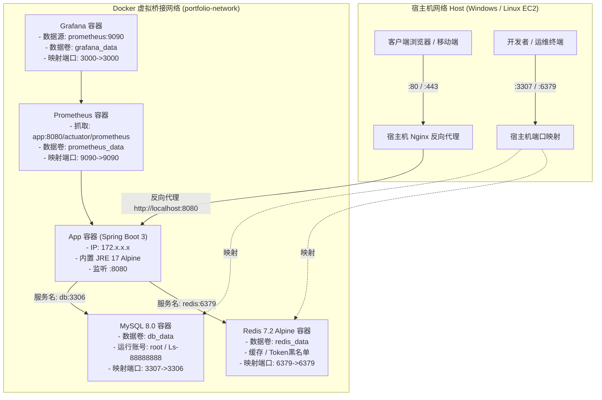
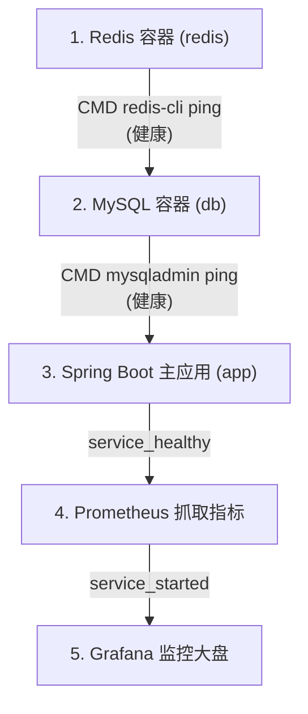

# Docker 容器化架构与运维实战手册 (Docker Architecture & DevOps Manual)

## 📋 目录
- [一、Docker 容器化架构与设计思路](#一docker-容器化架构与设计思路)
  - [1.1 容器编排拓扑与网络模型](#11-容器编排拓扑与网络模型)
  - [1.2 环境隔离与配置继承机制](#12-环境隔离与配置继承机制)
  - [1.3 资源限制与 JVM 容器化适配设计](#13-资源限制与-jvm-容器化适配设计)
- [二、核心实现细节与难点解析](#二核心实现细节与难点解析)
  - [2.1 Dockerfile 构建策略：Alpine 极简镜像与 Entrypoint 变量展开](#21-dockerfile-构建策略alpine-极简镜像与-entrypoint-变量展开)
  - [2.2 服务健康检查与依赖级联机制](#22-服务健康检查与依赖级联机制)
  - [2.3 端口映射双轨制 (宿主机 vs 容器内网络)](#23-端口映射双轨制-宿主机-vs-容器内网络)
  - [2.4 自动化生命周期脚本 (一键部署与深度回收)](#24-自动化生命周期脚本-一键部署与深度回收)
  - [2.5 Overlay2 孤儿构建层逆向清算引擎](#25-overlay2-孤儿构建层逆向清算引擎)
- [三、Portfolio 微服务全栈常用命令速查](#三portfolio-微服务全栈常用命令速查)
  - [3.1 一键运维脚本 (Windows PowerShell)](#31-一键运维脚本-windows-powershell)
  - [3.2 Docker Compose 核心命令](#32-docker-compose-核心命令)
  - [3.3 数据库运维与时序备份](#33-数据库运维与时序备份)
  - [3.4 Redis 缓存与 Blacklist 交互](#34-redis-缓存与-blacklist-交互)
  - [3.5 监控组件联动 (Prometheus + Grafana)](#35-监控组件联动-prometheus--grafana)
- [四、通用 Docker 基础与进阶命令参考](#四通用-docker-基础与进阶命令参考)
  - [4.1 容器管理与诊断](#41-容器管理与诊断)
  - [4.2 镜像与层级分析](#42-镜像与层级分析)
  - [4.3 网络诊断与数据卷维护](#43-网络诊断与数据卷维护)
  - [4.4 存储空间排查与系统清理](#44-存储空间排查与系统清理)
- [五、已知不足与优化方向 (记录于 todo.md)](#五已知不足与优化方向-记录于-todomd)

---

## 一、Docker 容器化架构与设计思路

### 1.1 容器编排拓扑与网络模型

ListenPortfolio 后端系统采用 Docker Compose 构建了微服务级别的单机编排架构。所有组件共同挂载在专用的桥接网络 `portfolio-network` 中，利用 Docker 内置的嵌入式 DNS 服务器（`127.0.0.11`）实现**基于服务名称的容器互访**。



### 1.2 环境隔离与配置继承机制

为了让同一套 Spring Boot 代码既能在本地 IDE 无容器模式下快速运行，又能在 Docker 容器化环境中免修改启动，系统设计了**增量 Profile 覆盖模型**：

1. **基础配置 (`application.properties`)**：
   - 默认指定本地直连地址：`spring.datasource.url=jdbc:mysql://localhost:3307/...`
   - 指定 Redis 本地地址：`spring.data.redis.host=localhost`
2. **容器差异配置 (`application-docker.properties`)**：
   - 当在 `docker-compose.yml` 中注入 `SPRING_PROFILES_ACTIVE=docker` 时，Spring Boot 会先加载基础配置，并以增量方式覆盖指定属性：
     ```properties
     # 数据库覆盖为 Docker 容器服务名 "db" 与内部端口 3306
     spring.datasource.url=jdbc:mysql://db:3306/portfolio?useSSL=false&serverTimezone=Asia/Tokyo&characterEncoding=UTF-8&collation=utf8mb4_bin&allowPublicKeyRetrieval=true

     # Redis 覆盖为 Docker 容器服务名 "redis"
     spring.data.redis.host=redis
     ```
3. **敏感凭据环境变量化 (`.env`)**：
   - 生产与开发环境通过 `${DB_PASSWORD:-Ls-88888888}` 语法从 `.env` 动态读取，Git 仓库仅提交 `.env.example` 模板，防止密码凭据泄露。

### 1.3 资源限制与 JVM 容器化适配设计

在低配置生产服务器（如 AWS EC2 `t2.micro`，仅 1 vCPU、1GB 内存）上，JVM 的默认内存分配策略（自动使用物理内存的 1/4 作为 MaxHeap）容易与同机的 MySQL 8.0 产生内存抢占，最终被 Linux 内核 OOM Killer 强杀。

系统在 `docker-compose.yml` 中为 App 容器注入了精准调优的 `JAVA_OPTS`：
```yaml
JAVA_OPTS: ${JAVA_OPTS:--Xms128m -Xmx256m -XX:+UseG1GC -XX:MaxGCPauseMillis=200}
```
- `-Xms128m -Xmx256m`：限制最小堆 128MB，最大堆上限 256MB，将堆内存稳固在安全区间。
- `-XX:+UseG1GC`：启用 G1 垃圾收集器，在有限内存下保证平滑的垃圾回收停顿。
- `-XX:MaxGCPauseMillis=200`：设置软性目标停顿时间不超过 200ms，优先保障 API 请求的响应时延。

---

## 二、核心实现细节与难点解析

### 2.1 Dockerfile 构建策略：Alpine 极简镜像与 Entrypoint 变量展开

查看项目中的 [`Dockerfile`](../Dockerfile)：
```dockerfile
# 1. 基础镜像选用 Temurin 官方发布的 Alpine JRE
FROM eclipse-temurin:17-jre-alpine

# 2. 声明嵌入式 Tomcat 的临时存储卷
VOLUME /tmp

# 3. 仅复制本地 Gradle 打包生成的单一可执行产物
COPY target/portfolio-0.0.1-SNAPSHOT.war app.war

# 4. 关键：通过 sh -c 触发变量展开
ENTRYPOINT ["sh", "-c", "java $JAVA_OPTS -jar /app.war"]
```

#### 难点与重点解析：
1. **为什么选择 JRE 而非 JDK？**
   - 完整的 JDK 镜像体积通常在 400MB~600MB 以上，包含编译器 `javac`、调试器和诊断工具，存在不必要的攻击面。
   - `eclipse-temurin:17-jre-alpine` 体积压缩到了约 **140MB**，只包含 Java 运行时，大幅减少云端镜像拉取与存储开销。
2. **为什么挂载 `VOLUME /tmp`？**
   - Spring Boot 内嵌的 Tomcat 默认会在 `/tmp` 创建工作缓存目录用于存放上传文件和 Servlet 临时会话。
   - 若不挂载 Volume，这些频繁的读写操作都会写入容器的可写层（Overlay2 Upper Layer），导致容器体积持续膨胀并影响 I/O 效率。
3. **ENTRYPOINT 为什么必须使用 `["sh", "-c", ...]`？**
   - 如果写成 `ENTRYPOINT ["java", "$JAVA_OPTS", "-jar", "/app.war"]`（Exec 格式），Docker 会将 `$JAVA_OPTS` 作为纯文本字面量传递给 Java 进程，无法被系统 Shell 展开，导致 JVM 无法识别参数而启动失败。
   - 使用 `["sh", "-c", "..."]` 启动一个轻量 Shell 进程作为父进程，先展开环境变量后再启动 Java 应用。

### 2.2 服务健康检查与依赖级联机制

在分布式容器编排中，如果 MySQL 尚未完成数据文件初始化，Spring Boot 主容器就已经启动，会导致数据库连接池初始化失败，应用瞬间崩溃（CrashLoopBackOff）。

项目在 `docker-compose.yml` 中建立了严密的**健康检查（Healthcheck）级联链条**：



#### 关键配置实现：
```yaml
db:
  image: mysql:8.0
  healthcheck:
    test: ["CMD", "mysqladmin", "ping", "-h", "localhost", "-u", "root", "-p${DB_PASSWORD:-Ls-88888888}"]
    interval: 10s       # 每 10 秒检测一次
    timeout: 5s         # 探测超时时间 5 秒
    retries: 10         # 最多重试 10 次 (共容忍 100 秒初始化耗时)
    start_period: 30s   # 前 30 秒为容器初始化宽限期，不计入失败次数

app:
  depends_on:
    redis:
      condition: service_healthy
    db:
      condition: service_healthy   # 必须等待 MySQL 探针通过后才拉起 App
```

### 2.3 端口映射双轨制 (宿主机 vs 容器内网络)

为了避免宿主机已安装的本地 MySQL（默认 3306 端口）发生冲突，系统采用了双轨端口策略：

| 服务 | 容器内暴露端口 | 宿主机映射端口 | 容器互访 URL (Docker 内) | 宿主机/IDE 访问 URL |
| :--- | :--- | :--- | :--- | :--- |
| **Spring Boot App** | 8080 | 8080 | `http://app:8080` | `http://localhost:8080` |
| **MySQL 8.0** | 3306 | **3307** | `jdbc:mysql://db:3306/portfolio` | `localhost:3307` |
| **Redis 7.2** | 6379 | 6379 | `redis:6379` | `localhost:6379` |
| **Prometheus** | 9090 | 9090 | `http://prometheus:9090` | `http://localhost:9090` |
| **Grafana** | 3000 | 3000 | `http://grafana:3000` | `http://localhost:3000` |

### 2.4 自动化生命周期脚本 (一键部署与深度回收)

#### 1. 一键部署：[`docker_deploy.ps1`](../docker_deploy.ps1)
脚本贯穿全流程：
1. **宿主机前置构建**：调用 `.\gradlew.bat bootWar` 编译生成产物，避免在容器内构建拉取庞大的 Gradle 依赖。
2. **编排拉起**：执行 `docker-compose --profile local up -d --build`。
3. **轮询健康探针**：以 10 秒间隔循环探测 `http://localhost:8080/actuator/health`，验证返回 JSON 中的 `status == "UP"`，确保 Flyway 数据库迁移完成且应用真正就绪。

#### 2. 全栈深度清理：[`docker_stop.ps1`](../docker_stop.ps1)
解决本地开发常见痛点：
1. **扫描本地冲突进程**：检测宿主机是否有 IDEA 启动的残余 Java 进程占用了 8080 端口，并执行优雅终止。
2. **级联下线与删除**：遍历终止 `app`, `db`, `redis`, `prometheus`, `grafana` 容器。
3. **清理虚拟网络**：强制移除残余的 `portfolio-network`，防止下次启动报错网络已存在。
4. **可选高级开关**：
   - `-RemoveImages`：同步清理构建生成的应用镜像。
   - `-Force`：清空并删除数据卷（重置数据库数据）。
5. **端口空闲校验**：通过 TCP Socket 校验 8080/3307/6379/9090/3000 是否全部恢复为 FREE 状态。

### 2.5 Overlay2 孤儿构建层逆向清算引擎

在 CI/CD 流水线频繁重新构建时，Docker 默认的 `docker image prune` 无法回收未打标或构建中断遗留在 `/var/lib/docker/overlay2` 中的孤儿目录。

项目在 [`tools/clean_docker_orphans.py`](../tools/clean_docker_orphans.py) 中实现了**图驱动拓扑逆向清算引擎**：
1. 递归提取所有运行与停止容器、以及全部本地镜像的 GraphDriver 数据（包括 `LowerDir`, `UpperDir`, `MergedDir`, `WorkDir`）。
2. 枚举物理文件系统 `/var/lib/docker/overlay2/` 下的全部子目录。
3. 计算物理目录与正被引用目录的差集：
   $$	ext{OrphanDirs} = 	ext{AllPhysicalDirs} \setminus 	ext{UsedLayers}$$
4. 排除系统级必备目录（`l` 软链接目录、`backingFsBlockDev`），对真正的孤儿层执行安全物理抹除，彻底根治云端 8GB EBS 磁盘枯竭问题。

---

## 三、Portfolio 微服务全栈常用命令速查

### 3.1 一键运维脚本 (Windows PowerShell)

```powershell
# 1. 一键全栈构建、部署与健康自检（推荐）
.\docker_deploy.ps1

# 2. 正常停止容器并清理网络
.\docker_stop.ps1

# 3. 停止容器并清理相关构建镜像
.\docker_stop.ps1 -RemoveImages

# 4. 彻底重置测试环境（注意：会清空 MySQL 与 Redis 数据卷！）
.\docker_stop.ps1 -Force -RemoveImages
```

### 3.2 Docker Compose 核心命令

```bash
# 启动全栈服务（包含监控组件）
docker-compose --profile local up -d

# 强制重新构建并启动应用
docker-compose --profile local up -d --build app

# 查看微服务群实时运行状态与健康探针
docker-compose ps

# 实时追踪 Spring Boot 主应用日志
docker-compose logs -f app

# 实时追踪数据库日志
docker-compose logs -f db

# 优雅下线并销毁容器群（保留数据卷）
docker-compose --profile local down

# 彻底下线并删除数据卷与孤儿容器
docker-compose --profile local down -v --remove-orphans
```

### 3.3 数据库运维与时序备份

```bash
# 进入 MySQL 交互式终端
docker-compose exec db mysql -u root -pLs-88888888 portfolio

# 探测 MySQL 服务运行健康状态
docker-compose exec db mysqladmin ping -h localhost -u root -pLs-88888888

# 导出当前数据库完整备份 (mysqldump)
docker-compose exec db mysqldump -u root -pLs-88888888 portfolio > backup_$(date +%Y%m%d).sql

# 导入/恢复数据库备份
docker-compose exec -T db mysql -u root -pLs-88888888 portfolio < backup_20260917.sql
```

### 3.4 Redis 缓存与 Blacklist 交互

```bash
# 进入 Redis 交互式客户端
docker-compose exec redis redis-cli

# 容器外探测 Redis 存活
docker-compose exec redis redis-cli ping

# 查看所有被加入黑名单的 JWT Token
docker-compose exec redis redis-cli keys "jwt:blacklist:*"

# 清空 Redis 缓存数据（调试时使用）
docker-compose exec redis redis-cli flushdb
```

### 3.5 监控组件联动 (Prometheus + Grafana)

```bash
# 检查 Prometheus 目标抓取状态
curl -s http://localhost:9090/api/v1/targets | grep "health"

# 动态热加载 Prometheus 配置 (无需重启容器)
curl -X POST http://localhost:9090/-/reload

# 查看 Spring Boot 暴露给 Prometheus 的原生指标
curl http://localhost:8080/actuator/prometheus

# 查看 Grafana 状态
curl http://localhost:3000/api/health
```

---

## 四、通用 Docker 基础与进阶命令参考

### 4.1 容器管理与诊断

```bash
# 查看全部容器（含已退出）及占用空间
docker ps -as

# 查看容器运行进程快照 (相当于容器内的 ps aux)
docker top <container_id>

# 实时监控各容器 CPU、内存、网络 I/O 资源消耗
docker stats

# 进入容器内部 Shell 环境
docker exec -it <container_id> /bin/sh

# 查看容器启动底层元数据 (挂载卷、网络 IP、环境变量)
docker inspect <container_id>
```

### 4.2 镜像与层级分析

```bash
# 列出本地所有镜像
docker images

# 逆向分析镜像的每一层构建指令与大小
docker history --no-trunc <image_name>:<tag>

# 镜像打标
docker tag <source_image>:<tag> <target_repo>/<image>:<tag>
```

### 4.3 网络诊断与数据卷维护

```bash
# 查看当前所有 Docker 网络
docker network ls

# 检查特定网络内部接入的所有容器与 IP 分配
docker network inspect portfolio-network

# 查看所有 Docker 持久化数据卷
docker volume ls

# 清理未挂载到任何容器的废弃数据卷
docker volume prune -f
```

### 4.4 存储空间排查与系统清理

```bash
# 查看 Docker 各组件占用的磁盘空间明细
docker system df -v

# 常规安全清理 (清除已停止容器、未使用网络与无标签镜像)
docker system prune -f

# 深度彻底清理 (清除所有未运行镜像与未挂载卷，慎用！)
docker system prune -a --volumes -f

# 执行项目定制的 Overlay2 孤儿层深度清理引擎
python3 tools/clean_docker_orphans.py
```

---

## 五、已知不足与优化方向 (记录于 todo.md)

基于对当前 Docker 镜像构建方式、编排策略与容器运行时安全的全面审计，以下 4 项改进已系统化归档至 [`docs/todo.md`](./todo.md) 中的 **第 8 章节：Docker 容器架构与镜像构建深度优化**：

1. **Dockerfile 多阶段构建与最小化 JRE 自定义裁剪 (Multi-Stage Build & jlink)**：
   - 现存问题：构建依赖宿主机提前执行 `gradlew bootWar`；基础镜像为通用的 140MB 运行时。
   - 优化方案：采用 Docker Multi-Stage 构建，第一阶段由 Gradle 镜像打包，第二阶段使用 `jlink` 提取定制化最小运行时，使生产镜像体积进一步缩减至 50MB~80MB。
2. **生产环境非 root 用户运行容器加固 (Non-Root User Enforcement)**：
   - 现存问题：当前 Dockerfile 默认以 Alpine root 用户执行，违背最小特权原则。
   - 优化方案：增加 `adduser -D appuser` 并声明 `USER appuser`，防范容器逃逸与提权风险。
3. **docker-compose.yml 增加资源配额硬限制 (Resource Limits & cgroups)**：
   - 现存问题：未在 Compose 文件中配置 cgroups 内存与 CPU 限制。
   - 优化方案：为 `app`、`db`、`redis` 显式声明 `mem_limit` 与 `cpus`，杜绝个别容器堆外内存泄漏导致整机雪崩。
4. **生产环境镜像推送与私有 Registry 镜像版本追溯 (Container Registry & Semantic Tagging)**：
   - 现存问题：本地与服务器直接 build 生成无版本号镜像，不利于故障快速回滚。
   - 优化方案：接入 GitHub Actions 自动推送打标镜像（`v1.0.X` 与 `commit-sha`）至私有 Registry，并配合 Trivy 进行漏洞扫描。\n