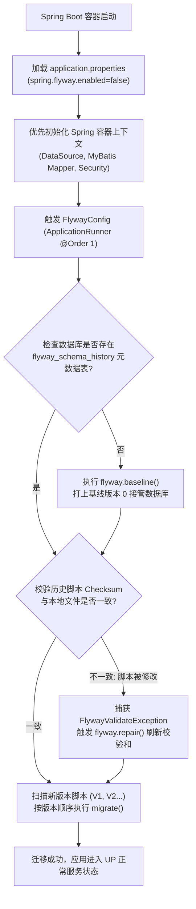

# Flyway 数据库版本迁移实战与架构指南 (Flyway Migration Architecture Manual)

## 📋 目录
- [一、Flyway 数据库迁移架构设计](#一flyway-数据库迁移架构设计)
  - [1.1 核心设计思路与版本演化模型](#11-核心设计思路与版本演化模型)
  - [1.2 为什么关闭 Spring 自动装配？循环依赖根除设计](#12-为什么关闭-spring-自动装配循环依赖根除设计)
  - [1.3 多环境隔离设计 (生产/Docker vs 测试 H2)](#13-多环境隔离设计-生产docker-vs-测试-h2)
- [二、核心实现细节与重难点剖析](#二核心实现细节与重难点剖析)
  - [2.1 FlywayConfig ApplicationRunner 架构实现](#21-flywayconfig-applicationrunner-架构实现)
  - [2.2 校验和不匹配 (Checksum Mismatch) 自动修复与自愈机制](#22-校验和不匹配-checksum-mismatch-自动修复与自愈机制)
  - [2.3 基线标记 (Baseline) 与既有数据库无缝接管原理](#23-基线标记-baseline-与既有数据库无缝接管原理)
  - [2.4 迁移版本脚本规划规范 (V1 结构与 V2 种子数据)](#24-迁移版本脚本规划规范-v1-结构与-v2-种子数据)
- [三、运维操作与排错指令手册](#三运维操作与排错指令手册)
  - [3.1 日常开发与应用自动迁移](#31-日常开发与应用自动迁移)
  - [3.2 数据库元数据表 (flyway_schema_history) 结构与诊断](#32-数据库元数据表-flyway_schema_history-结构与诊断)
  - [3.3 生产环境脚本被篡改或冲突排查指南 (Repair 手法)](#33-生产环境脚本被篡改或冲突排查指南-repair-手法)
  - [3.4 彻底重置数据库与清空基线步骤](#34-彻底重置数据库与清空基线步骤)
- [四、已知不足与演进方向 (记录于 todo.md)](#四已知不足与演进方向-记录于-todomd)

---

## 一、Flyway 数据库迁移架构设计

### 1.1 核心设计思路与版本演化模型

在现代敏捷开发与 CI/CD 自动化流水线中，数据库 Schema（DDL）与基础字典数据（DML）的演进必须同应用程序代码保持严格的版本对齐。

ListenPortfolio 引入 **Flyway 数据库版本化迁移工具**，其核心设计目标为：
1. **单一事实来源 (Single Source of Truth)**：所有数据表定义、多语言字段扩展、索引结构及初始简历测试数据均由标准 SQL 迁移脚本托管在 Git 仓库中（`src/main/resources/db/migration/`）。
2. **启动自迁移与幂等性保证**：服务容器拉起时自动扫描未应用的迁移脚本，按版本号单调递增顺序执行，绝不重复执行已完成的版本。
3. **零停机与灾备防御**：避免开发人员手工在生产服务器远程执行 SQL 带来的语法错误、漏执行或字符集不一致灾难。



---

### 1.2 为什么关闭 Spring 自动装配？循环依赖根除设计

在 Spring Boot 官方推荐的做法中，通常只需在 `application.properties` 配置 `spring.flyway.enabled=true`，Spring 会自动注入 `FlywayAutoConfiguration`。

#### 💣 遇到的底层架构痛点：
Spring Boot 在初始化 Bean 依赖图时，`FlywayAutoConfiguration` 会在 `EntityManagerFactory` 或 MyBatis `SqlSessionFactory` 装配之前要求立刻构建并执行 Flyway 实例。然而，由于项目中引入了持久化 Token 审计、AOP 限流拦截器、安全框架 `CustomUserDetailsService` 等组件，这些组件对 `DataSource` 的强依赖会在底层形成：
$$	ext{DataSource} \longrightarrow 	ext{Security/Service} \longrightarrow 	ext{Flyway} \longrightarrow 	ext{DataSource}$$
这一死锁闭环会导致 Spring Boot 在启动早期抛出致命的 `BeanCurrentlyInCreationException`（循环依赖崩溃）。

#### 💡 优雅解法：
1. 在 `application.properties` 中显式设置：
   ```properties
   spring.flyway.enabled=false
   ```
   从根本上关闭 Spring Boot 默认的自动装配 Bean。
2. 编写独立配置类 [`FlywayConfig.java`](../src/main/java/com/listen/portfolio/common/config/FlywayConfig.java) 实现 `ApplicationRunner`，并标注 `@Order(1)`。
3. **收益**：此时 Spring 容器全部 Bean 已组装完成，在 Spring Boot 刚刚就绪、但尚未对外开放 HTTP 端口的精准间隙，以绝对受控的方式编程式调用 Flyway 执行迁移，彻底根除了循环依赖。

---

### 1.3 多环境隔离设计 (生产/Docker vs 测试 H2)

单元测试与集成测试必须具备**秒级启动、纯内存隔离、不产生脏数据**的特性：
- **测试环境 (`@Profile("test")`)**：使用纯内存 H2 数据库（`jdbc:h2:mem:testdb`）。
  - 由于 V1 与 V2 迁移脚本中包含大量 MySQL 8.0 原生语法（如 `ENGINE=InnoDB DEFAULT CHARSET=utf8mb4 COLLATE=utf8mb4_bin`、`INSERT IGNORE`、`DATETIME DEFAULT CURRENT_TIMESTAMP ON UPDATE CURRENT_TIMESTAMP`），若让 Flyway 在 H2 上强行执行，会直接抛出语法不兼容错误导致测试全挂。
  - 为此，`FlywayConfig` 类打上了 `@Profile("!test")` 声明，使得任何跑在 `test` profile 下的测试用例完全跳过 Flyway，改由 MyBatis-Plus / H2 内存 schema 快速建表。
- **实体环境 (`dev`, `docker`, `prod`)**：`@Profile("!test")` 自动生效，连接真实 MySQL 8.0 容器或实例，由 Flyway 全权掌管表结构演进。

---

## 二、核心实现细节与重难点剖析

### 2.1 FlywayConfig ApplicationRunner 架构实现

代码实现位于 [`src/main/java/com/listen/portfolio/common/config/FlywayConfig.java`](../src/main/java/com/listen/portfolio/common/config/FlywayConfig.java)：

```java
@Configuration
@Profile("!test")
@Order(1)
public class FlywayConfig implements ApplicationRunner {

    private static final Logger logger = LoggerFactory.getLogger(FlywayConfig.class);
    private final DataSource dataSource;

    public FlywayConfig(DataSource dataSource) {
        this.dataSource = dataSource;
    }

    @Override
    public void run(ApplicationArguments args) {
        logger.info("=== [FlywayConfig] 开始执行 Flyway 数据库版本迁移 (via ApplicationRunner) ===");

        Flyway flyway = Flyway.configure()
                .dataSource(dataSource)
                .locations("classpath:db/migration")
                .baselineOnMigrate(true)  // 关键：对无 flyway 表的历史既有库自动打基线
                .baselineVersion("0")     // 基线版本设为 0，确保 V1 能被无遗漏执行
                .load();

        try {
            flyway.baseline();
            int count = flyway.migrate().migrationsExecuted;
            logger.info(">>> [FlywayConfig] 数据库迁移成功！本次新应用的迁移脚本数量: {}", count);
        } catch (FlywayValidateException e) {
            // 重点难点：捕获脚本校验和差异异常，启动自动修复自愈流程
            logger.warn(">>> [FlywayConfig] 捕获到 Flyway 校验和异常，启动自动修复 (repair)...", e);
            try {
                flyway.repair();
                int count = flyway.migrate().migrationsExecuted;
                logger.info(">>> [FlywayConfig] 自动修复完成并成功执行迁移！应用数量: {}", count);
            } catch (Exception repairError) {
                logger.error(">>> [FlywayConfig] 自动修复后二次迁移仍然失败", repairError);
                throw repairError;
            }
        }
    }
}
```

---

### 2.2 校验和不匹配 (Checksum Mismatch) 自动修复与自愈机制

#### 难点痛点场景：
在跨平台团队开发中，开发者 A 在 Windows 环境下拉取代码，Git 可能会自动转换换行符（CRLF vs LF）；或者开发者在已执行过的 `V1__Create_initial_tables.sql` 中补充了一个字段注释或微调了格式。
Flyway 会对每个脚本计算 CRC32 校验和并保存在 `flyway_schema_history` 表的 `checksum` 字段中。下一次启动时，Flyway 发现本地文件的 Checksum 与数据库记录不一致，便会抛出 `FlywayValidateException` 阻断启动，导致 Docker 容器进入无限重启崩溃循环（CrashLoop）。

#### 自动化自愈实现原理：
1. `FlywayConfig` 使用标准 `try-catch` 拦截 `FlywayValidateException`；
2. 自动调用 `flyway.repair()` 方法：
   - 清理此前因事务中断残留的标记为 `success = 0` 的失败记录；
   - 重新计算本地所有已迁移脚本的新 Checksum，并强制对齐更新到 `flyway_schema_history` 表中；
3. 二次调用 `flyway.migrate()`，平滑无感恢复服务，彻底免除运维人员半夜登录生产数据库手动执行 `UPDATE flyway_schema_history SET checksum = ...` 的繁琐与风险。

---

### 2.3 基线标记 (Baseline) 与既有数据库无缝接管原理

如果接入 Flyway 之前，数据库中已经手动建好了部分表（如 `users` 或 `projects`），直接执行 `migrate` 会报错：`Found non-empty schema(s) without schema history table! Use baseline()`。

通过配置：
```java
.baselineOnMigrate(true)
.baselineVersion("0")
```
- **工作机制**：如果发现目标数据库非空且尚不存在 `flyway_schema_history` 表，Flyway 会自动在数据库中新建该元数据表，并插入一条 `version = 0, description = '<< Flyway Baseline >>'` 的初始基线记录。
- **为什么基线版本必须设为 "0" 而不是默认的 "1"？**
  - 如果基线设为默认的 1，Flyway 会认为版本为 1 的脚本（`V1__Create_initial_tables.sql`）已经在基线之前被包含，从而**跳过 V1 的执行**！
  - 将基线显式指定为 `0`，使得 Flyway 在打完基线后，能正确识别出 `V1 > 0`，从而按计划完整执行 V1 和 V2，实现新老环境百分之百平滑兼容。

---

### 2.4 迁移版本脚本规划规范 (V1 结构与 V2 种子数据)

工程中的 SQL 迁移脚本严格遵守 Flyway 命名约定：`V<版本号>__<英文描述>.sql`（双下划线分隔）：

```
src/main/resources/db/migration/
├── V1__Create_initial_tables.sql   # DDL：创建 7 张核心业务表与多语言扩展列
└── V2__Add_test_data.sql           # DML：填充 Listen 真实中英日简历与项目案例
```

#### 1. [`V1__Create_initial_tables.sql`](../src/main/resources/db/migration/V1__Create_initial_tables.sql)：
- 创建 `users`、`user_certifications`、`projects`、`project_tech_stack`、`about_me`、`skills`、`stats` 等 7 张核心表。
- 全面预埋国际化多语言列（如 `title_zh`, `title_ja`, `bio_zh`, `bio_ja`, `item_desc_zh`, `item_desc_ja`）。
- 统一强制采用 MySQL 8 最佳编码：`ENGINE=InnoDB DEFAULT CHARSET=utf8mb4 COLLATE=utf8mb4_bin`，支持全套 Emoji 表情与区分大小写的安全查询。

#### 2. [`V2__Add_test_data.sql`](../src/main/resources/db/migration/V2__Add_test_data.sql)：
- 采用 `INSERT IGNORE INTO ...` 语法，保障即使在异常重试时也不会触发主键唯一约束冲突。
- 灌入 Listen 资深移动端/全栈架构师真实中英日三语简历背景、乐天证券交易 App 项目案例、6 大技术维度能力雷达图与统计指标数据。

---

## 三、运维操作与排错指令手册

### 3.1 日常开发与应用自动迁移

```bash
# 本地启动应用（自动扫描并应用未执行的 Flyway 迁移脚本）
./gradlew bootRun

# 在 Docker 容器编排环境中启动（Flyway 自动执行）
docker-compose --profile local up -d --build app

# 实时查看 Flyway 启动阶段迁移日志
docker-compose logs -f app | grep -E "FlywayConfig|Flyway"
```

### 3.2 数据库元数据表 (flyway_schema_history) 结构与诊断

在 MySQL 终端中可随时查看迁移历史：

```sql
-- 进入数据库
USE portfolio;

-- 查看 Flyway 版本元数据全貌
SELECT installed_rank, version, description, type, script, checksum, installed_on, execution_time, success 
FROM flyway_schema_history 
ORDER BY installed_rank ASC;
```

典型输出结果示意：
| installed_rank | version | description | type | script | checksum | installed_on | execution_time | success |
| :---: | :---: | :---: | :---: | :---: | :---: | :---: | :---: | :---: |
| 1 | 0 | `<< Flyway Baseline >>` | BASELINE | `<< Flyway Baseline >>` | NULL | 2026-08-01 10:00:00 | 0 | 1 |
| 2 | 1 | Create initial tables | SQL | `V1__Create_initial_tables.sql` | 1823940124 | 2026-08-01 10:00:02 | 125 | 1 |
| 3 | 2 | Add test data | SQL | `V2__Add_test_data.sql` | -982341209 | 2026-08-01 10:00:03 | 85 | 1 |

### 3.3 生产环境脚本被篡改或冲突排查指南 (Repair 手法)

如果生产容器因历史迁移校验失败退出，而自动自愈未生效时，可通过命令行手动执行修复：

```bash
# 方式 1：进入 MySQL 容器删除冲突或失败的脏记录（如失败的 V3）
docker-compose exec db mysql -u root -pLs-88888888 portfolio -e   "DELETE FROM flyway_schema_history WHERE version = '3' AND success = 0;"

# 方式 2：使用 Flyway 命令行客户端执行 repair (若宿主机安装了 flyway cli)
flyway -url="jdbc:mysql://localhost:3307/portfolio" -user=root -password=Ls-88888888 repair
```

### 3.4 彻底重置数据库与清空基线步骤

在集成测试或需要恢复出厂设置时：

```bash
# 方式 1：通过全栈清理脚本强制清空持久化数据卷（最彻底）
.\docker_stop.ps1 -Force
.\docker_deploy.ps1

# 方式 2：在 MySQL 中手工删库重建，重新触发 Flyway 全量初始化
docker-compose exec db mysql -u root -pLs-88888888 -e   "DROP DATABASE IF EXISTS portfolio; CREATE DATABASE portfolio DEFAULT CHARSET utf8mb4 COLLATE utf8mb4_bin;"

# 重启应用，Flyway 将从 V1 重新跑起
docker-compose restart app
```

---

## 四、已知不足与演进方向 (记录于 todo.md)

基于对当前 Flyway 架构与实战运行的深度审计，识别出以下 4 项改进点，并已系统化归档至 [`docs/todo.md`](./todo.md) 中的 **第 9 章节：Flyway 数据库迁移演进与多环境隔离**：

1. **生产环境种子数据与结构脚本解耦 (Separate DDL from DML / Seed Data)**：
   - 现存问题：`V2__Add_test_data.sql` 将业务测试数据作为强制迁移版本，增大了 DDL 与 DML 混合管理的耦合度。
   - 优化方案：拆分为纯结构版本迁移与按环境按需执行的 Repeatable 脚本（`R__01_Seed_Data.sql`）或由 Spring 初始化器分流。
2. **数据库迁移回滚与降级机制规划 (Flyway Undo / Down-Migration Strategy)**：
   - 现存问题：开源版不支持逆向 `undo` 脚本，发布失败后降级依赖手动整库还原。
   - 优化方案：建立 `rollback/` 逆向 SQL 归档规范与发布前快照备份机制。
3. **分布式多节点启动下的 Flyway 迁移互斥锁与超时治理 (Migration Lock & Timeout)**：
   - 现存问题：未来扩容为多容器/集群时，多实例并发执行可能引发分布式表锁竞争。
   - 优化方案：显式调优排他锁重试超时（`lockRetryCount: 50`），或收敛为独立的一次性 CI/CD 迁移 Job。
4. **集成测试环境纯内存 H2 自动化表结构同步校验 (Automated H2 Schema Sync)**：
   - 现存问题：目前测试环境绕过 Flyway，若未来新增 V3 字段而开发者漏改单测 H2 schema，单测仍会掩盖真实线上缺陷。
   - 优化方案：在 CI 流水线引入 Testcontainers 启动真实 MySQL 容器，对每一次 PR 完整跑一遍 Flyway 迁移做同构真实性验证。\n