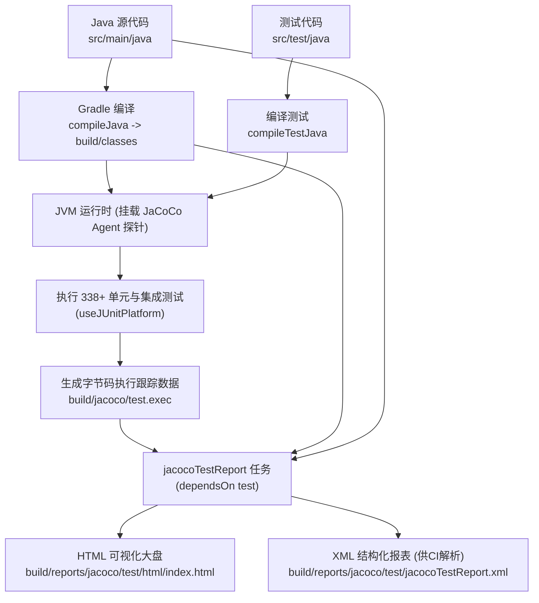

# JaCoCo 测试覆盖率实战与质量门禁手册 (JaCoCo Test Coverage Manual)

## 📋 目录
- [一、JaCoCo 架构设计与覆盖率原理](#一jacoco-架构设计与覆盖率原理)
  - [1.1 核心设计思路与字节码插桩机制](#11-核心设计思路与字节码插桩机制)
  - [1.2 Gradle 任务生命周期编排与自动关联](#12-gradle-任务生命周期编排与自动关联)
  - [1.3 六大覆盖率度量指标详解](#13-六大覆盖率度量指标详解)
- [二、核心实现细节与重难点剖析](#二核心实现细节与重难点剖析)
  - [2.1 build.gradle 插件配置与产物输出](#21-buildgradle-插件配置与产物输出)
  - [2.2 check-coverage.bat 自动化批处理与浏览器联动](#22-check-coveragebat-自动化批处理与浏览器联动)
  - [2.3 耗时测试与 CI 环境隔离策略 (excludePerformanceTest)](#23-耗时测试与-ci-环境隔离策略-excludeperformancetest)
  - [2.4 单测与集成测试覆盖率合并机制 (.exec 数据流)](#24-单测与集成测试覆盖率合并机制-exec-数据流)
- [三、日常操作命令与排错手册](#三日常操作命令与排错手册)
  - [3.1 常用命令速查](#31-常用命令速查)
  - [3.2 覆盖率报告目录结构与阅读技巧](#32-覆盖率报告目录结构与阅读技巧)
  - [3.3 典型问题排查与修复方案](#33-典型问题排查与修复方案)
- [四、已知不足与演进方向 (记录于 todo.md)](#四已知不足与演进方向-记录于-todomd)

---

## 一、JaCoCo 架构设计与覆盖率原理

### 1.1 核心设计思路与字节码插桩机制

在高质量后端工程体系中，单元测试不仅需要“跑通”，更需要量化评估测试用例对业务代码分支与边界条件的覆盖程度。

**JaCoCo (Java Code Coverage)** 是 Java 领域工业级的代码覆盖率分析引擎：
1. **On-The-Fly 运行时动态插桩**：
   - JaCoCo 通过 Java Agent 探针（在运行测试时挂载至 JVM）动态修改加载进 JVM 内存的 `.class` 字节码。
   - 在每个指令块（Basic Block）和分支跳转点插入探针计数器（Probe Array），当测试代码触发该路径时，探针标志位被置为 `true`。
   - **优势**：无需像早期工具那样物理重写磁盘上的 class 文件，保证编译产物纯净无污染，零性能侵入。
2. **测试数据文件收集 (`.exec`)**：
   - 当 JUnit 测试套件执行完毕后，探针数据统一转储到物理文件 `build/jacoco/test.exec` 中。
3. **结构化报表渲染 (HTML / XML)**：
   - `jacocoTestReport` 任务读取 `test.exec` 原始数据，结合源代码与编译生成的 class 文件，交叉比对生成交互式 HTML 网站与供 CI 解析的 XML 格式报表。



---

### 1.2 Gradle 任务生命周期编排与自动关联

在工程构建脚本 [`build.gradle`](../build.gradle) 中，测试与覆盖率任务通过生命周期钩子紧密编排：

```groovy
tasks.named('test') {
    useJUnitPlatform()
    finalizedBy jacocoTestReport // 核心钩子：test 任务结束后，无论成功与否，必定触发报表生成
}

jacocoTestReport {
    dependsOn test // 强依赖保障：生成报告前必须确保测试已经完成并产出 test.exec
    reports {
        xml.required = true
        html.required = true
    }
}
```

- **`finalizedBy` 与 `dependsOn` 的双向协同**：
  - 开发者执行 `./gradlew test` 时，测试跑完会**自动附带**生成最新的 JaCoCo 覆盖率报告。
  - 开发者执行 `./gradlew jacocoTestReport` 时，Gradle 会检测到 `dependsOn test`，先自动触发单测，确保拿到的永远是最鲜活的覆盖率数据。

---

### 1.3 六大覆盖率度量指标详解

在 JaCoCo 生成的报告中，包含 6 种维度的质量度量标准：

| 指标维度 | 英文全称 | 计算原理与含义 | 推荐门禁标准 |
| :--- | :--- | :--- | :--- |
| **指令覆盖率** | **Instructions** | 基于 JVM 字节码指令计算，与源代码行排版无关，是最精确的代码执行覆盖指标。 | **$\ge 70\%$** |
| **分支覆盖率** | **Branches** | 统计 `if`、`switch` 等逻辑判断的所有真假分支走向（每个分支点计为 2 条路径）。 | **$\ge 60\%$** |
| **代码行覆盖率** | **Lines** | 至少有一条指令被执行的源码行数（可直观看出哪些行变绿、哪些行变红）。 | **$\ge 70\%$** |
| **圈复杂度** | **Complexity** | McCabe 圈复杂度，反映方法的逻辑复杂度，覆盖率衡量是否覆盖了所有独立线性路径。 | **$\ge 65\%$** |
| **方法覆盖率** | **Methods** | 是否至少有一条指令被执行的 Java 方法数量。 | **$\ge 80\%$** |
| **类覆盖率** | **Classes** | 只要类中有一个方法被调用即视为该类被覆盖。 | **$\ge 85\%$** |

---

## 二、核心实现细节与重难点剖析

### 2.1 build.gradle 插件配置与产物输出

工程使用了标准 Gradle 8.5 搭配官方 `jacoco` 插件：

```groovy
plugins {
    id 'java'
    id 'war'
    id 'jacoco' // 引入 JaCoCo 官方构建插件
    // ...
}

// 报告输出路径定制为标准 build 目录
jacocoTestReport {
    dependsOn test
    reports {
        xml.required = true  // 供 CI/CD流水线、SonarQube 或 PR Coverage 机器人解析
        html.required = true // 供开发者本地在浏览器中点击下钻查看逐行覆盖
    }
}
```

- 编译生成的覆盖率报告输出位置：
  - **HTML 根入口**：`build/reports/jacoco/test/html/index.html`
  - **XML 机器解析文件**：`build/reports/jacoco/test/jacocoTestReport.xml`

---

### 2.2 check-coverage.bat 自动化批处理与浏览器联动

为了让 Windows 开发者免记复杂 Gradle 命令，项目根目录下内置了批处理脚本 [`check-coverage.bat`](../check-coverage.bat)：

```bat
@echo off
REM 步骤 1：调用本地 Gradle Wrapper 编译运行测试并生成报告
call .\gradlew.bat test jacocoTestReport

REM 步骤 2：检查生成的 HTML 报告文件是否存在
if exist "build
eports\jacoco	est\html\index.html" (
    echo [OK] 成功找到覆盖率报告网页文件！
    REM 步骤 3：调用 Windows 默认浏览器自动弹出大盘
    start "" "build
eports\jacoco	est\html\index.html"
)
```

#### 难点与细节解析：
- **`start ""` 语法**：在 Windows cmd/bat 中，`start` 命令的第一个参数若带引号会被当作窗口标题，因此必须传递空引号 `start "" "路径"`，确保 Windows 按照关联的文件类型自动拉起默认浏览器（Edge / Chrome / Firefox）。
- **同步阻塞调用 `call`**：执行 `call .\gradlew.bat` 能够防止子批处理执行完毕后直接退出当前命令会话，保证后续报告存在性检查与浏览器调起正常执行。

---

### 2.3 耗时测试与 CI 环境隔离策略 (excludePerformanceTest)

#### 痛点场景：
在自动化测试套件中，性能压测（`PerformanceTest`）需要模拟大量并发请求或高频吞吐，单次耗时可能长达数分钟，如果在每次本地开发快速核对覆盖率或 GitHub Actions CI 中全量执行，会严重拖慢研发效率。

#### 实现策略：
在 `build.gradle` 的 `test` 任务中动态判断环境变量与命令行参数：
```groovy
tasks.named('test') {
    useJUnitPlatform()
    if (System.getenv('CI') == 'true' || project.hasProperty('excludePerformanceTest')) {
        exclude '**/performance/**'
    }
    finalizedBy jacocoTestReport
}
```
- 本地快速单测：`./gradlew test -PexcludePerformanceTest` 或 `./gradlew test -Dtest=!PerformanceTest`
- CI/CD 自动化流水线：通过 `CI=true` 环境变量自动绕过高耗时压测，将测试与报表生成时间压缩在 **15~20 秒** 以内。

---

### 2.4 单测与集成测试覆盖率合并机制 (.exec 数据流)

ListenPortfolio 包含轻量级 Mockito 单元测试与基于 Spring 上下文的 `@SpringBootTest` 集成测试：
- Spring Boot 测试会启动内嵌的 H2 内存库和 Mock MVC 拦截器；
- JaCoCo 会将这两种不同类型的测试探针执行轨迹无缝累加记录至单一 `test.exec` 二进制流中；
- 无论是 Service 层的深层方法、Controller 的参数校验、还是全局异常处理器 `GlobalExceptionHandler` 的错误捕获分支，均能在合并后的报表中完整呈现。

---

## 三、日常操作命令与排错手册

### 3.1 常用命令速查

```bash
# 1. 最快捷方式 (Windows 一键执行单测并在浏览器打开可视化大盘)
.\check-coverage.bat

# 2. 命令行执行全量测试并生成覆盖率报告
./gradlew test jacocoTestReport

# 3. 排除耗时性能测试，极速生成覆盖率报告 (推荐日常使用)
./gradlew test jacocoTestReport -Dtest=!PerformanceTest

# 4. 强制重新编译并清空旧覆盖率缓存后生成
./gradlew clean test jacocoTestReport

# 5. 仅查看当前覆盖率报表（不重新跑测试，前提是已跑过 test）
./gradlew jacocoTestReport
```

---

### 3.2 覆盖率报告目录结构与阅读技巧

报告生成在 `build/reports/jacoco/test/html/` 目录下，网页大盘呈现层级：

```
index.html (全工程包级别汇总)
├── com.listen.portfolio.service (核心业务层，重点关注)
│   ├── AboutMeService.java
│   ├── ProjectService.java
│   └── UserService.java
├── com.listen.portfolio.api (Controller 控制器层)
├── com.listen.portfolio.common.util (工具类层)
└── com.listen.portfolio.common.jwt (JWT 认证与拦截器)
```

#### 报告颜色含义识别：
- 🟢 **绿色代码行**：该行字节码已被单测完整执行。
- 🟡 **黄色菱形/黄色行**：分支判断覆盖不全（例如 `if (condition)` 仅走过了 `true` 分支，从未走入 `false` 分支）。
- 🔴 **红色代码行**：完全未被任何测试用例触达的代码，需重点补充测试！

---

### 3.3 典型问题排查与修复方案

#### 场景 1：`build/reports/jacoco/test/html/index.html` 报告全是 0% 或显示“No class files specified”
- **原因**：执行了 `gradlew clean` 删除了 `build/classes`，但直接执行了 `gradlew jacocoTestReport` 而没有先执行 `test`。
- **修复**：运行 `./gradlew test jacocoTestReport`，确保 class 文件与 `test.exec` 探针数据均已就绪。

#### 场景 2：单元测试全部通过，但报告未生成
- **原因**：Gradle 守护进程命中构建缓存（UP-TO-DATE），认为代码未发生变动而跳过了执行。
- **修复**：添加 `--rerun-tasks` 强制重新执行：`./gradlew test jacocoTestReport --rerun-tasks`。

---

## 四、已知不足与演进方向 (记录于 todo.md)

基于对当前 JaCoCo 配置与持续集成验证机制的深度审计，规划了以下 4 项质量门禁演进点，已系统化归档至 [`docs/todo.md`](./todo.md) 中的 **第 10 章节：JaCoCo 测试覆盖率与质量门禁演进**：

1. **JaCoCo 自动化质量门禁 (jacocoTestCoverageVerification) 强阻断机制**：
   - 现存问题：目前仅输出报表，未配置阈值校验任务；若覆盖率下降构建依然绿灯。
   - 优化方案：增加 `jacocoTestCoverageVerification` 任务，设定全工程 Instruction $\ge 70\%$、核心 Service Branch $\ge 60\%$ 的硬性门禁，未达标直接阻断 Gradle 构建。
2. **JaCoCo 报表排除生成代码与基础设施类 (Exclusions: DTO, Entity, Config, AOP)**：
   - 现存问题：Getter/Setter、Entity 数据模型与全局配置类计入统计分母，稀释了业务覆盖率真实度。
   - 优化方案：在配置中排除 `**/entity/**`, `**/dto/**`, `**/config/**` 等模板类，聚焦核心逻辑。
3. **GitHub Actions CI 流水线 PR 自动化覆盖率评论与徽章展示 (CI PR Coverage Comment)**：
   - 现存问题：需要本地手动运行查看，GitHub PR 缺少即时反馈。
   - 优化方案：集成 CI 动作自动解析 `jacocoTestReport.xml`，在每次 PR 讨论区自动回复增量代码覆盖率差异大盘。
4. **边缘异常分支与复杂逻辑边界单测补全 (Edge-Case & Boundary Coverage)**：
   - 现存问题：部分底层 I/O 故障、Token 畸变或并发重置密码的异常分支仍有黄色未覆盖警告。
   - 优化方案：利用 Mockito 模拟极端异常场景，将核心 Service 分支覆盖率提升至 $80\%$ 以上。\n