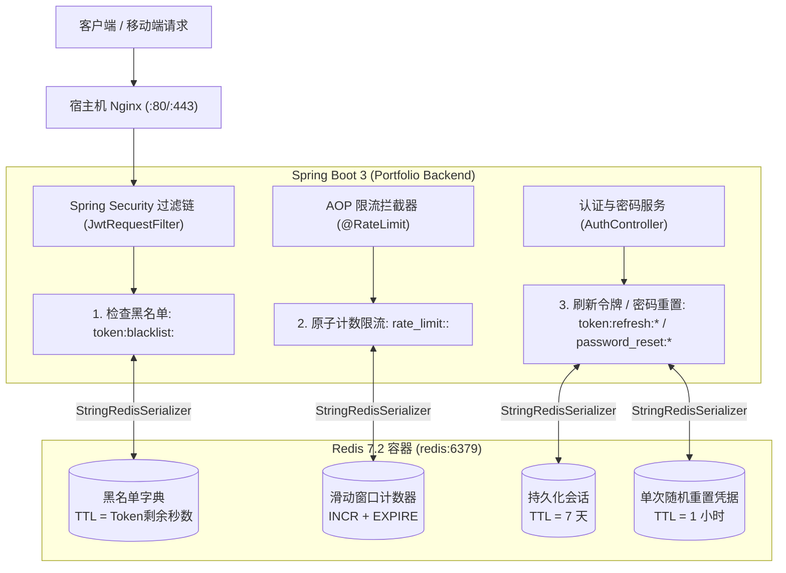

# Redis 分布式缓存与安全中枢实战手册 (Redis Architecture & DevOps Manual)

## 📋 目录
- [一、Redis 在系统中的架构定位与设计思路](#一redis-在系统中的架构定位与设计思路)
  - [1.1 总体架构与微服务依赖模型](#11-总体架构与微服务依赖模型)
  - [1.2 序列化透明度设计 (纯文本 StringRedisSerializer)](#12-序列化透明度设计-纯文本-stringredisserializer)
  - [1.3 容器化持久化与内存隔离](#13-容器化持久化与内存隔离)
- [二、核心业务场景与重难点实现剖析](#二核心业务场景与重难点实现剖析)
  - [2.1 JWT 令牌黑名单与主动登出机制 (TokenBlacklistService)](#21-jwt-令牌黑名单与主动登出机制-tokenblacklistservice)
  - [2.2 多端持久化会话与全局一键吊销 (RefreshTokenService)](#22-多端持久化会话与全局一键吊销-refreshtokenservice)
  - [2.3 高熵密码重置安全凭据 (PasswordResetTokenService)](#23-高熵密码重置安全凭据-passwordresettokenservice)
  - [2.4 高并发滑动时间窗口防刷限流 (RateLimitService)](#24-高并发滑动时间窗口防刷限流-ratelimitservice)
- [三、运维操作与排错调试指令手册](#三运维操作与排错调试指令手册)
  - [3.1 Docker 容器启动与存活探测](#31-docker-容器启动与存活探测)
  - [3.2 终端交互式客户端 (redis-cli) 高频命令](#32-终端交互式客户端-redis-cli-高频命令)
  - [3.3 业务 Key 模式匹配与数据诊断速查](#33-业务-key-模式匹配与数据诊断速查)
  - [3.4 缓存重置与极端故障排查 SOP](#34-缓存重置与极端故障排查-sop)
- [四、已知不足与演进方向 (记录于 todo.md)](#四已知不足与演进方向-记录于-todomd)

---

## 一、Redis 在系统中的架构定位与设计思路

### 1.1 总体架构与微服务依赖模型

在 ListenPortfolio 后端架构中，**Redis 7.2 Alpine** 扮演着分布式无状态应用的核心“状态与安全中枢”：
1. **补全 JWT 纯无状态缺陷**：标准 JWT 一旦签发无法撤回，Redis 黑名单与 Refresh Token 存储赋予服务端强控制力（一键下线、改密吊销）。
2. **高频访问内存加速**：以接近内存的微秒级吞吐支撑每个进入 Spring Boot 过滤链的 HTTP 请求进行安全与限流探测。
3. **松耦合容灾 (Fail-Open)**：若 Redis 节点宕机，服务层内置降级保护（如限流放行），防止单点故障引发整站瘫痪。



---

### 1.2 序列化透明度设计 (纯文本 StringRedisSerializer)

在 Spring Boot 默认配置下，`RedisTemplate` 使用 JDK 字节码序列化器（`JdkSerializationRedisSerializer`），其存储的 Key 和 Value 都会附带不可读的乱码前缀（如 `\xac\xed\x00\x05t\x00...`），给运维排查带来巨大困难。

在 [`src/main/java/com/listen/portfolio/common/config/RedisConfig.java`](../src/main/java/com/listen/portfolio/common/config/RedisConfig.java) 中重构为纯文本 UTF-8 字符串：
```java
@Bean
public RedisTemplate<String, String> redisTemplate(RedisConnectionFactory connectionFactory) {
    RedisTemplate<String, String> template = new RedisTemplate<>();
    template.setConnectionFactory(connectionFactory);
    
    StringRedisSerializer stringSerializer = new StringRedisSerializer();
    template.setKeySerializer(stringSerializer);
    template.setValueSerializer(stringSerializer);
    template.setHashKeySerializer(stringSerializer);
    template.setHashValueSerializer(stringSerializer);
    template.setDefaultSerializer(stringSerializer);
    
    template.afterPropertiesSet();
    return template;
}
```
- **核心收益**：
  - 运维人员直接通过 `docker exec redis-local redis-cli keys "*"` 可以肉眼清晰查看所有 Key。
  - 保证多语言、多平台（Go、Node.js、Python 等微服务）读写同一 Redis 实例时格式百分之百互通。

---

### 1.3 容器化持久化与内存隔离

在 `docker-compose.yml` 中：
```yaml
redis:
  image: redis:7.2-alpine
  container_name: redis-local
  restart: unless-stopped
  ports:
    - "${REDIS_PORT:-6379}:6379"
  volumes:
    - redis_data:/data
  networks:
    - portfolio-network
  healthcheck:
    test: ["CMD", "redis-cli", "ping"]
    interval: 10s
    timeout: 5s
    retries: 5
    start_period: 10s
```
- 镜像采用极简的 `redis:7.2-alpine`，运行内存占用不足 25MB。
- 挂载 `redis_data` 命名数据卷至 `/data`，确保容器销毁重建时 RDB 快照数据不丢失。
- 配置了容器级健康探针（`redis-cli ping`），保障依赖它的 Spring Boot 与 MySQL 按序就绪。

---

## 二、核心业务场景与重难点实现剖析

### 2.1 JWT 令牌黑名单与主动登出机制 (TokenBlacklistService)

#### 痛点与业务挑战：
客户端调用 `/api/v1/auth/logout` 登出时，即使客户端销毁了本地存储的 Token，但如果该 Token 在网络传输中被劫持，黑客在过期之前仍可伪造身份访问。

#### 解决方案实现：[`TokenBlacklistService.java`](../src/main/java/com/listen/portfolio/service/TokenBlacklistService.java)
1. **加入黑名单并计算精准 TTL**：
   $$	ext{TTL} = \min(	ext{tokenExpiration} - 	ext{currentTime}, 	ext{DEFAULT\_BLACKLIST\_TTL})$$
   将 Token 存入 Redis，Key 为 `token:blacklist:<token>`，Value 为 `"blacklisted"`。
2. **高效自洁与拦截**：
   - 当 JWT 原始有效时间耗尽，Redis 内部定时器自动淘汰该 Key，零维护开销。
   - `JwtRequestFilter` 在解析 Token 之前调用 `tokenBlacklistService.isBlacklisted(token)`，若存在则直接阻断并返回 `401 Unauthorized`。

---

### 2.2 多端持久化会话与全局一键吊销 (RefreshTokenService)

代码实现：[`RefreshTokenService.java`](../src/main/java/com/listen/portfolio/service/RefreshTokenService.java)
- **Key 命名规范**：`token:refresh:<username>:<refreshToken>`
- **TTL 设置**：对齐 Refresh Token 有效期（7 天，604,800,000 毫秒）。
- **多端登录支持**：同一用户在手机、平板与 Web 端登录时，Redis 中分别维护各自的 Token 记录。
- **一键全局吊销 (Global Sign-Out)**：
  - 当用户在任意设备上触发“修改密码”或“注销账户”时，服务端执行 `revokeAllRefreshTokens(username)`，遍历清除该用户下的全部 Refresh Token，强制所有已登录端立即重新验证身份。

---

### 2.3 高熵密码重置安全凭据 (PasswordResetTokenService)

代码实现：[`PasswordResetTokenService.java`](../src/main/java/com/listen/portfolio/service/PasswordResetTokenService.java)
1. **256 位高熵加密随机数生成**：
   - 使用 `java.security.SecureRandom` 生成 32 字节随机熵，经 URL-Safe Base64 编码生成重置密钥。
2. **短时效安全存储**：
   - Key 为 `password_reset:<token>`，Value 为用户注册邮箱，TTL 强制设为 3600 秒（1 小时）。
3. **单次使用即作废 (One-Time Semantic)**：
   - 验证通过并重置密码后，立刻调用 `deleteToken(token)` 物理擦除，防止恶意重放。

---

### 2.4 高并发滑动时间窗口防刷限流 (RateLimitService)

代码实现：[`RateLimitService.java`](../src/main/java/com/listen/portfolio/service/RateLimitService.java)
- **窗口时间槽切分**：
  $$	ext{CurrentWindowBucket} = \lfloor rac{	ext{System.currentTimeMillis()}}{	ext{timeWindowSeconds} 	imes 1000} 
floor$$
- **原子递增计数**：
  - Key 设计：`rate_limit:<IP/Email>:<CurrentWindowBucket>`
  - 首次自增（`count == 1`）时设置等于窗口长度的 TTL，后续递增直接累加。
- **降级容灾设计 (Fail-Open)**：
  - 若 Redis 发生异常，捕获并打印 warn 日志后直接返回 `true`（放行），保证在极端故障下不会因为 Redis 抖动误杀正常合法用户的业务请求。

---

## 三、运维操作与排错调试指令手册

### 3.1 Docker 容器启动与存活探测

```bash
# 启动 Redis 服务
docker-compose --profile local up -d redis

# 探测 Redis 容器运行健康度 (返回 PONG 为正常)
docker-compose exec redis redis-cli ping

# 查看 Redis 容器实时资源开销 (CPU / 内存)
docker stats redis-local --no-stream
```

---

### 3.2 终端交互式客户端 (redis-cli) 高频命令

```bash
# 进入 Redis 交互式终端
docker-compose exec redis redis-cli

# 查看服务器全局信息、版本与连接客户端数
info

# 查看 Redis 内存占用快照
info memory

# 查看当前连接的客户端列表
client list
```

---

### 3.3 业务 Key 模式匹配与数据诊断速查

```bash
# 1. 查看系统中全部黑名单 Token (带前缀)
docker-compose exec redis redis-cli keys "token:blacklist:*"

# 2. 查询指定 Token 距离自动销毁还剩多少秒
docker-compose exec redis redis-cli ttl "token:blacklist:<token>"

# 3. 查看特定用户当前所有已签发的 Refresh Token
docker-compose exec redis redis-cli keys "token:refresh:listen2code@gmail.com:*"

# 4. 查看当前活跃的密码重置凭据
docker-compose exec redis redis-cli keys "password_reset:*"

# 5. 查看特定 IP 或接口当前的限流累计请求量
docker-compose exec redis redis-cli keys "rate_limit:*"
```

---

### 3.4 缓存重置与极端故障排查 SOP

```bash
# 清空当前数据库的全部数据 (开发与调试使用，慎用！)
docker-compose exec redis redis-cli flushdb

# 清空所有 Redis 逻辑库数据 (慎用！)
docker-compose exec redis redis-cli flushall

# 查看 Redis 容器最近 100 行运行日志
docker-compose logs --tail=100 -f redis
```

---

## 四、已知不足与演进方向 (记录于 todo.md)

基于对当前 Redis 架构与实战运行的审计，规划了以下 4 项改进点，已系统化归档至 [`docs/todo.md`](./todo.md) 中的 **第 11 章节：Redis 分布式架构与缓存治理演进**：

1. **全局吊销扫描 O(N) 阻塞根除与二级索引集合优化 (Eradicate KEYS in revokeAllRefreshTokens)**：
   - 现存问题：`revokeAllRefreshTokens` 使用全字典匹配 `keys("token:refresh:" + username + ":*")`，高负载下会阻塞主线程引发请求超时。
   - 优化方案：维护二级索引 Set 数据结构 `user:refresh_tokens:<username>`，将全端注销时间复杂度优化至严格 $O(1)$。
2. **分布式限流从固定窗口升级为 Lua 脚本滑动日志/令牌桶 (Sliding Window Rate Limiter via Lua)**：
   - 现存问题：固定窗口在交界处存在临界双倍阈值突发问题；`INCR` 与 `EXPIRE` 分离存在未设 TTL 风险。
   - 优化方案：引入 Redis Lua 脚本，实现基于 ZSET 的滑动时间窗口算法或令牌桶算法，在单次网络往返中原子完成。
3. **业务数据只读多级缓存与 Cache-Aside 模式引入 (Spring Cache / Redis Multi-Layer)**：
   - 现存问题：核心高频只读 API（`/projects`, `/about-me`）每次均直查 MySQL。
   - 优化方案：引入 Spring Cache 与 Redis 二级缓存，对静态简历与作品数据缓存 2 小时，大幅降低数据库负载并将响应时延压缩至 5ms 内。
4. **生产环境 Redis 连接密码认证与物理持久化策略调优 (Redis Auth & RDB/AOF Optimization)**：
   - 现存问题：容器内部未强制开启 `requirepass`；仅依赖默认快照，断电时存在数据丢失窗口。
   - 优化方案：配置 `requirepass` 密码保护；开启 `appendonly yes` 与 `appendfsync everysec`，保障金融级会话持久化可靠性。\n