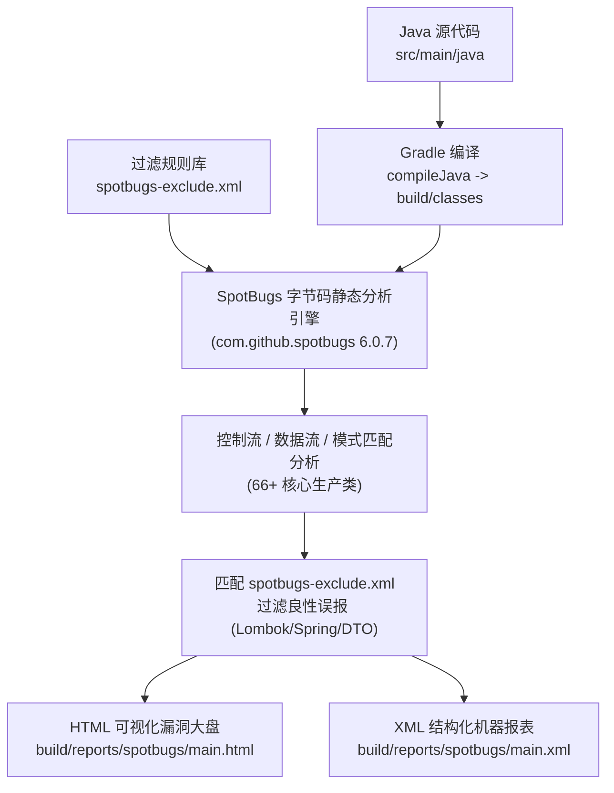

# SpotBugs 静态代码漏洞扫描与质量分析手册 (SpotBugs Analysis Manual)

## 📋 目录
- [一、SpotBugs 架构设计与静态分析原理](#一spotbugs-架构设计与静态分析原理)
  - [1.1 核心设计思路与字节码静态分析机制](#11-核心设计思路与字节码静态分析机制)
  - [1.2 Bug 模式分类体系与危险等级划分 (Rank & Priority)](#12-bug-模式分类体系与危险等级划分-rank--priority)
  - [1.3 静态扫描在 CI/CD 质量内建中的角色](#13-静态扫描在-cicd-质量内建中的角色)
- [二、核心实现细节与重难点剖析](#二核心实现细节与重难点剖析)
  - [2.1 build.gradle 构建集成与 HTML/XML 报表产出](#21-buildgradle-构建集成与-htmlxml-报表产出)
  - [2.2 spotbugs-exclude.xml 过滤规则精准降噪原理](#22-spotbugs-excludexml-过滤规则精准降噪原理)
  - [2.3 为什么 Spring Boot / MyBatis-Plus 会产生误报？](#23-为什么-spring-boot--mybatis-plus-会产生误报)
  - [2.4 check-spotbugs.bat 自动化批处理与浏览器联动](#24-check-spotbugsbat-自动化批处理与浏览器联动)
- [三、日常操作命令与排错调试手册](#三日常操作命令与排错调试手册)
  - [3.1 常用分析命令速查](#31-常用分析命令速查)
  - [3.2 漏洞报告阅读与典型 Bug 模式实战剖析](#32-漏洞报告阅读与典型-bug-模式实战剖析)
  - [3.3 典型问题排查与修复方案](#33-典型问题排查与修复方案)
- [四、已知不足与演进方向 (记录于 todo.md)](#四已知不足与演进方向-记录于-todomd)

---

## 一、SpotBugs 架构设计与静态分析原理

### 1.1 核心设计思路与字节码静态分析机制

**SpotBugs**（前身为著名的 FindBugs）是 Java 生态中最权威的静态代码分析工具之一。与基于源码 AST（抽象语法树）的 Checkstyle/PMD 不同，SpotBugs **直接分析编译后的 JVM 字节码（.class 文件）**：

1. **字节码流与控制流图分析 (Control Flow Graph & Data Flow)**：
   - 追踪方法内部每一条 JVM 字节码指令的执行路径与变量生命周期；
   - 能够检测到跨语句的潜在空指针反引用（Null Dereference）、未关闭的 I/O 流/数据库连接资源泄漏、死锁竞态条件等隐蔽缺陷。
2. **模式匹配算法 (Bug Pattern Matchers)**：
   - 内置数百种预置的代码漏洞规则库（Bug Patterns），将字节码序列与已知的缺陷模式进行特征比对。
3. **零运行开销 (Static Without Runtime)**：
   - 不需要启动 Spring 上下文或运行单元测试，仅需对编译产物扫描，耗时通常只需 10~30 秒。



---

### 1.2 Bug 模式分类体系与危险等级划分 (Rank & Priority)

SpotBugs 将检测到的问题按照类别与危害程度进行双重划分：

#### 1. 九大缺陷类别 (Categories)：
- **SECURITY (安全漏洞)**：密码硬编码、不可信输入、XSS/SQL 注入隐患。
- **CORRECTNESS (正确性缺陷)**：空指针异常、死循环、错误的比较（如 `==` 比较字符串）。
- **BAD_PRACTICE (不良实践)**：违反 Java 编码规范（如未重写 `hashCode`、忽略返回值）。
- **PERFORMANCE (性能隐患)**：多余的对象创建、循环内字符串拼接、低效的数据结构。
- **MALICIOUS_CODE (恶意代码漏洞)**：可变对象内部状态意外暴露（`EI_EXPOSE_REP`）。
- **MT_CORRECTNESS (多线程并发安全)**：非线程安全的单例字段读写、锁争抢死锁。
- **STYLE (代码坏味道)**：冗余赋值、无用局部变量。
- **EXPERIMENTAL (实验性规则)**。
- **I18N (国际化问题)**。

#### 2. 危险级别 (Rank 1~20)：
- **Rank 1 ~ 4**：🔴 **Scariest (最致命)**，必须立即修复，通常会导致生产奔溃或致命安全漏洞。
- **Rank 5 ~ 9**：🟠 **Scary (高危)**，存在严重稳定性隐患。
- **Rank 10 ~ 14**：🟡 **Troubling (中危)**，不良编码实践与性能隐患。
- **Rank 15 ~ 20**：🟢 **Of Concern (轻微关注)**，代码风格建议。

---

### 1.3 静态扫描在 CI/CD 质量内建中的角色

在 ListenPortfolio 的研发体系中，SpotBugs 作为**代码合并与发布前的第一道自动化质检防线**：
- 在代码提交阶段，通过运行 `./gradlew spotbugsMain` 在秒级内发现未关闭资源或空指针隐患；
- 与单元测试（JaCoCo）形成互补：单测验证“功能是否符合预期”，SpotBugs 验证“底层字节码实现是否存在安全与性能缺陷”。

---

## 二、核心实现细节与重难点剖析

### 2.1 build.gradle 构建集成与 HTML/XML 报表产出

工程在 [`build.gradle`](../build.gradle) 中配置了官方插件：

```groovy
plugins {
    // ...
    id 'com.github.spotbugs' version '6.0.7'
}

spotbugs {
    ignoreFailures = true    // 当前宽松策略：允许报告漏洞但不直接中断构建，便于循序渐进治理
    showStackTraces = true   // 打印分析堆栈信息
    showProgress = true      // 打印扫描进度 (0% -> 100%)
}

spotbugsMain {
    reports {
        xml.required = true  // 供 CI/CD 流水线解析
        html.required = true // 供开发者本地在浏览器中点击查看
    }
}
```

- 编译生成的覆盖率报告输出位置：
  - **HTML 根入口**：`build/reports/spotbugs/main.html`
  - **XML 机器解析文件**：`build/reports/spotbugs/main.xml`

---

### 2.2 spotbugs-exclude.xml 过滤规则精准降噪原理

未经定制的 SpotBugs 在现代 Spring Boot 框架下会产生海量“伪警告”。项目在根目录维护了定制过滤器 [`spotbugs-exclude.xml`](../spotbugs-exclude.xml)：

```xml
<?xml version="1.0" encoding="UTF-8"?>
<FindBugsFilter>
    <!-- 1. 排除测试类 (*Test*) -->
    <Match>
        <Class name="~.*Test.*" />
        <Bug pattern="~.*" />
    </Match>
    
    <!-- 2. 排除 Lombok 生成的内部合成类 ($ 符号命名) -->
    <Match>
        <Class name="~.*\$.*" />
        <Bug pattern="~.*" />
    </Match>
    
    <!-- 3. 排除实体类的可变对象直接引用暴露 (EI_EXPOSE_REP, EI_EXPOSE_REP2) -->
    <Match>
        <Class name="~.*Entity$" />
        <Bug pattern="EI_EXPOSE_REP,EI_EXPOSE_REP2" />
    </Match>
    
    <!-- 4. 排除 Mapper 返回值可能为 null 的良性告警 -->
    <Match>
        <Class name="~.*(Repository|Mapper)$" />
        <Bug pattern="NP_NULL_ON_SOME_PATH_FROM_RETURN_VALUE" />
    </Match>
    
    <!-- 5. 排除 Spring Config 类的序列化告警 (SE_BAD_FIELD) -->
    <Match>
        <Class name="~.*Config$" />
        <Bug pattern="SE_BAD_FIELD" />
        <Priority value="3" />
    </Match>
</FindBugsFilter>
```

---

### 2.3 为什么 Spring Boot / MyBatis-Plus 会产生误报？

#### 1. 内部状态暴露警告 (`EI_EXPOSE_REP`, `EI_EXPOSE_REP2`)
- **SpotBugs 的传统原则**：类中的 `Date`、`List` 等可变字段通过 Getter 返回或 Setter 赋值时，如果不做深拷贝（`new Date(...)`），外部调用方可以直接修改内部状态，破坏对象封装。
- **现实场景**：在 ORM 实体（Entity）与数据传输对象（DTO）中，做深拷贝不仅违背 JavaBean 规范，更会导致频繁创建多余对象，增大 GC 垃圾回收负担。因此必须通过正则定向抑制。

#### 2. 字段序列化警告 (`SE_BAD_FIELD`)
- **SpotBugs 的传统原则**：如果一个类实现了 `Serializable`，其内部注入的 Spring Service 必须同样可序列化。
- **现实场景**：Spring 管理的 Controller 与 Service 均为内存单例，无需落地磁盘或网络原生序列化，故该警告属于良性误报。

---

### 2.4 check-spotbugs.bat 自动化批处理与浏览器联动

针对 Windows 开发者的一键批处理脚本 [`check-spotbugs.bat`](../check-spotbugs.bat)：

```bat
@echo off
REM 步骤 1：调用本地 Gradle Wrapper 运行分析任务
call .\gradlew.bat spotbugsMain

REM 步骤 2：检查生成的 HTML 报告并自动调起浏览器
if exist "build\reports\spotbugs\main.html" (
    start "" "build\reports\spotbugs\main.html"
)
```

- 通过 `start "" "build
eports\spotbugs\main.html"` 自动调起 Windows 默认浏览器展示可视化报告，开发者点击即可直观定位风险代码行。

---

## 三、日常操作命令与排错调试手册

### 3.1 常用分析命令速查

```bash
# 1. Windows 一键执行并自动打开浏览器查看报表 (推荐)
.\check-spotbugs.bat

# 2. 命令行仅对生产代码进行静态扫描
./gradlew spotbugsMain

# 3. 对测试用例代码进行静态扫描 (可选)
./gradlew spotbugsTest

# 4. 强制清空编译产物后全量重新分析
./gradlew clean compileJava spotbugsMain

# 5. 生成报告后在命令行手动打开
start build/reports/spotbugs/main.html
```

---

### 3.2 漏洞报告阅读与典型 Bug 模式实战剖析

在浏览器中打开 `build/reports/spotbugs/main.html` 后，左侧为分类目录，右侧为源码高亮对照：

#### 典型 Bug 模式识别：
1. **`NP_NULL_ON_SOME_PATH` (可能发生空指针异常)**：
   - 典型代码：`user.getName().toLowerCase()` 当 `name` 数据库为 NULL 时崩溃。
   - 改进方案：使用 `Optional.ofNullable()` 或 `StringUtils.hasText()` 先行非空判断。
2. **`RCN_REDUNDANT_NULLCHECK_WOULD_HAVE_BEEN_A_NPE` (冗余的非空检查)**：
   - 典型代码：在已经反引用（调用方法）之后才执行 `if (obj != null)`。
3. **`DM_STRING_CTOR` (低效的 String 构造器)**：
   - 典型代码：`new String("hello")` 导致创建冗余的堆内存对象。
   - 改进方案：直接使用字符串字面量 `"hello"`。

---

### 3.3 典型问题排查与修复方案

#### 场景 1：运行 `spotbugsMain` 提示“No classes found to analyze”
- **原因**：源码尚未编译为 class 字节码。
- **修复**：先执行编译再分析：`./gradlew compileJava spotbugsMain`。

#### 场景 2：SpotBugs 发现高危问题但 Gradle 构建没有报错红灯
- **原因**：`build.gradle` 中设置了 `ignoreFailures = true`，默认不会中断构建流程。
- **修复**：若需要作为 CI 强阻断门禁，可在流水线执行 `./gradlew spotbugsMain -Pspotbugs.ignoreFailures=false`。

---

## 四、已知不足与演进方向 (记录于 todo.md)

基于对当前 SpotBugs 配置与静态质量审查机制的审计，规划了以下 4 项质量治理增强点，已系统化归档至 [`docs/todo.md`](./todo.md) 中的 **第 12 章节：SpotBugs 静态代码安全分析与质量门禁演进**：

1. **SpotBugs CI 门禁分级阻断机制 (Tiered Quality Gate: ignoreFailures Strategy)**：
   - 现存问题：目前 `ignoreFailures = true` 即使有高危漏洞构建仍绿灯。
   - 优化方案：引入分级机制，在 CI/CD 生产构建中对“Security”与“Scariest（Rank 1~4）”致命漏洞强制 `ignoreFailures = false` 阻断合并。
2. **引入 Find Security Bugs 插件深度扫描 OWASP Top 10 (Find Security Bugs Plugin)**：
   - 现存问题：仅使用默认规则库，Web 安全漏洞（SQL 注入、XSS、不安全凭据存储）检测深度有限。
   - 优化方案：集成 `findsecbugs-plugin:1.13.0` 扩展插件，对 REST API、JWT、文件上传展开 OWASP Top 10 深度巡检。
3. **spotbugs-exclude.xml 过滤规则精准化与现代化维护 (Precise Exclusion Maintenance)**：
   - 现存问题：采用宽泛的正则通配符（如 `~.*\$.*` 过滤所有内部类），可能误杀正常内部类的缺陷。
   - 优化方案：改用方法/类级别的精准 `@SuppressFBWarnings` 注解压制，并要求标注文档理由。
4. **PR 自动化 SpotBugs 增量审查报告机器人集成 (Automated PR Bug Review Bot)**：
   - 现存问题：缺乏 PR 增量反馈，需本地打开 HTML 排查。
   - 优化方案：在 GitHub Actions 流水线中集成机器审查机器人，自动在 PR 差异代码行留下警告批注。\n