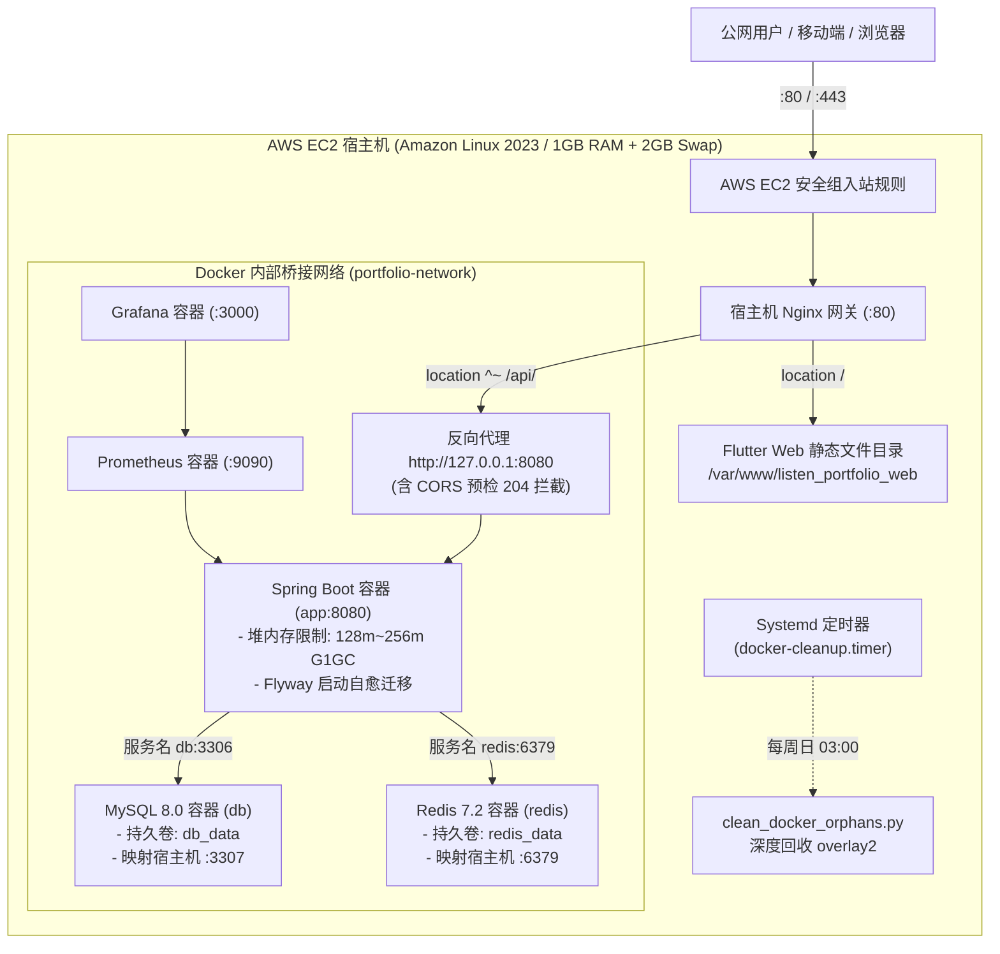
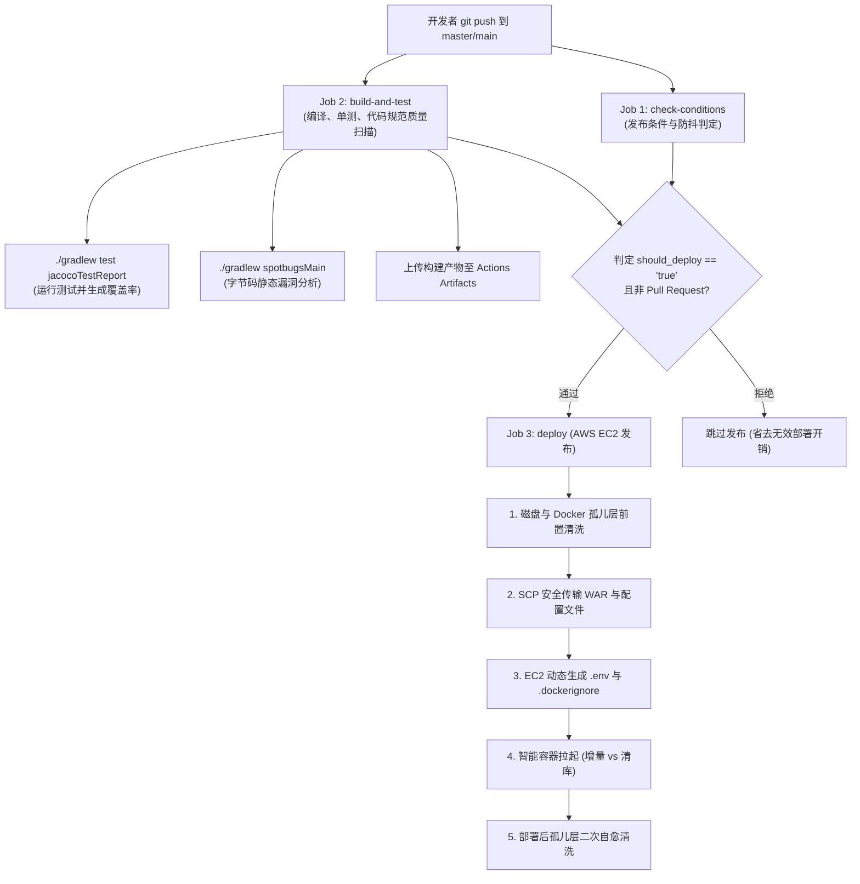

# AWS 生产部署与云原生运维实战指南 (AWS Architecture & GitOps Manual)

## 📋 目录
- [一、AWS 生产环境整体拓扑与设计思路](#一aws-生产环境整体拓扑与设计思路)
  - [1.1 宿主机与容器全栈架构拓扑](#11-宿主机与容器全栈架构拓扑)
  - [1.2 AWS t2.micro 极低资源约束下的架构设计哲学](#12-aws-t2micro-极低资源约束下的架构设计哲学)
  - [1.3 安全组网络边界与最小暴露原则](#13-安全组网络边界与最小暴露原则)
- [二、EC2 基础设施实战加固与核心实现](#二ec2-基础设施实战加固与核心实现)
  - [2.1 2GB Swap 虚拟内存激活与 OOM 彻底防御](#21-2gb-swap-虚拟内存激活与-oom-彻底防御)
  - [2.2 Amazon Linux 2023 Docker 与 Compose v2 现代化安装](#22-amazon-linux-2023-docker-与-compose-v2-现代化安装)
  - [2.3 宿主机 Nginx 生产配置 (动静路由、CORS、Wasm 缓存)](#23-宿主机-nginx-生产配置-动静路由corswasm-缓存)
  - [2.4 本地预编译 WAR 与 SCP 增量分发策略](#24-本地预编译-war-与-scp-增量分发策略)
- [三、GitHub Actions 自动化 CI/CD 流水线深度剖析](#三github-actions-自动化-cicd-流水线深度剖析)
  - [3.1 流水线三阶段架构设计 (Check -> Build/Test -> Deploy)](#31-流水线三阶段架构设计-check---buildtest---deploy)
  - [3.2 4 小时防抖与自动部署决策算法](#32-4-小时防抖与自动部署决策算法)
  - [3.3 增量部署 vs 清库部署 (clean deploy) 智能路由](#33-增量部署-vs-清库部署-clean-deploy-智能路由)
  - [3.4 免除 ssh-keyscan 与 Shell 多行证书解密保障](#34-免除-ssh-keyscan-与-shell-多行证书解密保障)
  - [3.5 孤儿层清洗引擎双保险 (CI Hook + Systemd 定时器)](#35-孤儿层清洗引擎双保险-ci-hook--systemd-定时器)
- [四、日常运维、排错与灾难恢复 SOP](#四日常运维排错与灾难恢复-sop)
  - [4.1 终端 SSH 与图形化数据库隧道 (SSH Tunnel) 连接](#41-终端-ssh-与图形化数据库隧道-ssh-tunnel-连接)
  - [4.2 容器与日志实时追踪命令](#42-容器与日志实时追踪命令)
  - [4.3 经典生产故障排查与应急修复 (Troubleshooting)](#43-经典生产故障排查与应急修复-troubleshooting)
- [五、进阶云原生托管方案演进 (ECS Fargate / EKS)](#五进阶云原生托管方案演进-ecs-fargate--eks)
- [六、已知不足与演进方向 (记录于 todo.md)](#六已知不足与演进方向-记录于-todomd)

---

## 一、AWS 生产环境整体拓扑与设计思路

### 1.1 宿主机与容器全栈架构拓扑

在当前的 AWS 生产环境中，系统运行于单一 AWS EC2 实例（IP: `13.218.192.181`），采用**宿主机高性能 Nginx 反向代理 + Docker Compose 多容器微服务编排**的混合架构。



---

### 1.2 AWS t2.micro 极低资源约束下的架构设计哲学

AWS 免费套餐（Free Tier）提供的 `t2.micro` 实例仅配备 **1 vCPU 与 1GB 内存**、8GB EBS 磁盘。
在如此严苛的物理环境下同时运行 Spring Boot 3 + MySQL 8.0 + Redis 7.2 + Prometheus + Grafana + Nginx，任何常规的默认参数都会在 10 分钟内引发系统彻底死机。

本项目采取了系统级的极致降本增效架构：
1. **JVM 物理内存锁死**：通过 `JAVA_OPTS: -Xms128m -Xmx256m -XX:+UseG1GC -XX:MaxGCPauseMillis=200` 将 Java 进程堆内存牢牢限定在 256MB 以内。
2. **虚拟内存缓冲 (Swap)**：划分 2GB 高性能交换分区，承载 MySQL 和系统突发瞬时负载，彻底免疫 Linux 内核 OOM Killer 强杀。
3. **本地预编译分发 (Out-of-Container Build)**：构建 JAR/WAR 产物在 GitHub Actions CI 虚拟机上完成，EC2 云服务器仅执行极简镜像组装，完全不消耗服务器的 CPU 与内存去跑 Gradle 编译。
4. **日志轮转硬限制**：所有容器一律配置 `max-size: 20m, max-file: 2`，保证系统日志永远不会撑爆 8GB EBS 磁盘。

---

### 1.3 安全组网络边界与最小暴露原则

生产环境 EC2 实例绑定的 AWS 安全组入站规则遵循最小特权原则：

| 端口号 | 协议 | 来源 (Source) | 业务用途说明 | 安全控制手段 |
| :---: | :---: | :---: | :--- | :--- |
| **80** | TCP | `0.0.0.0/0` | HTTP Web 访问与 REST API 统一网关 | 由 Nginx 接收，处理动静分流与限流 |
| **443** | TCP | `0.0.0.0/0` | HTTPS 加密传输通道 (规划中) | SSL/TLS 证书终止于 Nginx |
| **22** | TCP | `0.0.0.0/0` | SSH 远程维护与 GitHub Actions CI 部署 | **禁用密码登录**，仅限 `listen.pem` 私钥握手 |
| **8080** | TCP | 安全组内 / 本地 | Spring Boot 容器暴露端口 | 外部请求统一走 80 端口 Nginx 反向代理 |
| **3307** | TCP | 本地回环 `127.0.0.1` | MySQL 宿主机映射端口 | **严禁公网直连**，必须通过 SSH 隧道 (Tunnel) 访问 |
| **6379** | TCP | 本地回环 `127.0.0.1` | Redis 缓存宿主机映射端口 | 仅允许内网与本地调试，外网完全隐匿 |
| **3000** | TCP | 指定白名单 / 管理员 | Grafana 监控可视化大盘 | 生产环境建议通过内网端口转发访问 |

---

## 二、EC2 基础设施实战加固与核心实现

### 2.1 2GB Swap 虚拟内存激活与 OOM 彻底防御

当 1GB 内存用尽时，若无 Swap 分区，Linux 内核会启动 OOM Killer 随机杀死 `mysqld` 或 `java` 进程，甚至导致 SSH 守护进程挂起。

在 EC2 首次开机时必须执行以下标准加固脚本：
```bash
# 1. 在根磁盘创建 2GB 连续物理块空间
sudo dd if=/dev/zero of=/swapfile bs=128M count=16

# 2. 收敛安全权限（仅 root 可读写，防止内存敏感凭证被非特权用户嗅探）
sudo chmod 600 /swapfile

# 3. 格式化并激活交换空间
sudo mkswap /swapfile
sudo swapon /swapfile

# 4. 配置开机持久化挂载
echo '/swapfile swap swap defaults 0 0' | sudo tee -a /etc/fstab

# 5. 调整 Linux 内核交换积极度 (swappiness=10，优先物理内存，避免频繁 I/O)
echo 'vm.swappiness=10' | sudo tee -a /etc/sysctl.conf
sudo sysctl -p
```

---

### 2.2 Amazon Linux 2023 Docker 与 Compose v2 现代化安装

Amazon Linux 2023 使用现代的 `dnf` 包管理器，并全面拥抱 Docker Compose CLI Plugin（`docker compose` 不带连字符模式）：

```bash
# 1. 安装最新 Docker 引擎并设置开机自启
sudo dnf update -y
sudo dnf install -y docker
sudo systemctl enable --now docker
sudo usermod -aG docker ec2-user

# 2. 安装 Docker Compose v2 官方 CLI 插件
sudo mkdir -p /usr/libexec/docker/cli-plugins
sudo curl -SL "https://github.com/docker/compose/releases/download/v2.29.1/docker-compose-linux-x86_64"      -o /usr/libexec/docker/cli-plugins/docker-compose
sudo chmod +x /usr/libexec/docker/cli-plugins/docker-compose

# 3. 建立兼容软链接（使传统 docker-compose 脚本无缝兼容）
sudo ln -sf /usr/libexec/docker/cli-plugins/docker-compose /usr/local/bin/docker-compose
```

---

### 2.3 宿主机 Nginx 生产配置 (动静路由、CORS、Wasm 缓存)

宿主机 Nginx 作为流量总入口，配置文件位于 `/etc/nginx/conf.d/listen_portfolio.conf`：

```nginx
server {
    listen 80;
    server_name _;

    # 1. 静态资源路由：托管 Flutter Web 编译产物
    location / {
        root /var/www/listen_portfolio_web;
        index index.html;
        try_files $uri $uri/ /index.html;
    }

    # 2. 静态资源深度缓存 (JS, CSS, Wasm, 字体)
    location ~* \.(js|css|png|jpg|jpeg|gif|ico|svg|wasm|otf|ttf|woff|woff2)$ {
        root /var/www/listen_portfolio_web;
        expires 30d;
        add_header Cache-Control "public, no-transform";
        access_log off;
    }

    # 3. 动态 API 反向代理：路由至 Docker Spring Boot 容器
    location ^~ /api/ {
        # 跨域 CORS 预检请求 (OPTIONS) 极速响应 204
        if ($request_method = 'OPTIONS') {
            add_header 'Access-Control-Allow-Origin' '*' always;
            add_header 'Access-Control-Allow-Methods' 'GET, POST, PUT, DELETE, OPTIONS' always;
            add_header 'Access-Control-Allow-Headers' 'DNT,User-Agent,X-Requested-With,If-Modified-Since,Cache-Control,Content-Type,Range,Authorization,Accept-Language' always;
            add_header 'Access-Control-Max-Age' 1728000;
            add_header 'Content-Type' 'text/plain; charset=utf-8';
            add_header 'Content-Length' 0;
            return 204;
        }

        proxy_pass http://127.0.0.1:8080/;
        proxy_set_header Host $host;
        proxy_set_header X-Real-IP $remote_addr;
        proxy_set_header X-Forwarded-For $proxy_add_x_forwarded_for;
        proxy_set_header X-Forwarded-Proto $scheme;
        proxy_connect_timeout 60s;
        proxy_read_timeout 60s;
    }
}
```

---

### 2.4 本地预编译 WAR 与 SCP 增量分发策略

避免在云端 EC2 运行 `gradlew build`，在本地或 CI 环境先执行：
```powershell
# 1. 本地/CI 生成 WAR 包
./gradlew bootWar

# 2. SCP 传输核心产物至 EC2
scp -i tool/listen.pem build/libs/portfolio-0.0.1-SNAPSHOT.war ec2-user@13.218.192.181:~/portfolio/target/
scp -i tool/listen.pem Dockerfile docker-compose.yml ec2-user@13.218.192.181:~/portfolio/
scp -i tool/listen.pem -r monitoring tools ec2-user@13.218.192.181:~/portfolio/
```

---

## 三、GitHub Actions 自动化 CI/CD 流水线深度剖析

### 3.1 流水线三阶段架构设计 (Check -> Build/Test -> Deploy)

配置文件位于 [`.github/workflows/ci.yml`](../.github/workflows/ci.yml)：



---

### 3.2 4 小时防抖与自动部署决策算法

为了防止多人高频提交触发频繁无效部署造成云服务器抖动，流水线实现了**防抖（Debounce）决策引擎**：

1. **强制发布开关**：Commit 消息中包含 `[deploy]`, `deploy`, `release`, 或 `clean deploy` 时，**无条件立即触发发布**。
2. **纯文档修改过滤**：若本次提交仅修改了 `*.md`、`docs/` 或 `LICENSE` 等非代码文件，**自动跳过发布**。
3. **4 小时冷却周期**：常规提交若距离上次成功发布不足 4 小时，跳过部署；若超过 4 小时，自动触发定时发布。

---

### 3.3 增量部署 vs 清库部署 (clean deploy) 智能路由

在 CI 部署步骤中：
```bash
if [[ "$COMMIT_MESSAGE" == *"clean deploy"* || "$COMMIT_MESSAGE" == *"deploy-clean"* ]]; then
    # 模式 A：清库重置部署 (清除包括 MySQL 数据卷在内的全部旧数据，从 Flyway V1 重新跑起)
    ssh -i ~/.ssh/id_rsa ec2-user@$AWS_HOST       "cd ~/portfolio && docker compose --profile local down -v && docker compose --profile local build --no-cache app && docker compose --profile local up -d && python3 ~/portfolio/tools/clean_docker_orphans.py"
else
    # 模式 B：常规增量热部署 (数据卷保留，秒级无缝重启应用容器)
    ssh -i ~/.ssh/id_rsa ec2-user@$AWS_HOST       "cd ~/portfolio && docker compose --profile local build --no-cache app && docker compose --profile local up -d && python3 ~/portfolio/tools/clean_docker_orphans.py"
fi
```

---

### 3.4 免除 ssh-keyscan 与 Shell 多行证书解密保障

CI 流水线针对自动化 SSH 握手进行了高可用加固：
1. **彻底规避 `ssh-keyscan` 偶发性网络中断**：
   在 CI 虚拟机全局 `~/.ssh/config` 写入：
   ```
   Host *
     StrictHostKeyChecking no
     UserKnownHostsFile /dev/null
     ConnectTimeout 30
     ConnectionAttempts 5
   ```
   免去了对动态 IP 指纹嗅探的依赖，即使 AWS 防火墙有防护也不会挂起。
2. **多行 PEM 证书防破坏转义**：
   将 `secrets.AWS_SSH_KEY` 绑定在 Shell `env` 变量中，通过 `echo "$SSH_KEY" > ~/.ssh/id_rsa` 单向输出，避免 YAML 语法引擎对换行符破坏导致密钥失效。

---

### 3.5 孤儿层清洗引擎双保险 (CI Hook + Systemd 定时器)

针对 8GB 磁盘枯竭痛点，部署链路配置了双保险：
1. **发布钩子 (Deploy Hook)**：每次 `docker compose up -d` 之后立即执行 `python3 ~/portfolio/tools/clean_docker_orphans.py`。
2. **每周定时自愈 (Weekly Systemd Timer)**：在 EC2 上启用了 `docker-cleanup.timer`，每周日凌晨 03:00 自动执行一次深度拓扑清扫，即使长期无发布也不会发生磁盘溢出。

---

## 四、日常运维、排错与灾难恢复 SOP

### 4.1 终端 SSH 与图形化数据库隧道 (SSH Tunnel) 连接

```bash
# 1. 本地终端通过私钥登录云服务器
ssh -i "tool/listen.pem" ec2-user@13.218.192.181

# 2. 查看系统当前物理内存与 Swap 占用
free -h

# 3. 查看根磁盘剩余空间
df -h /
```

#### Navicat / DBeaver 数据库安全连接 (SSH 隧道方式)：
- **常规连接**：主机 `localhost`，端口 `3307`，用户 `root`，密码 `Ls-88888888`。
- **SSH 隧道**：主机 `13.218.192.181`，端口 `22`，用户 `ec2-user`，认证方式选择私钥 `tool/listen.pem`。

---

### 4.2 容器与日志实时追踪命令

```bash
# 进入项目部署工作目录
cd ~/portfolio

# 查看所有容器健康状态与端口映射
docker compose --profile local ps

# 实时追踪 Spring Boot 后端主应用日志
docker compose --profile local logs -f app

# 实时追踪数据库日志
docker compose --profile local logs -f db

# 手动重启单一服务
docker compose --profile local restart app
```

---

### 4.3 经典生产故障排查与应急修复 (Troubleshooting)

#### 故障 1：SSH 登录超时，提示 `Connection timed out during banner exchange`
- **成因**：物理内存（1GB）耗尽，Linux 内核陷入频繁页换出死锁，SSH 进程无响应。
- **SOP 修复方案**：
  1. 进入 AWS 控制台，对该实例执行 **“强制停止 (Force Stop)”**；
  2. 待 Stopped 状态后重新 **“启动 (Start)”**；
  3. 连入后立即检查并确保 `swapon -s` 显示 2GB Swap 分区已挂载。

#### 故障 2：访问 API 返回 502 Bad Gateway
- **成因**：Spring Boot 容器正在拉起，或者 Flyway 迁移脚本发生死锁崩溃退出。
- **SOP 修复方案**：
  1. 执行 `docker compose ps` 查看 `app` 容器是否处于 Exited 状态；
  2. 执行 `docker compose logs app --tail=100` 查看异常堆栈；
  3. 若为 Flyway 校验和不一致，执行自动修复或重新部署。

---

## 五、进阶云原生托管方案演进 (ECS Fargate / EKS)

当业务流量增长、需要 SLA 99.99% 高可用时，单台 EC2 虚机应平滑演进为 AWS 托管云原生架构：

| 维度 | 当前方案 (EC2 + Compose) | 进阶推荐方案 (AWS ECS Fargate) | 大型分布式方案 (AWS EKS) |
| :--- | :--- | :--- | :--- |
| **计算架构** | 单台虚拟机 `t2.micro` | 无服务器容器 (Serverless Container) | 托管 Kubernetes 集群 |
| **运维负担** | 需维护 Linux 内核、Swap、磁盘 | **零虚机运维**，仅关注容器镜像 | 需维护 K8s 节点与网络插件 |
| **数据库** | 容器内自建 MySQL 8.0 | **AWS RDS (Aurora Serverless v2)** | AWS RDS 或分布式 TiDB |
| **缓存** | 容器内自建 Redis 7.2 | **AWS ElastiCache for Redis** | AWS ElastiCache 集群 |
| **弹性伸缩** | 手动垂直扩容 (修改实例规格) | 基于 CPU/内存指标**秒级自动水平伸缩** | HPA / KEDA 高级自动伸缩 |
| **高可用性** | 单可用区 (AZ)，存在单点故障 | **跨多可用区 (Multi-AZ) 容灾** | 跨多可用区 / 跨地域容灾 |
| **月度预算** | 免费套餐 / 极低成本 (~$5/月) | 按秒计费 (~$20~$50/月) | 较高 ($100+/月起) |

---

## 六、已知不足与演进方向 (记录于 todo.md)

基于对当前 AWS 生产拓扑与自动化流水线的深度审计，识别出以下 4 项核心演进点，已系统化归档至 [`docs/todo.md`](./todo.md) 中的 **第 13 章节：AWS 云上生产架构与自动化流水线演进**：

1. **基于 AWS Systems Manager (SSM) 的零开放端口安全通信 (SSM Session Manager)**：
   - 现存问题：CI/CD 部署与远程连接依赖安全组开放 22 端口并暴露于公网。
   - 优化方案：启用 AWS SSM Agent，彻底关闭公网 22 端口，通过 IAM 授权的加密 Session 通道进行管理和部署。
2. **静态资源 CDN 加速与 AWS CloudFront / S3 动静分离 (CloudFront Static Acceleration)**：
   - 现存问题：Flutter Web 静态文件与 CanvasKit Wasm 资源由单机 Nginx 直接承载，消耗单核 EC2 宝贵带宽。
   - 优化方案：将前端构建产物部署至 S3 存储桶并挂载 CloudFront 全球 CDN 边缘节点，仅将 `/api/*` 动态流量回源。
3. **GitHub Actions 部署后自动化全链路烟雾测试与自愈回滚 (Automated Smoke Test & Rollback)**：
   - 现存问题：CI 流水线在容器启动后即标记成功，无法感知容器内初始化崩溃。
   - 优化方案：追加自动化健康探测脚本（验证 `/actuator/health` 与 `/api/v1/projects`），探测失败自动拉起上一版本备份并回滚。
4. **生产环境向无服务器容器 AWS ECS Fargate 平滑迁移评估 (ECS Fargate Migration Readiness)**：
   - 现存问题：单机 EC2 虚机存在硬件单点故障。
   - 优化方案：输出 Terraform / CloudFormation IaC 编排模板，将 Spring Boot App 与托管 RDS / ElastiCache 对接，实现高可用弹性伸缩。\n