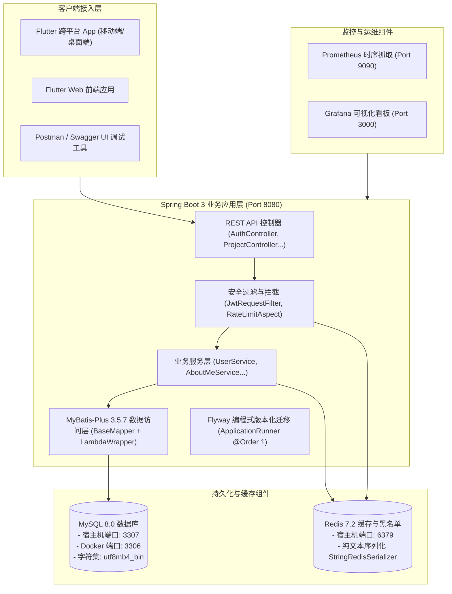

# 本地开发环境搭建与工程实战手册 (Development Setup & Architecture Guide)

## 📋 目录
- [一、开发环境整体设计理念与架构模型](#一开发环境整体设计理念与架构模型)
  - [1.1 架构分层与依赖模型](#11-架构分层与依赖模型)
  - [1.2 双轨配置设计理念 (本地 IDE 直跑 vs Docker 容器)](#12-双轨配置设计理念-本地-ide-直跑-vs-docker-容器)
  - [1.3 双轨网络与端口映射矩阵](#13-双轨网络与端口映射矩阵)
- [二、环境基线与工具链准备](#二环境基线与工具链准备)
  - [2.1 基础软件版本要求](#21-基础软件版本要求)
  - [2.2 推荐开发工具 (IDE & 调试插件)](#22-推荐开发工具-ide--调试插件)
  - [2.3 环境变量注入机制 (.env 与 OS Env)](#23-环境变量注入机制-env-与-os-env)
- [三、双模式快速拉起实战指引](#三双模式快速拉起实战指引)
  - [3.1 模式 A：本地混合开发 (推荐：IDE 直跑 + Docker 基础组件)](#31-模式-a本地混合开发-推荐ide-直跑--docker-基础组件)
  - [3.2 模式 B：全栈纯容器化开发 (一键脚本自动化)](#32-模式-b全栈纯容器化开发-一键脚本自动化)
  - [3.3 模式 C：纯本地手工安装 (无 Docker 环境)](#33-模式-c纯本地手工安装-无-docker-环境)
- [四、核心实现细节与重难点剖析](#四核心实现细节与重难点剖析)
  - [4.1 为什么禁用 JPA / Hibernate 迁移至 MyBatis-Plus？](#41-为什么禁用-jpa--hibernate-迁移至-mybatis-plus)
  - [4.2 为什么 Application 类必须 exclude FlywayAutoConfiguration？](#42-为什么-application-类必须-exclude-flywayautoconfiguration)
  - [4.3 单测环境纯内存 H2 隔离与极速执行原理](#43-单测环境纯内存-h2-隔离与极速执行原理)
- [五、验证与联调入口速查](#五验证与联调入口速查)
  - [5.1 服务可用性与探针检查](#51-服务可用性与探针检查)
  - [5.2 Swagger UI 与 OpenAPI 交互式测试](#52-swagger-ui-与-openapi-交互式测试)
  - [5.3 监控指标大盘 (Prometheus / Grafana)](#53-监控指标大盘-prometheus--grafana)
- [六、常见开发问题与排错手册 (Troubleshooting)](#六常见开发问题与排错手册-troubleshooting)
  - [6.1 端口占用冲突处理 (8080/3307/6379)](#61-端口占用冲突处理-808033076379)
  - [6.2 数据库连接报错与时区/字符集陷阱](#62-数据库连接报错与时区字符集陷阱)
  - [6.3 Gradle 构建与本地依赖缓存刷新](#63-gradle-构建与本地依赖缓存刷新)
- [七、已知不足与演进方向 (记录于 todo.md)](#七已知不足与演进方向-记录于-todomd)

---

## 一、开发环境整体设计理念与架构模型

### 1.1 架构分层与依赖模型

ListenPortfolioBackend 采用标准的 **DDD / 分层整洁架构 (Clean Architecture)**。服务端由 Spring Boot 3 主程序、MySQL 8.0 关系型数据库、Redis 7.2 状态缓存中枢以及 Prometheus/Grafana 可观测性体系共同组成：



---

### 1.2 双轨配置设计理念 (本地 IDE 直跑 vs Docker 容器)

为了兼顾“**本地 IDE 代码秒级修改与断点调试**”以及“**线上容器化环境零差异交付**”，工程设计了无侵入的增量覆盖体系：

1. **主配置文件 (`application.properties`)**：
   - 默认配置为宿主机本地视角：数据库指向 `localhost:3306`（或本地安装的 MySQL），Redis 指向 `localhost:6379`。
   - 包含 95% 以上的系统通用业务参数（JWT 有效期、邮件 SMTP、HikariCP 连接池、日志级别等）。
2. **容器网络覆盖 (`application-docker.properties`)**：
   - 仅覆盖由于 Docker 虚拟桥接网络导致的 Hostname 差异：
     ```properties
     # 数据库主机重写为容器服务名 "db"
     spring.datasource.url=jdbc:mysql://db:3306/portfolio?useSSL=false&serverTimezone=Asia/Tokyo&characterEncoding=UTF-8&collation=utf8mb4_bin&allowPublicKeyRetrieval=true

     # Redis 主机重写为容器服务名 "redis"
     spring.data.redis.host=redis
     ```
   - 仅在由 Docker Compose 注入环境变量 `SPRING_PROFILES_ACTIVE=docker` 时生效，不污染本地开发。

---

### 1.3 双轨网络与端口映射矩阵

| 服务组件 | 容器内暴露端口 | 宿主机映射端口 | 本地 IDE 直跑访问地址 | 容器内微服务互访地址 |
| :--- | :---: | :---: | :--- | :--- |
| **Spring Boot App** | 8080 | 8080 | `http://localhost:8080` | `http://app:8080` |
| **MySQL 8.0** | 3306 | **3307** | `jdbc:mysql://localhost:3307/...` | `jdbc:mysql://db:3306/...` |
| **Redis 7.2** | 6379 | 6379 | `localhost:6379` | `redis:6379` |
| **Prometheus** | 9090 | 9090 | `http://localhost:9090` | `http://prometheus:9090` |
| **Grafana** | 3000 | 3000 | `http://localhost:3000` | `http://grafana:3000` |

> [!TIP]
> **为什么要将 MySQL 宿主机端口映射为 3307？**
> 本地开发者的电脑上往往安装了原生 MySQL 实例（默认占用 3306 端口）。将 Docker 容器映射到 3307 可以彻底避免端口冲突，实现本地原有数据库与本项目容器化数据库的和平共处。

---

## 二、环境基线与工具链准备

### 2.1 基础软件版本要求

| 软件组件 | 最低版本 | 推荐版本 | 选型与兼容性说明 |
| :--- | :---: | :---: | :--- |
| **Java (JDK)** | 17 | **Eclipse Temurin 17 LTS** | 必须使用 JDK 17（Spring Boot 3 强依赖） |
| **Gradle** | 8.5 | **8.5+ (项目内置 Wrapper)** | 统一使用 `./gradlew` 或 `.\gradlew.bat` |
| **Docker** | 20.10+ | **Docker Desktop 4.25+** | 提供容器化组件运行时 |
| **Docker Compose**| 2.0+ | **v2.20+ (CLI 插件模式)** | 支持 `docker compose` 子命令 |
| **Git** | 2.30+ | **2.40+** | 版本控制与换行符支持 |

### 2.2 推荐开发工具 (IDE & 调试插件)

- **开发 IDE**：
  - **IntelliJ IDEA Ultimate / Community** (首选，开箱即用支持 Spring Boot、Gradle 与 Lombok)
  - **Android Studio** (移动端开发者双开首选)
  - **VS Code** (搭配 Extension Pack for Java、Spring Boot Extension Pack)
- **必备插件**：
  - **Lombok Plugin**：必须启用 Annotation Processing（注解处理器）；
  - **Database Navigator / Database Tools**：用于直连本地与云端 MySQL；
  - **GitLens**：代码上下文溯源。

### 2.3 环境变量注入机制 (.env 与 OS Env)

Spring Boot 支持通过操作系统环境变量覆盖默认配置：

#### 常用开发环境变量速查：
```bash
# Windows PowerShell
$env:DB_URL="jdbc:mysql://localhost:3307/portfolio?useSSL=false&serverTimezone=Asia/Tokyo&characterEncoding=UTF-8&collation=utf8mb4_bin&allowPublicKeyRetrieval=true"
$env:DB_USERNAME="root"
$env:DB_PASSWORD="your_custom_password"
$env:JWT_SECRET="your-super-strong-secret-key-that-is-at-least-256-bits-long"
$env:MAIL_PASSWORD="your-gmail-app-password"

# Linux / macOS Bash
export DB_URL="jdbc:mysql://localhost:3307/portfolio?useSSL=false&serverTimezone=Asia/Tokyo&characterEncoding=UTF-8&collation=utf8mb4_bin&allowPublicKeyRetrieval=true"
export DB_USERNAME="root"
export DB_PASSWORD="your_custom_password"
export JWT_SECRET="your-super-strong-secret-key-that-is-at-least-256-bits-long"
export MAIL_PASSWORD="your-gmail-app-password"
```

---

## 三、双模式快速拉起实战指引

### 3.1 模式 A：本地混合开发 (推荐：IDE 直跑 + Docker 基础组件)

这是日常功能研发、断点调试与热修改的最佳姿势。

#### 步骤 1：仅拉起 MySQL 与 Redis 容器
```bash
# 启动数据库和缓存中间件（映射宿主机 3307 和 6379 端口）
docker-compose up -d db redis

# 确认容器处于 Up (healthy) 状态
docker-compose ps
```

#### 步骤 2：启动 Spring Boot 应用
- **方式一（IDE）**：直接在 IntelliJ IDEA 中打开主类 [`PortfolioApplication.java`](../src/main/java/com/listen/portfolio/PortfolioApplication.java)，配置环境变量 `DB_URL=jdbc:mysql://localhost:3307/portfolio?...` 后点击 Debug/Run。
- **方式二（命令行）**：
  ```bash
  # Windows PowerShell
  $env:DB_URL="jdbc:mysql://localhost:3307/portfolio?useSSL=false&serverTimezone=Asia/Tokyo&characterEncoding=UTF-8&collation=utf8mb4_bin&allowPublicKeyRetrieval=true"
  .\gradlew.bat bootRun

  # Linux / Mac
  export DB_URL="jdbc:mysql://localhost:3307/portfolio?useSSL=false&serverTimezone=Asia/Tokyo&characterEncoding=UTF-8&collation=utf8mb4_bin&allowPublicKeyRetrieval=true"
  ./gradlew bootRun
  ```

---

### 3.2 模式 B：全栈纯容器化开发 (一键脚本自动化)

适合验证生产容器同构环境、或者前端/移动端开发者无需关注后端代码细节。

```powershell
# Windows PowerShell 一键拉起全栈（包含 Gradle 构建、Docker 启动与健康检查轮询）
.\docker_deploy.ps1

# 手动命令拉起
docker-compose --profile local up -d --build

# 停止全栈容器并释放资源
.\docker_stop.ps1
```

---

### 3.3 模式 C：纯本地手工安装 (无 Docker 环境)

若开发者未安装 Docker，也可在本机直接安装原生 MySQL 8.0 与 Redis：
1. **创建数据库**：
   ```sql
   CREATE DATABASE portfolio DEFAULT CHARSET utf8mb4 COLLATE utf8mb4_bin;
   ```
2. **启动本地 Redis**：
   ```bash
   redis-server
   ```
3. **直接运行应用**：
   ```bash
   ./gradlew bootRun
   ```
   *应用启动时，`FlywayConfig` 会自动接管数据库并自动执行 V1/V2 建表与灌入测试数据。*

---

## 四、核心实现细节与重难点剖析

### 4.1 为什么禁用 JPA / Hibernate 迁移至 MyBatis-Plus？

在早期的 Spring Boot JPA 架构中，存在两大长期痛点：
1. **隐蔽的 N+1 查询与 Open-Session-In-View 性能陷阱**：在查询用户信息及其证书列表时，容易产生级联懒加载引发的大量往返查询。
2. **复杂多语言字段与关联表控制力不足**：多语言字段（如 `bio_zh`, `bio_ja`）需要高灵活度的 SQL 控制。

#### 重构收益：
- 全工程已全面切换为 **MyBatis-Plus (v3.5.7)**；
- 实体类采用强类型注解（`@TableName`, `@TableId(type = IdType.AUTO)`, `@TableLogic`, `@TableField`）；
- Service 层全面使用 Lambda 类型安全的查询包装器（`LambdaQueryWrapper`），杜绝拼写错误，查询吞吐与 SQL 可控性大幅提升。

---

### 4.2 为什么 Application 类必须 exclude FlywayAutoConfiguration？

在 [`PortfolioApplication.java`](../src/main/java/com/listen/portfolio/PortfolioApplication.java) 中：
```java
@SpringBootApplication(exclude = {FlywayAutoConfiguration.class})
@MapperScan("com.listen.portfolio.mapper")
public class PortfolioApplication { ... }
```

#### 架构考量与难点：
- **循环依赖根除**：Spring Boot 默认的 `FlywayAutoConfiguration` 企图在 `DataSource` 初始化的同时构建 Flyway Bean。然而系统中的安全审计拦截器、AOP 限流切面与 `CustomUserDetailsService` 同时引用了数据源，在 Spring 启动初期会形成底层循环依赖引发崩溃。
- **精准受控执行**：通过在启动类显式 `exclude`，并在独立的 [`FlywayConfig.java`](../src/main/java/com/listen/portfolio/common/config/FlywayConfig.java) 中实现 `ApplicationRunner` (`@Order(1)`)，使 Spring 容器全部 Bean 组装完毕后再手动拉起 Flyway，彻底根治框架级依赖死锁。

---

### 4.3 单测环境纯内存 H2 隔离与极速执行原理

在运行全量单测时，为了实现“**秒级完成、纯内存运行、零外部组件依赖**”：
1. **测试配置重写 (`application-test.properties`)**：
   - 数据库强制重写为 `jdbc:h2:mem:testdb`；
   - 标记 `@Profile("!test")` 彻底跳过 Flyway 对 MySQL 迁移脚本的执行；
2. **H2 Schema 自动化建表**：
   - 测试上下文通过轻量 `schema-h2.sql` 或 MyBatis 映射在内存中快速初始化数据表；
3. **单测覆盖结果**：
   - 全工程 **338+ 单元与集成测试 100% 绿色秒级通过**，且绝不污染本地真实数据库。

---

## 五、验证与联调入口速查

### 5.1 服务可用性与探针检查

```bash
# 检查应用核心就绪状态 (返回 {"status":"UP"} 为正常)
curl http://localhost:8080/actuator/health

# 验证公网只读项目 API
curl http://localhost:8080/api/v1/projects

# 验证中英日多语言切换 (通过请求头 Accept-Language)
curl -H "Accept-Language: zh-CN" http://localhost:8080/api/v1/about-me
curl -H "Accept-Language: ja-JP" http://localhost:8080/api/v1/about-me
```

---

### 5.2 Swagger UI 与 OpenAPI 交互式测试

- **Swagger UI 交互大盘**：`http://localhost:8080/swagger-ui.html`
- **OpenAPI v3 JSON 契约**：`http://localhost:8080/v3/api-docs`

> [!NOTE]
> 在 Swagger UI 中可直接在 `Authorize` 按钮输入 `Bearer <JWT_TOKEN>`，即可直接在页面上调试受权限保护的管理端接口。

---

### 5.3 监控指标大盘 (Prometheus / Grafana)

- **Prometheus 原生指标端点**：`http://localhost:8080/actuator/prometheus`
- **Prometheus 监控服务控制台**：`http://localhost:9090`
- **Grafana 数据可视化面板**：`http://localhost:3000` (默认管理员账号/密码: `admin / admin123`)

---

## 六、常见开发问题与排错手册 (Troubleshooting)

### 6.1 端口占用冲突处理 (8080/3307/6379)

#### 症状：
启动应用或容器报错 `Bind for 0.0.0.0:8080 failed: port is already allocated`。

#### 排错命令：
```powershell
# Windows 查看指定端口占用进程 PID
netstat -ano | findstr :8080

# 强制结束占用进程 (根据查到的 PID)
taskkill /F /PID <PID>

# 或直接运行项目内置全栈清理脚本
.\docker_stop.ps1
```

---

### 6.2 数据库连接报错与时区/字符集陷阱

#### 症状：
报错 `The server time zone value '...' is unrecognized` 或中文/日文存入数据库显示乱码问号。

#### 正确连接字符串规范：
```
jdbc:mysql://localhost:3307/portfolio?useSSL=false&serverTimezone=Asia/Tokyo&characterEncoding=UTF-8&collation=utf8mb4_bin&allowPublicKeyRetrieval=true
```
- `serverTimezone=Asia/Tokyo`：确保日本东京时间戳对齐；
- `characterEncoding=UTF-8` 与 `collation=utf8mb4_bin`：保证支持 Emoji 与国际化日文字符。

---

### 6.3 Gradle 构建与本地依赖缓存刷新

```bash
# 强制清空编译产物与旧缓存重新构建
./gradlew clean build -x test

# 排除高耗时性能测试运行单测并生成覆盖率报告
./gradlew test -Dtest=!PerformanceTest jacocoTestReport

# 查看本地 Gradle 任务列表
./gradlew tasks
```

---

## 七、已知不足与演进方向 (记录于 todo.md)

基于对当前开发环境配置与工具链的审计，规划了以下 4 项研发体验（DX）增强点，已系统化归档至 [`docs/todo.md`](./todo.md) 中的 **第 14 章节：本地研发体验与环境隔离演进**：

1. **Spring Boot DevTools 热加载与极速重启支持 (Spring Boot DevTools Integration)**：
   - 现存问题：修改 Java 代码后需完整重新打包重启，影响调试效率。
   - 优化方案：引入 `spring-boot-devtools` 依赖，利用双层类加载器实现秒级代码热替换与资源重载。
2. **Docker Compose 本地按需开发编排拆分 (docker-compose.dev.yml)**：
   - 现存问题：Compose 文件将 App 与基础中间件混合，本地 IDE 调试时需手动过滤启动容器。
   - 优化方案：拆分出专门的 `docker-compose.infra.yml`（仅包含 MySQL + Redis），一键秒级拉起基础设施。
3. **跨平台开发统一启动与环境探测脚本 (Make / Just / Bash CLI)**：
   - 现存问题：当前自动化脚本多为 Windows PowerShell/Bat，Mac/Linux 开发者体验欠佳。
   - 优化方案：编写通用的 `Makefile` 或 `justfile` 规范跨平台日常研发指令。
4. **统一代码格式化与 Git Pre-commit 静态卡点 (Spotless / Pre-commit Hook)**：
   - 现存问题：不同 IDE 格式化规则差异易导致 Git Commit 产生多余 Diff。
   - 优化方案：集成 Gradle Spotless（Google Java Format）并在 Git Pre-commit 阶段自动化格式校验。\n