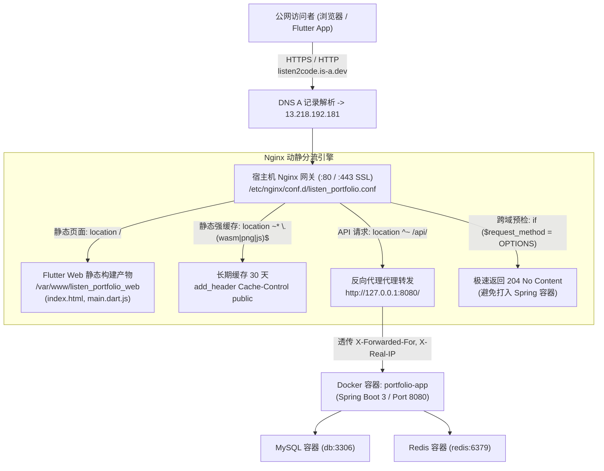

# 域名解析、Nginx 生产反向代理与 Let's Encrypt HTTPS 实战手册 (Nginx & SSL Manual)

## 📋 目录
- [一、网关架构设计与设计思路](#一网关架构设计与设计思路)
  - [1.1 总体架构与流量分流拓扑](#11-总体架构与流量分流拓扑)
  - [1.2 为什么必须采用 Nginx 作为宿主机前端网关？](#12-为什么必须采用-nginx-作为宿主机前端网关)
  - [1.3 免费顶级开发者域名 (is-a.dev) 解析体系](#13-免费顶级开发者域名-is-adev-解析体系)
- [二、核心实现细节与重难点剖析](#二核心实现细节与重难点剖析)
  - [2.1 Nginx 动静分离与 Flutter Web SPA 路由重定向 (try_files)](#21-nginx-动静分离与-flutter-web-spa-路由重定向-try_files)
  - [2.2 跨域 CORS 预检请求 (OPTIONS 204) 极速拦截机制](#22-跨域-cors-预检请求-options-204-极速拦截机制)
  - [2.3 静态切片与 CanvasKit Wasm 深度缓存优化](#23-静态切片与-canvaskit-wasm-深度缓存优化)
  - [2.4 反向代理头部透传与 Spring Boot Real-IP 识别 (X-Forwarded-*)](#24-反向代理头部透传与-spring-boot-real-ip-识别-x-forwarded-)
- [三、Let's Encrypt 证书申请与自动化运维](#三lets-encrypt-证书申请与自动化运维)
  - [3.1 Certbot ACME 协议申请全流程](#31-certbot-acme-协议申请全流程)
  - [3.2 证书注入后 Nginx 443 SSL 标准配置剖析](#32-证书注入后-nginx-443-ssl-标准配置剖析)
  - [3.3 证书自动续签与 Systemd Timer 守护机制](#33-证书自动续签与-systemd-timer-守护机制)
- [四、日常操作命令与排错调试手册](#四日常操作命令与排错调试手册)
  - [4.1 常用 Nginx 与 Certbot 管理指令速查](#41-常用-nginx-与-certbot-管理指令速查)
  - [4.2 经典故障排查 (502 Bad Gateway, 证书验证失败, 404/CORS 报错)](#42-经典故障排查-502-bad-gateway-证书验证失败-404cors-报错)
- [五、客户端集成验证 (Flutter 移动端与 Web 端)](#五客户端集成验证-flutter-移动端与-web-端)
- [六、已知不足与演进方向 (记录于 todo.md)](#六已知不足与演进方向-记录于-todomd)

---

## 一、网关架构设计与设计思路

### 1.1 总体架构与流量分流拓扑

在 ListenPortfolio 的生产拓扑中，外部流量通过唯一公开的 `80` (HTTP) 与 `443` (HTTPS) 端口进入服务器，统一由宿主机 **Nginx** 充当反向代理网关与静态资源服务器，再向后方 Docker 桥接网络中的 Spring Boot 微服务容器（`127.0.0.1:8080`）进行路由分发。



---

### 1.2 为什么必须采用 Nginx 作为宿主机前端网关？

如果让 Spring Boot 容器直接将 `8080` 端口暴露给公网，会面临严重的设计与运维缺陷：
1. **隐藏端口号，标准化 URL**：对外统一使用标准的 80/443 端口，用户无需记忆 `:8080` 后缀。
2. **动静分流极致性能**：Flutter Web 的编译产物（HTML, JS, WebAssembly）直接由 Nginx 借助 Linux 零拷贝（`sendfile`）内核机制高效发送，吞吐量是 JVM 处理静态文件的 10 倍以上，且不消耗 JVM 堆内存。
3. **CORS 跨域预检轻量拦截**：浏览器发起的复杂请求必定先发送 `OPTIONS` 探测。由 Nginx 直接返回 `204`，避免大量轻量探测请求穿透进 Spring Security 过滤器链，大幅节省 CPU 算力。
4. **统一 SSL 终止 (SSL Offloading)**：SSL/TLS 握手计算由 Nginx 在 C 语言层高效处理，Spring Boot 内部维持轻量 HTTP 通信，降低架构耦合度。

---

### 1.3 免费顶级开发者域名 (is-a.dev) 解析体系

项目采用开源极客社区提供的开放开发者子域名：
- **目标域名**：`listen2code.is-a.dev`
- **解析配置方式**：在 GitHub 开源仓库 [is-a-dev/register](https://github.com/is-a-dev/register) 提交 Pull Request，在 `domains/listen2code.json` 中配置：
  ```json
  {
      "description": "Listen Portfolio Web & API Backend Service",
      "repo": "https://github.com/listen2code/ListenPortfolioBackend",
      "owner": {
          "username": "listen2code",
          "email": "listen2code@gmail.com"
      },
      "record": {
          "A": ["13.218.192.181"]
      }
  }
  ```
- **生效核验**：
  ```bash
  ping listen2code.is-a.dev
  # 输出: 来自 13.218.192.181 的回复: 字节=32 时间=...
  ```

---

## 二、核心实现细节与重难点剖析

### 2.1 Nginx 动静分离与 Flutter Web SPA 路由重定向 (try_files)

在单页面应用（SPA）中，当用户在浏览器直接刷新如 `/projects` 或 `/about` 页面时，若物理路径不存在该文件，Nginx 默认会返回 404 Not Found。

```nginx
location / {
    root /var/www/listen_portfolio_web;
    index index.html;
    # 关键机制：优先匹配物理文件/目录，若无则内部重定向至 index.html 交由 Flutter 客户端路由解析
    try_files $uri $uri/ /index.html;
}
```

---

### 2.2 跨域 CORS 预检请求 (OPTIONS 204) 极速拦截机制

#### 难点痛点：
移动端和 Web 端调用跨域 API 时，浏览器会强制发送一次 HTTP `OPTIONS` 预检请求。如果预检请求打入 Spring Boot 容器，会依次触发 Tomcat 线程池获取、Filter 链解析、Spring Security 上下文构造，带来不必要的延迟（通常耗时 50~100ms）。

#### 高性能实现：
在 Nginx `location ^~ /api/` 中实施网关级硬拦截：
```nginx
if ($request_method = 'OPTIONS') {
    add_header 'Access-Control-Allow-Origin' '*' always;
    add_header 'Access-Control-Allow-Methods' 'GET, POST, PUT, DELETE, OPTIONS' always;
    add_header 'Access-Control-Allow-Headers' 'DNT,User-Agent,X-Requested-With,If-Modified-Since,Cache-Control,Content-Type,Range,Authorization,Accept-Language' always;
    add_header 'Access-Control-Max-Age' 1728000; # 缓存预检结果 20 天，避免频繁重试
    add_header 'Content-Type' 'text/plain; charset=utf-8';
    add_header 'Content-Length' 0;
    return 204; # 极速返回 204 No Content，0ms 进内核
}
```

---

### 2.3 静态切片与 CanvasKit Wasm 深度缓存优化

Flutter Web 采用先进的 CanvasKit / Skia 渲染引擎，核心产物包含数兆的 `.wasm` 二进制文件与字体图标：
```nginx
location ~* \.(js|css|png|jpg|jpeg|gif|ico|svg|wasm|otf|ttf|woff|woff2)$ {
    root /var/www/listen_portfolio_web;
    expires 30d; # 浏览器本地持久缓存 30 天
    add_header Cache-Control "public, no-transform";
    access_log off; # 关闭静态资源访问日志，保护磁盘 I/O
}
```
- **核心收益**：首屏加载之后，后续访问完全走浏览器本地磁盘缓存（`from disk cache`），二次进入实现 **0 秒秒开**。

---

### 2.4 反向代理头部透传与 Spring Boot Real-IP 识别 (X-Forwarded-*)

由于请求经过了 Nginx 反向代理，Spring Boot 容器内通过 `request.getRemoteAddr()` 获取到的将永远是宿主机本地回环 `127.0.0.1`。这会导致：
1. 日志记录的客户端 IP 全部为 127.0.0.1；
2. 限流切面（`RateLimitAspect`）基于客户端 IP 防刷时，误将所有用户的请求累加到同一 IP，造成全局误杀！

#### 解决方案与代码联动：
1. **Nginx 头部注入**：
   ```nginx
   proxy_pass http://127.0.0.1:8080/;
   proxy_set_header Host $host;
   proxy_set_header X-Real-IP $remote_addr;
   proxy_set_header X-Forwarded-For $proxy_add_x_forwarded_for;
   proxy_set_header X-Forwarded-Proto $scheme;
   ```
2. **Spring Boot 代码解析联动 ([`RequestLoggingFilter.java`](../src/main/java/com/listen/portfolio/common/config/RequestLoggingFilter.java))**：
   - 过滤器自动识别 `X-Forwarded-For` 与 `X-Real-IP` 请求头，精准提取客户端真实公网 IP。

---

## 三、Let's Encrypt 证书申请与自动化运维

### 3.1 Certbot ACME 协议申请全流程

在 Amazon Linux 2023 上使用官方推荐的 Certbot 自动化客户端：

```bash
# 1. 安装 Certbot 与 Nginx 联动插件
sudo dnf install python3-certbot-nginx -y

# 2. 执行自动化签发与注入 (指定绑定域名)
sudo certbot --nginx -d listen2code.is-a.dev
```

- **交互流程输入**：
  - 邮箱：`listen2code@gmail.com`（用于证书到期前自动告警）；
  - Agree to Terms：输入 `Y`；
  - 自动将 HTTP (80) 301 强制跳转至 HTTPS (443)。

---

### 3.2 证书注入后 Nginx 443 SSL 标准配置剖析

经过 Certbot 处理后，`/etc/nginx/conf.d/listen_portfolio.conf` 形成的完整生产配置如下：

```nginx
server {
    server_name listen2code.is-a.dev;

    # 1. 静态资源托管
    location / {
        root /var/www/listen_portfolio_web;
        index index.html;
        try_files $uri $uri/ /index.html;
    }

    # 2. 静态深度缓存
    location ~* \.(js|css|png|jpg|jpeg|gif|ico|svg|wasm|otf|ttf|woff|woff2)$ {
        root /var/www/listen_portfolio_web;
        expires 30d;
        add_header Cache-Control "public, no-transform";
        access_log off;
    }

    # 3. 后端微服务动态代理
    location ^~ /api/ {
        if ($request_method = 'OPTIONS') {
            add_header 'Access-Control-Allow-Origin' '*' always;
            add_header 'Access-Control-Allow-Methods' 'GET, POST, PUT, DELETE, OPTIONS' always;
            add_header 'Access-Control-Allow-Headers' 'DNT,User-Agent,X-Requested-With,If-Modified-Since,Cache-Control,Content-Type,Range,Authorization,Accept-Language' always;
            add_header 'Access-Control-Max-Age' 1728000;
            add_header 'Content-Type' 'text/plain; charset=utf-8';
            add_header 'Content-Length' 0;
            return 204;
        }

        proxy_pass http://127.0.0.1:8080/;
        proxy_set_header Host $host;
        proxy_set_header X-Real-IP $remote_addr;
        proxy_set_header X-Forwarded-For $proxy_add_x_forwarded_for;
        proxy_set_header X-Forwarded-Proto $scheme;
    }

    # 由 Certbot 自动管理的 SSL 证书路径
    listen 443 ssl;
    ssl_certificate /etc/letsencrypt/live/listen2code.is-a.dev/fullchain.pem;
    ssl_certificate_key /etc/letsencrypt/live/listen2code.is-a.dev/privkey.pem;
    include /etc/letsencrypt/options-ssl-nginx.conf;
    ssl_dhparam /etc/letsencrypt/ssl-dhparams.pem;
}

# HTTP 80 端口自动强制重定向至 HTTPS
server {
    if ($host = listen2code.is-a.dev) {
        return 301 https://$host$request_uri;
    }
    listen 80;
    server_name listen2code.is-a.dev;
    return 404;
}
```

---

### 3.3 证书自动续签与 Systemd Timer 守护机制

Let's Encrypt 证书的生命周期为 **90 天**。Certbot 内置了自愈式自动续订逻辑：
```bash
# 模拟执行证书续签 (测试网络与 Nginx hook 是否正常)
sudo certbot renew --dry-run
```

- **自动化守护**：系统会在证书剩余不足 30 天时自动触发 ACME 协议挑战，成功后自动调用 `systemctl reload nginx`，全流程 100% 零人工干预。

---

## 四、日常操作命令与排错调试手册

### 4.1 常用 Nginx 与 Certbot 管理指令速查

```bash
# 1. 语法检查 (任何修改配置后必须首先执行)
sudo nginx -t

# 2. 平滑重载配置 (不断流重新加载配置)
sudo systemctl reload nginx

# 3. 查看 Nginx 实时访问日志与错误日志
sudo tail -f /var/log/nginx/access.log
sudo tail -f /var/log/nginx/error.log

# 4. 查看当前系统中全部已安装的 SSL 证书及到期剩余天数
sudo certbot certificates

# 5. 立即强制执行一次证书真实验证与续期
sudo certbot renew --force-renewal
```

---

### 4.2 经典故障排查 (Troubleshooting)

#### 故障 1：访问 API 提示 `502 Bad Gateway`
- **成因**：后方 Spring Boot 容器挂掉，或 Docker 容器尚未启动完毕，Nginx 无法连通 `127.0.0.1:8080`。
- **SOP 修复**：
  1. 执行 `docker compose ps` 检查 `app` 容器是否处于 Exited 状态；
  2. 执行 `docker compose logs -f app` 查看 Java 异常；
  3. 待容器健康探针变为 healthy 后重试。

#### 故障 2：Certbot 申请证书报错 `Challenge failed for domain ...`
- **成因**：AWS 安全组未放行 80 端口，或者 DNS A 记录尚未完全在全球 DNS 服务器传播生效。
- **SOP 修复**：
  1. 检查 AWS 安全组入站规则中 `HTTP (80)` 是否为 `0.0.0.0/0`；
  2. 确认 `ping listen2code.is-a.dev` 能够解析出当前的 EC2 IP。

---

## 五、客户端集成验证 (Flutter 移动端与 Web 端)

在 Flutter 客户端工程中，将生产环境统一指向加密域名：
- **配置文件**：`ListenPortfolioFlutter/lib/shared/constants/env_config.dart`
```dart
prod(
  env: AppEnvironment.prod,
  baseUrl: 'https://listen2code.is-a.dev',
)
```

- **验证指令**：
```bash
# 验证公网 HTTPS 接口打通
curl -i https://listen2code.is-a.dev/api/v1/projects

# 验证多语言头
curl -i -H "Accept-Language: zh-CN" https://listen2code.is-a.dev/api/v1/about-me
```

---

## 六、已知不足与演进方向 (记录于 todo.md)

基于对当前 Nginx 网关与证书管理体系的深度审计，规划了以下 4 项治理点，已系统化归档至 [`docs/todo.md`](./todo.md) 中的 **第 15 章节：域名解析、Nginx 网关与 SSL 安全治理演进**：

1. **Nginx SSL 密码套件与 HTTP/2 / TLS 1.3 现代安全加固 (TLS 1.3 & HTTP/2 Hardening)**：
   - 现存问题：未开启 HTTP/2 多路复用，缺乏 HSTS（HTTP Strict Transport Security）等安全响应头。
   - 优化方案：配置 `listen 443 ssl http2;`，开启 TLSv1.3 与 HSTS，冲刺 SSL Labs A+ 评级。
2. **商业顶级独立域名与 AWS Route 53 托管迁移规划 (Custom Apex Domain & Route 53)**：
   - 现存问题：`is-a.dev` 依赖第三方社区审查，缺乏商业 SLA，不支持 Wildcard 证书。
   - 优化方案：购置商业独立顶级域名，迁移至 AWS Route 53 托管解析并配置健康检查。
3. **Certbot 定时证书自动续签与 Nginx 平滑重载 Systemd Timer 固化 (Certbot Auto-Renew Timer)**：
   - 现存问题：依赖默认计划任务，缺乏续订失败的主动告警通知。
   - 优化方案：固化独立的 systemd timer 周期性执行检查，并在续订异常时触发告警。
4. **Nginx 网关层防 DDoS 与突发流量限速限流 (Nginx Rate Limiting & Burst Control)**：
   - 现存问题：限流依赖应用层 AOP 切面，大流量攻击会穿透占用 JVM 线程池。
   - 优化方案：在宿主机 Nginx 声明 `limit_req_zone` 漏桶限流，在最外层网关直接以 503 阻断恶意突发扫描。\n