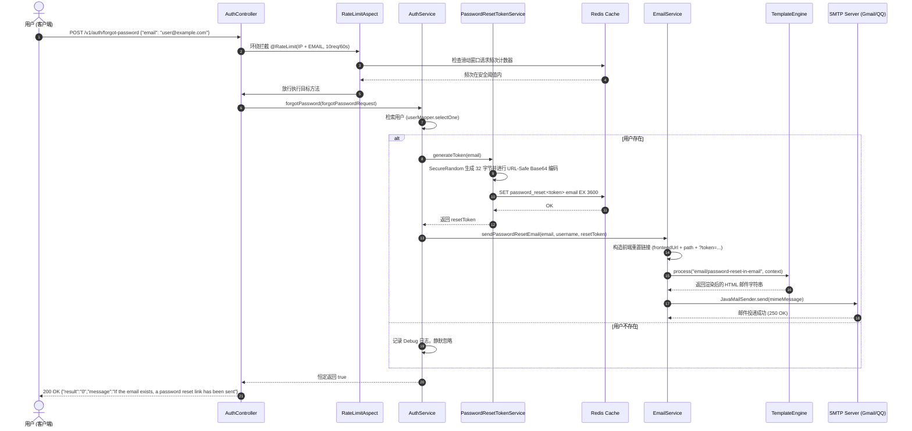
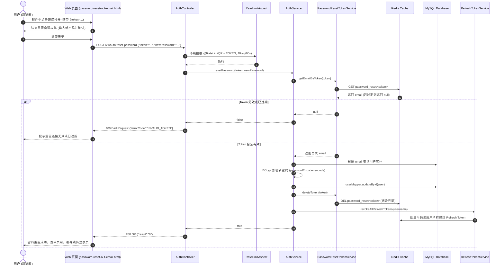

# 📧 邮件服务与密码重置架构深度指南 (Email & Password Reset Architecture Guide)

---

## 一、概述与核心设计理念

本项目邮件服务系统依托 **Spring Boot Mail (基于 Jakarta Mail / JavaMailSender)** 与 **Thymeleaf 模板引擎** 构建，深度整合 **Redis 分布式缓存** 与 **Spring Security 认证授权体系**。目前主要承担 **用户忘记密码重置（Password Reset Flow）**、安全凭证发放与通知提醒等关键安全业务。

```
┌─────────────────────────────────────────────────────────────────────────────────────────────┐
│                                邮件服务与密码重置整体交互链路                                   │
└─────────────────────────────────────────────────────────────────────────────────────────────┘

       [ 客户端 / Web / App ]
                 │
                 │ 1. POST /v1/auth/forgot-password (email)
                 ▼
       ┌───────────────────────────────┐
       │   RateLimitAspect (AOP)       │ ── 拦截高频刷接口 (IP + EMAIL 双维度滑动窗口限流)
       └───────────────────────────────┘
                 │ (放行)
                 ▼
       ┌───────────────────────────────┐
       │   AuthController              │ ── 统一防枚举响应 ("If the email exists, link sent")
       └───────────────────────────────┘
                 │
                 ▼
       ┌───────────────────────────────┐        ┌───────────────────────────────┐
       │   AuthService                 │ ──▶ ── │ PasswordResetTokenService     │
       └───────────────────────────────┘ 查询用户 └───────────────────────────────┘
                 │ (用户存在)                               │
                 │                                          │ CSPRNG 生成 256 位 Token
                 │                                          ▼
                 │                               ┌───────────────────────────────┐
                 │                               │ Redis (TTL: 3600s)            │
                 │                               │ key: password_reset:<token>   │
                 │                               │ value: user@example.com       │
                 │                               └───────────────────────────────┘
                 ▼
       ┌───────────────────────────────┐
       │   EmailService                │
       └───────────────────────────────┘
          │                 │
          │ 渲染动态变量     │ 注入 HTML 模板
          ▼                 ▼
   ┌──────────────┐   ┌──────────────────────────────────────────────┐
   │ Context      │   │ Thymeleaf: email/password-reset-in-email.html│
   └──────────────┘   └──────────────────────────────────────────────┘
          │
          ▼
   ┌───────────────────────────────┐
   │ JavaMailSender                │ ──▶ SMTP (STARTTLS / 端口 587) ──▶ [ Gmail / QQ / 163 ]
   └───────────────────────────────┘                                         │
                                                                             ▼
                                                                  用户邮箱接收到重置邮件
                                                                             │
   ┌───────────────────────────────┐                                         │ 点击重置链接
   │ Web 重置页 (静态/SPA)          │ ◀───────────────────────────────────────┘
   │ password-reset-out-email.html │
   └───────────────────────────────┘
          │
          │ 2. POST /v1/auth/reset-password (token, newPassword)
          ▼
   ┌───────────────────────────────┐
   │   AuthController              │ ── AOP 限流校验 (IP + TOKEN 双维度)
   └───────────────────────────────┘
          │
          ▼
   ┌───────────────────────────────┐
   │   AuthService                 │
   └───────────────────────────────┘
          │
          ├─▶ 1. 验证 Token (Redis get) ── 匹配用户并校验 TTL
          ├─▶ 2. 物理删除 Token (Redis del) ── 单次使用即作废 (One-Time Semantic)
          ├─▶ 3. BCrypt 加密新密码 ── 更新 MySQL users 表
          └─▶ 4. 吊销全端会话 ── RefreshTokenService.revokeAllRefreshTokens(username)
```

### 核心安全架构规范 (Security Architectural Principles)

1. **防用户枚举攻击 (Anti-User-Enumeration Pattern)**：
   - 传统接口若邮箱不存在则返回 `404 User Not Found`，攻击者可借此编写爬虫快速碰撞枚举平台全量注册用户的邮箱清单；
   - 本系统在 `/forgot-password` 接口无论邮箱是否存在、格式是否命中，均统一返回 HTTP 200 与统一提示文案：`"If the email exists, a password reset link has been sent"`。
2. **密码学高熵安全凭据 (CSPRNG 256-bit Token)**：
   - 摒弃伪随机数 `java.util.Random` 或简单的自增 ID，底层采用基于操作系统高熵熵池的 `java.security.SecureRandom` 生成 32 字节（256 位）安全随机数，并经 URL-Safe Base64 编码，彻底杜绝时间戳撞库与序列猜测攻击。
3. **Redis 分布式时效生命周期控制 (Strict TTL)**：
   - 密码重置凭据不落数据库磁盘，完全由 Redis 管理并配置强时效（默认 3600 秒 / 1 小时）；超时由 Redis 自动驱逐失效，避免废弃凭据永久驻留。
4. **单次使用即作废语义 (One-Time Semantic / Single-Use Token)**：
   - 密码成功重置后，系统立即显式调用 `redisTemplate.delete(key)` 物理销毁凭据；即使 Token 仍在 1 小时有效期内，也严禁被二次复用。
5. **全端多设备会话协同吊销 (Global Multi-Session Invalidation)**：
   - 密码更新完毕后，立即联动调用 `RefreshTokenService.revokeAllRefreshTokens(username)` 强制注销该用户在全网各终端（移动端、PC 浏览器等）持有的有效会话，切断攻击者已持有的旧登录态。
6. **多层次防刷与邮件轰炸防御 (Rate Limiting Defense)**：
   - 在控制器层挂载 `@RateLimit` AOP 切面，针对 `/forgot-password` 配置基于客户端真实公网 `IP` 与收件人 `EMAIL` 的双重滑动窗口限流（60 秒内最多 10 次），防止黑客利用邮件接口恶意骚扰第三方邮箱或消耗服务器发信配额。

---

## 二、端到端业务流程序列图

### 1. 申请忘记密码与发送邮件流 (Forgot Password Flow)



### 2. 用户点击链接重置密码流 (Reset Password Flow)



---

## 三、配置详解与多 SMTP 服务商适配

### 1. Spring Boot 基础属性配置 (`application.properties`)

```properties
# ===================================================================
# Spring Mail 核心网络与协议配置
# ===================================================================
# SMTP 主机地址（支持环境变量覆盖）
spring.mail.host=${MAIL_HOST:smtp.gmail.com}

# SMTP 端口：587 为 STARTTLS 标准端口，465 为传统 SMTPS/SSL 端口
spring.mail.port=${MAIL_PORT:587}

# 发信账号与授权密码（生产环境切勿硬编码真实密码）
spring.mail.username=${MAIL_USERNAME:listen2code@gmail.com}
spring.mail.password=${MAIL_PASSWORD:wlrwwiltnwvbjinn}

# 邮件协议
spring.mail.protocol=smtp
spring.mail.default-encoding=UTF-8

# SMTP 身份认证开关
spring.mail.properties.mail.smtp.auth=true

# STARTTLS 传输层安全协商（推荐 587 端口开启）
spring.mail.properties.mail.smtp.starttls.enable=true
spring.mail.properties.mail.smtp.starttls.required=true

# 严格的网络超时控制（毫秒），防止网络故障时业务线程无限期挂死
spring.mail.properties.mail.smtp.connectiontimeout=5000
spring.mail.properties.mail.smtp.timeout=5000
spring.mail.properties.mail.smtp.writetimeout=5000

# ===================================================================
# 密码重置业务参数配置
# ===================================================================
# 前端服务根地址（用于拼接邮件内包含的重置密码 HTML 页面跳转链接）
app.frontend.url=${FRONTEND_URL:http://localhost:8080}

# 密码重置 Token 在 Redis 中的生存周期（单位：秒，默认 3600 秒 = 1 小时）
app.password-reset.token-expiration=${PASSWORD_RESET_TOKEN_EXPIRATION:3600}
```

### 2. 主流 SMTP 服务商参数速查表

> [!IMPORTANT]
> 主流现代邮箱（Gmail、QQ、163 等）均**强制禁止直接使用邮箱登录密码**进行 SMTP 登录，必须在邮箱后台启用两步验证并申请“**应用专用密码 (App Password)**”或“**SMTP 授权码**”。

| 提供商 | SMTP 主机地址 | 端口 | 传输加密模式 | 密码要求 | 注意事项 |
| :--- | :--- | :--- | :--- | :--- | :--- |
| **Gmail** | `smtp.gmail.com` | `587` | STARTTLS | 16 位应用专用密码 | 需开启 Google 两步验证，并在安全性中生成专用密码 |
| **QQ 邮箱** | `smtp.qq.com` | `587` 或 `465` | STARTTLS / SSL | 16 位授权码 | 邮箱设置 ➔ 账户 ➔ 开启 POP3/SMTP ➔ 获取授权码 |
| **163 邮箱** | `smtp.163.com` | `465` | SSL | 客户端授权密码 | 设置 ➔ POP3/SMTP/IMAP ➔ 开启并设置授权密码 |
| **Outlook** | `smtp.office365.com` | `587` | STARTTLS | 账号密码 / 应用密码 | 企业版需注意管理员是否开启 SMTP AUTH 权限 |
| **AWS SES** | `email-smtp.{region}.amazonaws.com` | `587` | STARTTLS | IAM SES SMTP 凭证 | 生产级推荐，未移出沙箱前只能发给已验证邮箱 |
| **阿里云企邮**| `smtp.mxhichina.com` | `465` | SSL | 专属客户端密码 | 企业级域名邮箱专用 |

### 3. 多环境运行环境变量配置示例

#### 本地开发环境 (Windows PowerShell)
```powershell
$env:MAIL_HOST="smtp.gmail.com"
$env:MAIL_PORT="587"
$env:MAIL_USERNAME="listen2code@gmail.com"
$env:MAIL_PASSWORD="your-16-char-app-password"
$env:FRONTEND_URL="http://localhost:8080"
./gradlew bootRun
```

#### 本地开发环境 (Linux / macOS Bash)
```bash
export MAIL_HOST=smtp.gmail.com
export MAIL_PORT=587
export MAIL_USERNAME=listen2code@gmail.com
export MAIL_PASSWORD=your-16-char-app-password
export FRONTEND_URL=http://localhost:8080
./gradlew bootRun
```

#### Docker Compose 部署配置 (`.env` 文件)
```ini
# Docker 容器注入配置
MAIL_HOST=smtp.gmail.com
MAIL_PORT=587
MAIL_USERNAME=listen2code@gmail.com
MAIL_PASSWORD=your-16-char-app-password
FRONTEND_URL=https://listen2code.is-a.dev
PASSWORD_RESET_TOKEN_EXPIRATION=3600
```

---

## 四、核心代码实现与深度技术剖析

### 1. 邮件发送核心服务 [`EmailService.java`](file:///c:/Users/liste/Downloads/github/ListenPortfolioBackend/src/main/java/com/listen/portfolio/service/EmailService.java)

#### 技术难点与实现细节：
- **`MimeMessageHelper` UTF-8 编码防乱码**：
  构建富文本邮件时，必须指定 `new MimeMessageHelper(message, true, "UTF-8")`。第二个参数 `multipart = true` 声明支持包含图片/内嵌附件的复合邮件；第三个参数严格约束为 UTF-8，彻底解决中文用户名和重置按钮乱码问题。
- **Thymeleaf `Context` 动态参数解耦**：
  通过 `templateEngine.process("email/password-reset-in-email", context)` 实现视图与业务模型解耦。模板内不仅渲染静态 HTML，还支持生成带参数的动态超链接 `${resetLink}` 与 API curl 样例。
- **快速前置校验与异常阻断**：
  `validateEmailParameters` 在进行开销巨大的网络通信前拦截空邮箱和明显非法的邮箱格式，减轻无效网络请求对连接池的争抢。

```java
// 核心发信实现片段
public void sendPasswordResetEmail(String toEmail, String username, String token) throws MessagingException {
    logger.info(">>> [EmailService] 准备向用户 [{}] 发送密码重置邮件, 邮箱: {}", username, toEmail);

    try {
        // 1. 组装跳转前端重置界面的完整 URL
        String resetLink = frontendUrl + "/password-reset-out-email.html?token=" + token;
        
        // 2. 创建 MIME 消息
        MimeMessage message = mailSender.createMimeMessage();
        MimeMessageHelper helper = new MimeMessageHelper(message, true, "UTF-8");

        helper.setFrom(fromEmail);
        helper.setTo(toEmail);
        helper.setSubject("密码重置请求 - Portfolio");

        // 3. 填充模板变量上下文
        Context context = new Context();
        context.setVariable("username", username);
        context.setVariable("resetLink", resetLink);
        context.setVariable("token", token);
        context.setVariable("expirationTime", "1小时");

        // 4. 渲染 Thymeleaf 模板
        String htmlContent = templateEngine.process("email/password-reset-in-email", context);
        helper.setText(htmlContent, true);

        // 5. 调用 SMTP 底层发送
        mailSender.send(message);
        logger.info(">>> [EmailService] 密码重置邮件发送成功, 收件人: {}", toEmail);

    } catch (MessagingException e) {
        logger.error(">>> [EmailService] 发送密码重置邮件失败, 收件人: {}, 错误信息: {}", toEmail, e.getMessage());
        throw e;
    }
}
```

---

### 2. 密码重置 Token 生命周期管理 [`PasswordResetTokenService.java`](file:///c:/Users/liste/Downloads/github/ListenPortfolioBackend/src/main/java/com/listen/portfolio/service/PasswordResetTokenService.java)

#### 技术难点与实现细节：
- **CSPRNG 256 位加密随机源**：
  采用 `SecureRandom` 读取底层系统的 `/dev/urandom`（Linux）或 CryptGenRandom（Windows），生成 32 字节随机数：
  `Base64.getUrlEncoder().withoutPadding().encodeToString(randomBytes)`。URL-Safe 编码移除了 `+` 和 `/`，替换为 `-` 和 `_`，并去除了 `=` 填充符，确保作为 URL Query 参数时不发生转义冲突。
- **Redis 键名设计与时效治理**：
  Key 结构采用统一命名空间 `password_reset:<token>`，Value 为绑定的用户邮箱；写入时使用 `redisTemplate.opsForValue().set(key, email, tokenExpiration, TimeUnit.SECONDS)` 实现原子性写入与 TTL 设置。
- **O(1) 探测与单次消费即作废**：
  `getEmailByToken` 返回邮箱后，在修改密码成功那一刻必须立即显式执行 `deleteToken(token)`，实现单次使用作废（One-time Semantic），杜绝重放风险。

```java
public String generateToken(String email) {
    logger.info(">>> [PasswordResetTokenService] 正在为邮箱 {} 签发密码重置安全凭据...", email);

    // 1. 生成 32 字节 (256 位) 密码学安全随机数
    byte[] randomBytes = new byte[32];
    secureRandom.nextBytes(randomBytes);
    String token = Base64.getUrlEncoder().withoutPadding().encodeToString(randomBytes);

    // 2. 存入 Redis 并赋予 TTL
    String key = TOKEN_PREFIX + token;
    redisTemplate.opsForValue().set(key, email, tokenExpiration, TimeUnit.SECONDS);

    logger.info(">>> [PasswordResetTokenService] 密码重置 Token 签发完毕，Redis TTL: {} 秒", tokenExpiration);
    return token;
}
```

---

### 3. 认证逻辑闭环与全端会话吊销 [`AuthService.java`](file:///c:/Users/liste/Downloads/github/ListenPortfolioBackend/src/main/java/com/listen/portfolio/service/AuthService.java)

#### 技术难点与实现细节：
- **防嗅探静默返回机制**：
  在 `forgotPassword` 中，若 `userMapper.selectOne(...)` 为 `null`，执行 `logger.debug` 记录后直接 `return true;`。对外绝对不返回 404 或错误信息。
- **会话联动安全闭环**：
  在 `resetPassword` 中，更新密码后不仅删除 Token，还调用 `refreshTokenService.revokeAllRefreshTokens(user.getName())`。这将遍历清除该用户在 Redis 中的所有 Refresh Token，切断任何已失窃凭证的刷新通道。

```java
@Transactional
public boolean resetPassword(String token, String newPassword) {
    // 1. 校验 Token 有效性
    String email = passwordResetTokenService.getEmailByToken(token);
    if (email == null) return false;
    
    // 2. 匹配数据库用户实体
    UserEntity user = userMapper.selectOne(
            new LambdaQueryWrapper<UserEntity>().eq(UserEntity::getEmail, email)
    );
    if (user == null) {
        passwordResetTokenService.deleteToken(token);
        return false;
    }
    
    // 3. BCrypt 密文落盘
    user.setPassword(passwordEncoder.encode(newPassword));
    userMapper.updateById(user);
    
    // 4. 物理擦除 Token (单次作废)
    passwordResetTokenService.deleteToken(token);

    // 5. 吊销全端会话
    refreshTokenService.revokeAllRefreshTokens(user.getName());
    return true;
}
```

---

### 4. 接口限流切面防护 [`AuthController.java`](file:///c:/Users/liste/Downloads/github/ListenPortfolioBackend/src/main/java/com/listen/portfolio/api/v1/auth/AuthController.java)

#### 技术难点与实现细节：
- **IP 与 EMAIL 双重限流**：
  在 `/forgot-password` 上配置 `@RateLimit(types = {IP, EMAIL}, maxRequests = 10, timeWindowSeconds = 60)`。`RateLimitAspect` 会分别对 `rate_limit:ip:{client_ip}` 与 `rate_limit:email:{target_email}` 维护 Redis ZSet 滑动时间窗口，既限制单 IP 的刷量行为，也限制针对单个目标受害者邮箱的高频轰炸。

---

## 五、测试与验证指南

### 1. 自动化单元测试验证

项目已编写完备的 Mockito 单元测试，覆盖发信、模板变量捕获、参数边界与异常处理链路：
- 邮件测试：[`EmailServiceTest.java`](file:///c:/Users/liste/Downloads/github/ListenPortfolioBackend/src/test/java/com/listen/portfolio/service/EmailServiceTest.java)（覆盖 HTML/文本发信、UTF-8 编码、变量校验、批量投递等 15 个用例）
- Token 测试：[`PasswordResetTokenServiceTest.java`](file:///c:/Users/liste/Downloads/github/ListenPortfolioBackend/src/test/java/com/listen/portfolio/service/PasswordResetTokenServiceTest.java)（覆盖 256 位熵生成、TTL 设置、多线程并发唯一性等 16 个用例）

执行测试指令：
```bash
./gradlew test --tests "com.listen.portfolio.service.EmailServiceTest"
./gradlew test --tests "com.listen.portfolio.service.PasswordResetTokenServiceTest"
```

### 2. 使用 MailHog 进行本地无真实凭据联调（推荐）

MailHog 是一款轻量级开发测试专用的虚拟 SMTP 服务器，能够在本地完整拦截发出的所有邮件，并提供直观的 Web UI 检查 HTML 渲染与标头，无需绑定真实邮箱账号。

```bash
# 1. 后台启动 MailHog 容器 (1025 为 SMTP 端口，8025 为 Web UI 端口)
docker run -d --name mailhog -p 1025:1025 -p 8025:8025 mailhog/mailhog

# 2. 配置应用指向本地 MailHog
export MAIL_HOST=localhost
export MAIL_PORT=1025
export MAIL_USERNAME=test@test.com
export MAIL_PASSWORD=dummy
export FRONTEND_URL=http://localhost:8080

# 3. 启动应用
./gradlew bootRun

# 4. 打开浏览器查看邮件箱
# 访问 http://localhost:8025 实时查看被捕获的邮件
```

### 3. API 联调测试 (cURL)

#### 步骤 1：触发忘记密码
```bash
curl -X POST http://localhost:8080/v1/auth/forgot-password   -H "Content-Type: application/json"   -d '{"email":"listen2code@gmail.com"}'
```
**期望响应** (HTTP 200)：
```json
{
  "result": "0",
  "messageId": "",
  "message": "If the email exists, a password reset link has been sent",
  "body": null
}
```

#### 步骤 2：查看 Redis 中的 Token
```bash
# 检查 Redis 中生成的 Key
docker exec -it listen_portfolio_redis redis-cli keys "password_reset:*"
# 查看 TTL 剩余秒数
docker exec -it listen_portfolio_redis redis-cli ttl "password_reset:<your_token>"
```

#### 步骤 3：提交新密码重置
```bash
curl -X POST http://localhost:8080/v1/auth/reset-password   -H "Content-Type: application/json"   -d '{
    "token": "<your_token>",
    "newPassword": "MyNewSecurePassword123!"
  }'
```
**期望响应** (HTTP 200)：
```json
{
  "result": "0",
  "messageId": "",
  "message": "",
  "body": null
}
```

---

## 六、生产高频故障排查手册 (Troubleshooting)

### 1. `AuthenticationFailedException: 535-5.7.8 Username and Password not accepted`
- **故障根因**：SMTP 认证失败。通常是因为使用了邮箱登录密码，而非应用专用密码（App Password）或授权码。
- **排查与解决**：
  1. 登录 Gmail 账号管理 ➔ 安全性 ➔ 两步验证 ➔ 生成 16 位“应用专用密码”；
  2. 若为 QQ 邮箱，需进入邮箱设置 ➔ 账户 ➔ 重新生成 SMTP 授权码；
  3. 确认复制密码时未包含多余的首尾空格。

### 2. `MailConnectException: Couldn't connect to host, port: 587; timeout 5000`
- **故障根因**：服务器与 SMTP 主机之间的网络握手超时。云厂商（如 AWS EC2、阿里云）默认会从安全组与网关层封禁出站 25 端口，部分地域对 587 端口也有特定策略。
- **排查与解决**：
  ```bash
  # 在部署服务器上测试连通性
  nc -zv smtp.gmail.com 587
  # 或使用 curl 测试
  curl -v telnet://smtp.gmail.com:587
  ```
  若无法连通，可尝试切换为 465 端口（开启 SSL），或配置 HTTP 代理 / 接入 AWS SES。

### 3. 邮件被目标邮箱归类为垃圾邮件 (Spam / Junk)
- **故障根因**：发信域名未配置 SPF、DKIM、DMARC 记录，或个人发信量短时间偏高被公共邮件服务商判定为滥发。
- **排查与解决**：
  1. 个人开发阶段提示用户去“垃圾箱”中查找并点击“这不是垃圾邮件”；
  2. 生产环境建议迁移至 AWS SES 或 SendGrid，并严格为顶级域名配置 DNS TXT 记录（SPF 记录：`v=spf1 include:amazonses.com ~all`）及 DKIM 签名。

### 4. `INVALID_TOKEN` (提示重置链接无效或已过期)
- **故障根因**：
  1. 超过了 1 小时有效期，Redis 中键已自动过期销毁；
  2. 用户在打开页面后重复点击了重置按钮（一次性使用已被删除）；
  3. Redis 服务异常重启，且未开启 AOF 持久化导致内存数据丢失。

---

## 七、架构演进与待办治理 (Roadmap)

根据本项目当前的邮件实现现状，在 [`docs/todo.md`](file:///c:/Users/liste/Downloads/github/ListenPortfolioBackend/docs/todo.md) **第 16 章节（邮件服务架构演进与生产可靠性治理）** 中已建立以下改进规划：

1. **邮件异步解耦发送与重试机制 (Asynchronous Dispatch via @Async / Redis Stream)**：
   - 摆脱主线程同步阻塞（1~3 秒握手等待），提升 `/forgot-password` 接口响应速度至 50ms 内，并具备指数退避重试能力。
2. **多通道邮件供应商平滑容灾降级 (Multi-Vendor Failover)**：
   - 引入 `EmailProviderAdapter`，支持 AWS SES / SendGrid 作为主发信通道，Gmail / QQ 作为备用通道，实现通道级自动故障转移。
3. **邮件发送审计日志持久化与单邮箱频次防护 (Email Audit Logging & Abuse Defense)**：
   - 建立 `email_send_log` 审计流水，引入单邮箱 24 小时自然日总发信限额（如最多 5 封），严防滥用。
4. **邮件模板国际化 (i18n) 与移动端 Dark Mode 适配 (Template i18n & Dark Mode Adaptive)**：
   - 邮件支持中/英/日动态语言切换，并在 CSS 中深度适配邮件客户端深色模式，提升跨端阅读体验。
