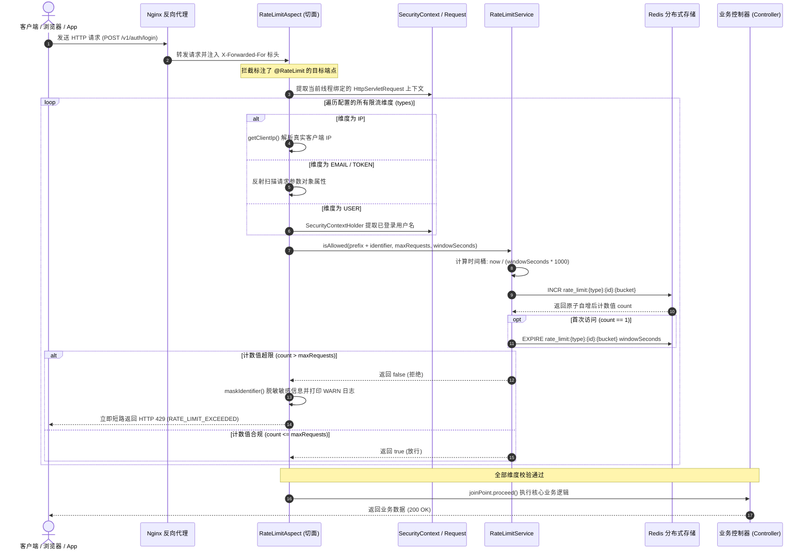

# 🛡️ 智能分布式限流系统架构与实战深度指南 (Distributed Rate Limiting Architecture Guide)

## 1. 系统定位与设计哲学

在现代互联网高并发与高对抗环境下，API 接口不仅需要应对合法用户的突发高并发流量，更需要时刻抵御外部黑客或恶意脚本的恶意攻击，包括：
- **密码暴力破解与凭据撞库**：黑客利用字典工具针对 `/v1/auth/login` 进行高频试错；
- **邮件/短信接口资源耗尽与泛洪轰炸**：恶意调用 `/v1/auth/forgot-password` 导致企业企业邮件服务配额耗尽并滋扰正常用户；
- **爬虫恶意扫描与数据窃取**：利用分布式代理高频抓取系统核心作品与统计数据；
- **Token 遍历与重放探测**：针对密码重置 Token 实施离线或在线暴力枚举；
- **内部用户失常高频请求**：登录用户被木马控制或脚本恶意调用资源修改接口。

本项目设计并落地了一套**基于 Spring AOP 声明式切面 + Redis 分布式集群**的高性能、零侵入、多维度智能限流防刷系统。

```
                                      【分布式多维度限流架构全景】

 客户端 HTTP 请求 (Client Request)
            │
            ▼
 ┌────────────────────────────────────────────────────────────────────────┐
 │ 边缘代理网关 (Nginx Reverse Proxy / AWS ALB)                           │
 │ 注入标头: X-Forwarded-For: <Client_IP>, <Proxy_IP> ; X-Real-IP         │
 └────────────────────────────────────┬───────────────────────────────────┘
                                      │
                                      ▼
 ┌────────────────────────────────────────────────────────────────────────┐
 │ Spring Boot 应用层 (Tomcat Thread Pool)                                │
 │                                                                        │
 │   ┌────────────────────────────────────────────────────────────────┐   │
 │   │ RateLimitAspect (AOP 环绕切面通知 @Around)                       │   │
 │   │                                                                │   │
 │   │   1. 提取 @RateLimit 注解配置 (types, maxRequests, window)     │   │
 │   │   2. 多维度标识符解析:                                         │   │
 │   │      ├─ IP: X-Forwarded-For 穿透提取真实源 IP                  │   │
 │   │      ├─ EMAIL: 反射扫描 DTO 中的 "email" 属性                  │   │
 │   │      ├─ TOKEN: 反射扫描 DTO 中的 "token" 属性                  │   │
 │   │      ├─ USER: 从 SecurityContextHolder 提取 Principal           │   │
 │   │      └─ CUSTOM: 提取动态业务标识                               │   │
 │   └───────────────────────────────┬────────────────────────────────┘   │
 │                                   │                                    │
 │                                   ▼                                    │
 │   ┌────────────────────────────────────────────────────────────────┐   │
 │   │ RateLimitService (分布式限流业务底座)                          │   │
 │   │                                                                │   │
 │   │   1. 计算离散时间桶: currentWindow = now / (windowSeconds*1000)│   │
 │   │   2. 组装 Key: rate_limit:{type}:{identifier}:{windowBucket}   │   │
 │   │   3. Redis INCR 原子自增                                       │   │
 │   │   4. 首击 (count == 1) 设置 EXPIRE 自动清理 TTL                │   │
 │   │   5. 判定配额: count <= maxRequests                            │   │
 │   │   6. 故障保护: Redis 异常时 Fail-Open 保守放行                  │   │
 │   └───────────────────────────────┬────────────────────────────────┘   │
 └───────────────────────────────────┼────────────────────────────────────┘
                                     │ Redis 网络通信 (Jedis/Lettuce)
                                     ▼
 ┌────────────────────────────────────────────────────────────────────────┐
 │ Redis 内存存储引擎 (Redis Cluster / Standalone)                        │
 │ Key: rate_limit:ip:192.168.1.100:2910384 -> Value: "4", TTL: 42s       │
 └────────────────────────────────────────────────────────────────────────┘
            │
            ├─ [配额充足 (count <= maxRequests)] ──▶ 放行执行下游 Controller 业务逻辑
            │
            └─ [配额超限 (count > maxRequests)] ───▶ 拦截短路，立即返回 HTTP 429 Too Many Requests
```

### 核心设计目标

1. **声明式零侵入 (Zero Intrusiveness)**：通过自定义 Java 注解 `@RateLimit` 实现即插即用，业务控制器无需编写任何 Redis 计数与判断代码。
2. **多维度正交组合 (Multi-Dimensional Composition)**：单接口支持组合多种防护维度（例如 IP + EMAIL 双重防护），杜绝攻击者通过切换代理 IP 绕过邮箱维度的轰炸防护。
3. **全集群无状态协同 (Distributed Consistency)**：以 Redis 作为集中式分布式共享存储，完全适应 Kubernetes/Docker 容器集群多副本横向扩容场景。
4. **高可用韧性开路 (Fail-Open Resilience Pattern)**：限流作为辅助性防御组件，若 Redis 遭遇网络瞬断、超时或宕机，系统自动降级为“开路放行”，绝不因安全组件故障导致全局核心业务瘫痪。
5. **隐私脱敏合规 (PII Audit Masking)**：日志记录中对触发限流的 IP、邮箱或 Token 实施单向脱敏，符合 GDPR 与安全合规审计要求。

---

## 2. 核心架构与交互时序图

### 2.1 请求拦截与限流校验时序 (Sequence Flow)



---

## 3. 核心代码设计与重点、难点深度剖析

### 3.1 注解定义：`RateLimit.java`

在 `src/main/java/com/listen/portfolio/common/aspect/RateLimit.java` 中定义了元数据结构：

```java
@Target(ElementType.METHOD)
@Retention(RetentionPolicy.RUNTIME)
@Documented
public @interface RateLimit {

    /**
     * 限流维度类型数组，默认按客户端 IP 限流
     * 支持同时指定多个，如 {RateLimitType.IP, RateLimitType.EMAIL}
     */
    RateLimitType[] types() default {RateLimitType.IP};

    /**
     * 窗口期内最大允许请求数上限
     */
    int maxRequests() default 10;

    /**
     * 时间窗口周期（单位：秒），默认 60 秒
     */
    int timeWindowSeconds() default 60;

    /**
     * 自定义标识符表达式（配合 CUSTOM 类型）
     */
    String identifierExpression() default "";

    enum RateLimitType {
        IP,      // 客户端源 IP
        EMAIL,   // 请求参数中的邮箱地址
        TOKEN,   // 请求参数中的安全凭证/令牌
        USER,    // Spring Security 认证用户
        CUSTOM   // 自定义业务标签 / SpEL 表达式
    }
}
```

---

### 3.2 切面实现：`RateLimitAspect.java` 核心难点解析

切面是拦截处理的中枢，包含多个工程级细节与安全难点：

#### 难点 1：多级反向代理穿透与真实客户端 IP 提取 (`getClientIp`)
当系统部署在 AWS ALB、Cloudflare 或 Nginx 之后时，Tomcat 接收到的直接连接 IP（`request.getRemoteAddr()`）实际上是内网网关代理服务器的 IP。如果不做特殊处理，会导致全网所有用户共享同一个 IP 配额，造成全站大面积误杀。
切面按严密优先级解析反向代理头：
```java
private String getClientIp(HttpServletRequest request) {
    String ip = request.getHeader("X-Forwarded-For");
    if (ip == null || ip.isEmpty() || "unknown".equalsIgnoreCase(ip)) {
        ip = request.getHeader("X-Real-IP");
    }
    if (ip == null || ip.isEmpty() || "unknown".equalsIgnoreCase(ip)) {
        ip = request.getRemoteAddr();
    }
    // 关键细节：当经过多级代理（如 CDN -> Nginx -> 应用）时，
    // X-Forwarded-For 格式为 "client_ip, proxy1_ip, proxy2_ip"
    // 最左侧的第一个有效 IP 才是真实的客户端来源 IP
    if (ip != null && ip.contains(",")) {
        ip = ip.split(",")[0].trim();
    }
    return ip;
}
```

#### 难点 2：基于反射深度探测请求 DTO 参数 (`extractEmailFromRequest` / `extractTokenFromRequest`)
不同的业务接口入参 DTO 类各不相同（如 `ForgotPasswordRequest`、`ResetPasswordRequest`、`SignUpRequest`）。为了保证切面的通用性，切面并不强绑定特定接口或父类，而是利用 Java 反射扫描方法的所有实参对象：
```java
private String extractEmailFromRequest(ProceedingJoinPoint joinPoint) {
    Object[] args = joinPoint.getArgs();
    for (Object arg : args) {
        if (arg == null) continue;
        try {
            // 反射获取声明的 email 字段
            java.lang.reflect.Field emailField = arg.getClass().getDeclaredField("email");
            emailField.setAccessible(true);
            Object email = emailField.get(arg);
            if (email != null) {
                // 统一去除首尾空格并转换为小写，彻底封堵通过大小写混淆（User@Test.com vs user@test.com）绕过限流的漏洞
                return email.toString().trim().toLowerCase();
            }
        } catch (Exception e) {
            // 参数无 email 字段时静默忽略，继续检查后续参数
        }
    }
    return null;
}
```

#### 难点 3：日志防泄漏与脱敏处理 (`maskIdentifier`)
IP 地址、邮箱与安全 Token 属于个人可标识信息（PII）或高度敏感的安全凭证。若在限流报警日志中明文记录完整字符串，不仅违反数据安全审计规范，还可能因日志系统泄露造成凭证被窃取。切面对超限日志统一执行掩码：
```java
private String maskIdentifier(String identifier) {
    if (identifier == null || identifier.length() <= 4) {
        return identifier;
    }
    return identifier.substring(0, Math.min(10, identifier.length())) + "...";
}
```

---

### 3.3 限流核心：`RateLimitService.java` 与固定窗口算法剖析

在 `src/main/java/com/listen/portfolio/service/RateLimitService.java` 中，系统采用**固定时间窗口计数器算法（Fixed-Window Counter Algorithm）**：

```java
public boolean isAllowed(String identifier, int maxRequests, int timeWindowSeconds) {
    try {
        // 步骤 1：基于整除计算离散时间桶号
        long currentWindow = System.currentTimeMillis() / (timeWindowSeconds * 1000L);
        // 步骤 2：组装包含时间桶号的全局唯一 Key
        String key = RATE_LIMIT_PREFIX + identifier + ":" + currentWindow;

        // 步骤 3：借助 Redis INCR 指令单线程原子递增
        Long count = redisTemplate.opsForValue().increment(key);
        if (count == null) {
            logger.warn("Redis increment returned null for key: {}", key);
            return true; // Fail-Open 保守放行
        }

        // 步骤 4：仅当该窗口期第一个请求到来时，初始化 Key 的 TTL
        if (count == 1) {
            redisTemplate.expire(key, timeWindowSeconds, TimeUnit.SECONDS);
        }

        // 步骤 5：判定是否超过配额
        boolean allowed = count <= maxRequests;
        if (!allowed) {
            logger.warn("Rate limit exceeded for identifier: {}, count: {}, limit: {}",
                    identifier, count, maxRequests);
        }
        return allowed;
    } catch (Exception e) {
        logger.error("Rate limit check failed for identifier: {}, error: {}",
                identifier, e.getMessage());
        return true; // 关键容灾设计：Fail-Open 故障开路
    }
}
```

#### 数学原理与分桶机制
假设 `timeWindowSeconds = 60` 秒：
- 时间戳 `t1 = 1711929600000`（16:00:00.000）$
ightarrow$ `1711929600000 / 60000 = 28532160`
- 时间戳 `t2 = 1711929659999`（16:00:59.999）$
ightarrow$ `1711929659999 / 60000 = 28532160`
- 时间戳 `t3 = 1711929660000`（16:01:00.000）$
ightarrow$ `1711929660000 / 60000 = 28532161`

在同一分钟内的所有请求计算出的 `currentWindow` 完全相同，映射到同一个 Redis Key（例如 `rate_limit:ip:1.2.3.4:28532160`）。新的一分钟开始时，除法商数自动递增生成全新的 Key，老 Key 会在 60 秒后由 Redis TTL 自动清理释放内存。

---

## 4. 主流限流算法深度横向对比与缺陷分析

在分布式系统架构中，常见的限流算法有 5 种，其优缺点与适用场景如下表：

| 算法名称 | 实现复杂度 | 内存开销 | 计数准确度 | 平滑度 (无毛刺) | 突发流量适应度 |
| :--- | :--- | :--- | :--- | :--- | :--- |
| **固定时间窗口计数器 (本项目现状)** | 极低（INCR + EXPIRE） | 极低（仅存整型数字） | 良好（窗口内准确） | 差（存在窗口临界 2 倍突发） | 差（硬截断） |
| **滑动时间窗口日志 (Sliding Window Log via ZSet)** | 中等（ZADD + ZREMRANGEBYSCORE） | 较高（记录每次请求的时间戳） | 极高（任意时间跨度绝对精确） | 极高（彻底杜绝边界效应） | 差（硬截断） |
| **滑动窗口计数器 (Sliding Window Counter)** | 中等（加权均值估算） | 极低（存前一个与当前窗口两个值）| 较高（近似准确率 > 99%） | 良好（平滑过渡） | 差（硬截断） |
| **令牌桶算法 (Token Bucket)** | 中等（记录上次填充时间与当前令牌数）| 极低（两个数值） | 极高 | 极高（速率平滑整形） | **极高（支持突发配额）** |
| **漏桶算法 (Leaky Bucket)** | 中等（固定流出速率队列） | 低 | 极高 | 极高（强行匀速流出） | 差（不支持突发） |

### 本项目固定窗口算法的核心缺陷：窗口边界 2 倍突发 (Boundary Burst)

固定时间窗口算法最大的技术局限在于**无法防御跨窗口临界点的短时突发冲击**。
假设配置规则为：`maxRequests = 10`，`timeWindowSeconds = 60`。

```
时间轴 (Seconds):
           窗口 1 (0 ~ 59s)                        窗口 2 (60 ~ 119s)
... ─────────────────────────────┬───────────────────────────── ...
                   59.0s ~ 59.9s │ 60.0s ~ 60.9s
                   [发起 10 次请求]│ [发起 10 次请求]
```

- **攻击现象**：攻击者在第 59.5 秒瞬时发起 10 次请求，窗口 1 计数器为 10，完全合法通过；
- 紧接着在第 60.1 秒（仅间隔 0.6 秒），时间桶跳转到窗口 2，攻击者再次发起 10 次请求，窗口 2 计数器为 10，再次合法通过；
- **攻击后果**：在仅仅 **1 秒钟的狭窄时间范围内，系统实际承受了 20 次请求**，瞬间超出预设限额的 **200%**！这可能直接打崩后端数据库连接池。

> 💡 **解决之道**：在 `docs/todo.md` 第 21 节已正式规划演进方案，将固定窗口升级为基于 **Redis ZSet 的滑动时间窗口算法**或 **令牌桶算法 (Token Bucket)**。

---

## 5. 多维度防护业务场景配置实战

### 场景 1：未登录公开端点防爆破（IP 维度）
- **防护接口**：`POST /v1/auth/login`
- **配置规则**：限制单 IP 每分钟最多 10 次密码尝试。
```java
@PostMapping("/login")
@RateLimit(types = {RateLimit.RateLimitType.IP}, maxRequests = 10, timeWindowSeconds = 60)
public ResponseEntity<ApiResponse<LoginResponse>> login(@Valid @RequestBody LoginRequest request) {
    return ResponseEntity.ok(ApiResponse.success(authService.login(request)));
}
```

### 场景 2：找回密码接口防撞库与邮件轰炸（IP + 邮箱正交双重维度）
- **防护接口**：`POST /v1/auth/forgot-password`
- **业务痛点**：攻击者可能使用数千个国外代理 IP，疯狂输入同一个受害者邮箱发起重置请求，造成邮件轰炸；反之，攻击者也可能在同一台机器上枚举全校用户的邮箱。
- **解决方案**：同时配置 `IP` 和 `EMAIL` 双维度：
```java
@PostMapping("/forgot-password")
@RateLimit(
    types = {RateLimit.RateLimitType.IP, RateLimit.RateLimitType.EMAIL},
    maxRequests = 5,
    timeWindowSeconds = 300
)
public ResponseEntity<ApiResponse<Void>> forgotPassword(@Valid @RequestBody ForgotPasswordRequest request) {
    authService.forgotPassword(request);
    return ResponseEntity.ok(ApiResponse.success(null));
}
```
**拦截机制**：
- 同一个 IP 5 分钟内请求达 5 次 $
ightarrow$ 拦截并返回 429；
- 同一个邮箱 5 分钟内被请求达 5 次 $
ightarrow$ 拦截并返回 429；
- 两者独立计数、短路判断，形成立体式防御矩阵。

### 场景 3：已登录用户资产修改防护（USER 维度）
- **防护接口**：`PUT /v1/user/profile`
- **业务痛点**：防止自动化外挂频繁刷写用户数据。
```java
@PutMapping("/profile")
@RateLimit(types = {RateLimit.RateLimitType.USER}, maxRequests = 100, timeWindowSeconds = 3600)
public ResponseEntity<ApiResponse<UserDto>> updateProfile(@Valid @RequestBody UpdateUserRequest request) {
    return ResponseEntity.ok(ApiResponse.success(userService.updateProfile(request)));
}
```

---

## 6. 响应报文规范与客户端交互

### 6.1 触发限流时的 HTTP 响应
当请求被切面拦截时，系统直接中断并返回 HTTP 状态码 `429 Too Many Requests`，Body 结构遵循全局标准统一 `ApiResponse`：

```http
HTTP/1.1 429 Too Many Requests
Content-Type: application/json;charset=UTF-8

{
  "result": "RATE_LIMIT_EXCEEDED",
  "messageId": "RATE_LIMIT_EXCEEDED",
  "message": "Requests are too frequent, please try again later",
  "body": null
}
```

### 6.2 客户端（Flutter / Web）适配建议
客户端网络请求拦截器（如 Dio Interceptor / Axios Interceptor）检测到 HTTP 429 时，应触发**退避与防抖机制**：
1. 禁止立即自动无脑重试，避免形成重试风暴（Retry Storm）；
2. 在 UI 界面向用户弹出 Toast 友好提示：“操作过于频繁，请稍候重试”；
3. 将触发操作的按钮（如“发送验证码”）进入倒计时冻结状态（如置灰 60 秒）。

---

## 7. 运维排查、监控与自测验证指南

### 7.1 Redis 控制台状态实测查询
在后端服务运行期间，运维与开发者可通过 `redis-cli` 直观查看限流键与计数状态：

```bash
# 1. 登录 Redis 命令行
docker exec -it listen-portfolio-redis redis-cli

# 2. 查询当前正在活跃的限流 Key (String 纯文本序列化器保证完全可读)
127.0.0.1:6379> KEYS rate_limit:*
1) "rate_limit:ip:127.0.0.1:2910384"
2) "rate_limit:email:test@example.com:582076"

# 3. 查看当前窗口已累积的请求数
127.0.0.1:6379> GET rate_limit:ip:127.0.0.1:2910384
"7"

# 4. 查看该时间窗口剩余存活时间 (TTL)
127.0.0.1:6379> TTL rate_limit:ip:127.0.0.1:2910384
(integer) 38
```

### 7.2 cURL 自动化高频压测复现
使用 Bash 或 PowerShell 脚本快速验证 429 拦截：

```bash
# 连续发起 12 次快速请求
for i in {1..12}; do
  curl -s -o /dev/null -w "Request $i: HTTP %{http_code}
" -X POST http://localhost:8080/v1/auth/login     -H "Content-Type: application/json"     -d '{"username":"admin","password":"wrong-password"}'
done
```
**预期输出**：
```
Request 1: HTTP 401 (密码错误，但接口允许访问)
...
Request 10: HTTP 401 (达到配额上限)
Request 11: HTTP 429 (Too Many Requests! 被限流切面拦截)
Request 12: HTTP 429 (Too Many Requests! 被限流切面拦截)
```

---

## 8. 当前不足与未来改善路线 (详见 todo.md Section 21)

当前实现经过了完整的单元测试与实战验证，但在超大规模生产与极端对抗场景下，仍有进一步演进空间：

| 改善点序号 | 核心任务 | 现状痛点 | 演进与解决方案 |
| :--- | :--- | :--- | :--- |
| **21.1** | **滑动时间窗口算法升级 (Sliding Window Log)** | 固定窗口算法在边界处存在最高 2 倍突发毛刺；`INCR` 与 `EXPIRE` 两步操作存在悬挂键隐患 | 升级为基于 Redis ZSet 或单条 Lua 脚本实现的滑动窗口算法，使用毫秒时间戳去重与范围清除，彻底消除边界突发 |
| **21.2** | **令牌桶算法 (Token Bucket) 引入** | 只有通过/拦截二值化判定，不支持突发流量整形 | 引入 Bucket4j / Redis 令牌桶算法，支持瞬时合规突发（Burst Capacity）并自动平滑削峰填谷 |
| **21.3** | **SpEL 动态求值与分级白名单机制** | `CUSTOM` 限流类型仅支持静态字面量；缺乏内网与管理用户白名单 | 集成 Spring SpEL 表达式引擎支持动态入参求值；引入 `@RateLimit(whitelist="...")` 对本地健康探针及超管免除限流 |
| **21.4** | **双层协同限流与标准 RFC 标头输出** | 流量全部穿透至 Tomcat 线程池；触发 429 时未返回 RFC 标准头 | 构建“Nginx 边缘网关 `limit_req` 粗防护 + 应用层 AOP 精防护”体系；在响应头中回传 `X-RateLimit-Remaining` 与 `Retry-After` |

---

## 9. 关联参考

- [Spring AOP 官方参考文档](https://docs.spring.io/spring-framework/reference/core/aop.html)
- [Redis 官方原子命令文档 (INCR / EXPIRE)](https://redis.io/commands/incr/)
- [RFC 6585: Additional HTTP Status Codes (429 Too Many Requests)](https://datatracker.ietf.org/doc/html/rfc6585#section-4)
- [项目规划待办清单 (docs/todo.md)](file:///c:/Users/liste/Downloads/github/ListenPortfolioBackend/docs/todo.md)
