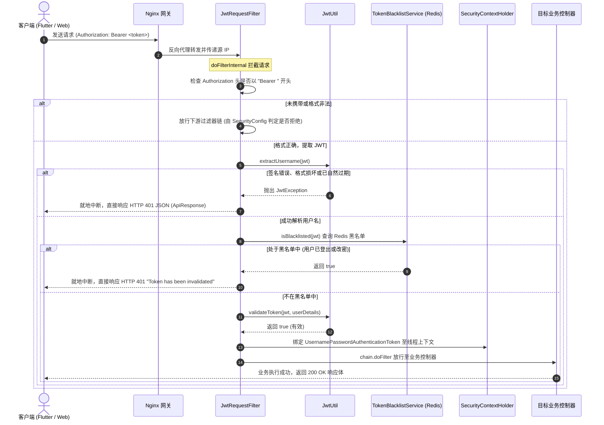

# 🛡️ 平台全链路应用安全纵深防御与身份治理完整指南 (Application Security Architecture & Identity Governance)

## 1. 系统定位与全局安全架构

在面向公网提供服务的现代化 Web 与移动端应用中，后端系统时刻面临来自自动化扫描器、网络嗅探、撞库脚本及恶意攻击者的安全挑战：
- **认证与会话风险**：密码弱口令、离线彩虹表破解、JWT 签发后无法服务端主动注销、长效会话被截获无限重放；
- **业务滥用与探测**：接口高频暴力破解、利用返回歧义探测全站注册邮箱（账号枚举嗅探）、垃圾邮件/短信泛洪轰炸；
- **恶意 Payload 与注入攻击**：上传伪造魔数的非法二进制文件导致内存溢出（OOM）或客户端渲染崩溃，SQL 注入漏洞等；
- **敏感数据泄露**：系统配置硬编码、明文密码入库、运维日志打印未脱敏凭据等。

本项目构建了覆盖**接入层网关、应用层过滤器链、业务 AOP 切面、数据持久层与分布式缓存**的多层级、纵深防御（Defense-in-Depth）安全架构体系。

```
                                      【全链路安全防护纵深防御拓扑】

 外部客户端 (Web / Flutter App / 浏览器)
                │ HTTPS (TLS 1.2/1.3)
                ▼
 ┌────────────────────────────────────────────────────────────────────────┐
 │ 1. 边缘接入网关层 (Nginx Edge Gateway)                                 │
 │    ├─ SSL/TLS 证书终止与 HTTPS 强校验                                 │
 │    ├─ client_max_body_size 10M 拦截超大上传包                          │
 │    ├─ 统一反向代理，剥离 /api 路由前缀                                │
 │    └─ 注入真实源 IP: X-Forwarded-For, X-Real-IP                        │
 └────────────────────────────────────┬───────────────────────────────────┘
                                      │
                                      ▼
 ┌────────────────────────────────────────────────────────────────────────┐
 │ 2. 应用层安全过滤器链 (Spring Security Filter Chain)                   │
 │    ├─ HttpSecurity 闭网策略 (Fail-Close): 默认 .anyRequest().authenticated()
 │    ├─ 无状态会话管理: SessionCreationPolicy.STATELESS (禁用 HttpSession)
 │    ├─ 豁免 CSRF: 基于 Authorization Header 的 JWT 架构天然免疫 CSRF    │
 │    ├─ 公开白名单显式放行: /v1/auth/**, /v1/projects/**, /images/**     │
 │    ├─ Actuator 监控端点最小暴露与白名单: /actuator/health, prometheus  │
 │    └─ JwtRequestFilter 核心前置拦截器:                                  │
 │         ├─ Bearer Token 规范提取                                       │
 │         ├─ HMAC-SHA256 签名校验与过期时间判定                         │
 │         ├─ Redis 实时黑名单探测 (TokenBlacklistService)                │
 │         ├─ UserDetailsService 数据库有效性核验                         │
 │         └─ 构造 UsernamePasswordAuthenticationToken 载入 SecurityContext
 └────────────────────────────────────┬───────────────────────────────────┘
                                      │
                                      ▼
 ┌────────────────────────────────────────────────────────────────────────┐
 │ 3. 业务切面与防御层 (Business Aspect & Payload Defense)                │
 │    ├─ @RateLimit 注解切面 (RateLimitAspect): IP/Email/Token/User 组合限流│
 │    ├─ 头像 Payload 深度魔数白名单校验 (PNG/JPEG/GIF/WebP/SVG, 3MB/2MB)  │
 │    ├─ 防账号枚举契约设计 (统一 200/401 统一模糊提示文案)               │
 │    └─ 日志隐私脱敏 (maskToken / maskIdentifier)                        │
 └────────────────────────────────────┬───────────────────────────────────┘
                                      │
                                      ▼
 ┌────────────────────────────────────────────────────────────────────────┐
 │ 4. 数据与缓存持久层 (Data & Cache Tier)                                │
 │    ├─ MySQL: BCrypt 自动加盐哈希密码存储 (Cost 10, 60字符密文)          │
 │    ├─ MyBatis-Plus: 强类型 LambdaQueryWrapper 参数化预编译防 SQL 注入  │
 │    └─ Redis: 分布式黑名单 (token:blacklist:) + 跨端 Refresh Token 持久化│
 └────────────────────────────────────────────────────────────────────────┘
```

---

## 2. 端到端认证授权执行链路与时序图

系统的身份生命周期采用**双令牌协同模型（Dual-Token Architecture）**：
- **Access Token（访问令牌）**：短期有效（默认 5 分钟），无状态携带在 HTTP `Authorization: Bearer <token>` 请求头中，用于日常高频鉴权。
- **Refresh Token（刷新令牌）**：长效持久化（默认 24 小时至 7 天），存储于 Redis，仅用于在 Access Token 过期时请求换发新凭证，支持令牌旋转（RTR）与全端会话协同吊销。

### 2.1 受保护端点请求鉴权流程 (Mermaid Sequence Diagram)



### 2.2 令牌生命周期全景图

```
 [用户登录 /v1/auth/login]
         │
         ├─ 1. BCrypt 比对密码成功
         ├─ 2. JwtUtil 生成 Access Token (5分钟)
         ├─ 3. JwtUtil 生成 Refresh Token (24小时)
         └─ 4. RefreshTokenService 保存至 Redis: token:refresh:<user>:<refreshToken> (TTL=24h)
         
 [日常请求受保护接口]
         │
         ├─ Header: Authorization: Bearer <Access Token>
         ├─ JwtRequestFilter 校验签名、有效时间与 Redis 黑名单
         └─ 验证通过即刻放行至控制器业务

 [Access Token 过期]
         │
         └─ 客户端捕获 HTTP 401，发起刷新请求 [/v1/auth/refresh?refreshToken=...]
                 │
                 ├─ 1. 验证 Refresh Token 签名与有效性
                 ├─ 2. 检查 Redis 中是否存在且处于 active 状态
                 ├─ 3. 令牌旋转 (Rotation): 销毁旧 Refresh Token，签发新 Access Token 与新 Refresh Token
                 └─ 4. 客户端更新本地持久化凭证，透明重发原业务请求

 [主动登出 / 密码修改 / 账号注销]
         │
         ├─ 1. 当前 Access Token 写入 Redis 黑名单 (TTL = 剩余有效时间)
         ├─ 2. 吊销 Redis 中的 Refresh Token (单端注销或 revokeAllRefreshTokens 全端协同注销)
         └─ 3. 清空当前线程 SecurityContextHolder，旧凭证全网彻底失效
```

---

## 3. 核心组件设计理念与技术难点深度剖析

### 3.1 安全配置中枢：`SecurityConfig.java`

在 `src/main/java/com/listen/portfolio/common/config/SecurityConfig.java` 中集中声明了 Spring Security 核心规则：

#### 重点 1：为什么必须配置 `SessionCreationPolicy.STATELESS`？
```java
.sessionManagement(session -> session.sessionCreationPolicy(SessionCreationPolicy.STATELESS))
```
- **技术原理**：Spring Security 默认会尝试使用 `HttpSession` 缓存用户的 `SecurityContext`。开启无状态策略后，Spring 彻底禁用服务端 Session 创建与读取。
- **架构收益**：
  1. **消灭 Session 维度的所有漏洞**：包括 Session 固定攻击（Session Fixation）、Session 劫持；
  2. **消除分布式 Session 复制负担**：多节点部署时无需挂载 Spring Session Redis 或开启粘性会话（Sticky Sessions），节点故障迁移对客户端完全透明；
  3. **降低服务器内存占用**：单机可轻松承载百万级并发会话，每个请求独立依靠请求头中的 JWT 鉴权。

#### 重点 2：为什么可以安全地禁用 CSRF (`csrf.disable()`)？
```java
http.csrf(csrf -> csrf.disable())
```
- **攻击原理复盘**：CSRF（跨站请求伪造）之所以能够发动，核心是因为**浏览器对于 Cookie 机制的“环境隐式自动携带”特性**。当受害者访问黑客的钓鱼网站时，钓鱼网站向目标银行网站发起跨域 POST 请求，浏览器会自动带上受害者在目标银行保存的 Cookie。
- **JWT 的免疫性**：在前后端分离与移动端架构中，JWT 存储在客户端本地存储（LocalStorage / SecureStorage）中，并且必须由代码**显式组装到 HTTP Header 中**（`Authorization: Bearer <token>`）。外部恶意网页根本无法跨源读取受害者的本地存储，更无法强迫浏览器在跨域请求中添加自定义 Header。因此，本架构**在原理上对标准 CSRF 攻击天然免疫**，禁用 CSRF 可消除昂贵且无意义的 Token 同步开销。

#### 重点 3：监控端点 Actuator 的纵深防御与最小暴露
在安全配置中，特别对监控探针进行了精细化放行：
```java
.requestMatchers("/actuator/health", "/actuator/health/**", "/actuator/prometheus").permitAll()
```
- **放行原因**：Docker 容器健康检查（`HEALTHCHECK`）与 Kubernetes 存活/就绪探针需要高频访问 `/actuator/health`，Prometheus 每隔 15 秒需要拉取指标。若要求携带 JWT，会导致容器因探针探测失败被集群管理组件误杀重启。
- **纵深防御策略**：
  1. 在 `application.properties` 中严格约束 `management.endpoints.web.exposure.include=health,info,prometheus`，**坚决不暴露**高危端点（如 `/env` 包含系统密码配置、`/heapdump` 包含内存堆转储文件可逆向内存凭据、`/beans` 暴露内部依赖）；
  2. 在生产拓扑中，Nginx 边缘网关应配置访问白名单，阻断来自外网公网对 `/actuator/**` 的嗅探，仅允许内网网段访问。

---

### 3.2 过滤器前哨：`JwtRequestFilter.java` 核心实现细节

在 `src/main/java/com/listen/portfolio/common/jwt/JwtRequestFilter.java` 中：

#### 难点 1：继承 `OncePerRequestFilter` 的深层考量
标准 Java Servlet 规范中，单个 HTTP 请求可能因内部转发（`RequestDispatcher.forward`）、错误重定向（`error dispatch`）或包含（`include`）被过滤器链重复经过多次。继承 `OncePerRequestFilter` 保证了在 Spring 容器生命周期中，无论是正常分发还是异常分发，JWT 解析与数据库鉴权逻辑**有且仅执行一次**，避免多次解析同一 Token 的 CPU 浪费。

#### 难点 2：非阻断式 JSON 401 统一响应输出 (`writeErrorResponse`)
当客户端携带了一个被篡改的 JWT 或已在 Redis 黑名单中的 Token 时，若放行给 Spring Security 默认处理器，往往会抛出未捕获异常并返回空白 403 页面或 HTML 错误页，破坏前后端标准 JSON 契约。
`JwtRequestFilter` 在捕获解析异常或黑名单命中时，直接接管响应流并写入全局统一的 `ApiResponse`：
```java
private void writeErrorResponse(HttpServletResponse response, int status, String messageId, String message) throws IOException {
    response.setStatus(status);
    response.setContentType("application/json;charset=UTF-8");
    ApiResponse<String> apiResponse = ApiResponse.error(messageId, message);
    String json = new ObjectMapper().writeValueAsString(apiResponse);
    response.getWriter().write(json);
}
```

---

### 3.3 有状态黑名单补全：`TokenBlacklistService.java`

JWT 最常为人诟病的缺陷是**“一旦签发，在其过期时间到达前，服务端无法单方面收回其权限”**。如果用户点击登出、修改了密码或管理员封禁了恶意账号，攻击者若此前截获了该 Token，仍可在剩余有效期内肆意调用接口。

`TokenBlacklistService` 巧妙结合 Redis 提供了轻量级的有状态黑名单：

```java
public void addToBlacklist(String token, long expiration) {
    try {
        String key = BLACKLIST_PREFIX + token;
        long ttl = calculateTTL(expiration);
        // 写入 Redis 并设定精准的毫秒级生存周期
        redisTemplate.opsForValue().set(key, "blacklisted", ttl, TimeUnit.MILLISECONDS);
    } catch (Exception e) {
        logger.error("写入 Token 黑名单失败: {}", e.getMessage());
    }
}
```

#### 核心设计考量：
1. **$O(1)$ 极速查询**：在 `JwtRequestFilter` 中，通过 `redisTemplate.opsForValue().get(key)` 进行校验，单次探测仅耗时 1ms 以内，对请求响应时间几乎无影响。
2. **零维护自动淘汰 (Zero Maintenance via TTL)**：黑名单 Key 的 TTL 设置为**该 Token 距离过期的剩余秒数**。一旦该 Token 自身已经自然过期，即便黑名单 Key 消失，JWT 自身的 `exp` 校验也会在应用层将其拦截，因此黑名单记录无需保留，由 Redis 内部定时/惰性删除自动淘汰，永不引发缓存内存泄漏。
3. **Fail-Safe 高可用容灾**：当 Redis 发生网络分区或集群抖动时，方法捕获异常并返回 `false`（放行）。防止因缓存基础设施故障直接演变成全站用户无法访问的级联雪崩。

---

### 3.4 会话持久化与令牌旋转：`RefreshTokenService.java`

为了兼顾“短凭证防失窃”与“长会话免频繁登录体验”，系统设计了基于 Redis 的 Refresh Token 管理机制：

```java
// AuthController.java - 令牌旋转 (RTR)
String jwt = jwtUtil.refreshToken(refreshToken);
String newRefreshToken = jwtUtil.generateRefreshToken(jwt);

// 旋转（Rotation）：立即销毁旧的 refresh token，保存新的 refresh token
refreshTokenService.revokeRefreshToken(username, refreshToken);
refreshTokenService.saveRefreshToken(username, newRefreshToken, jwtUtil.getRefreshExpiration());
```

- **令牌旋转 (Refresh Token Rotation - RTR)**：每次客户端调用 `/v1/auth/refresh` 成功获取新 Access Token 时，服务端同时**废弃旧的 Refresh Token 并颁发全新的 Refresh Token**。这极大缩短了长效凭证被拦截后的窗口期；若攻击者试图复用已使用过的旧 Refresh Token，将被服务端当场拦截。
- **全端协同即时吊销 (`revokeAllRefreshTokens`)**：在修改密码（`change-password`）、忘记密码重置成功（`reset-password`）或注销账号（`delete-account`）时，调用 `revokeAllRefreshTokens(username)` 清空该用户所有终端的长效会话，强制所有设备重新登录。

---

### 3.5 密码密码学加固：`BCryptPasswordEncoder`

在 `SecurityConfig.java` 中配置了 Spring Security 标准的 BCrypt 加密算法：
```java
@Bean
public PasswordEncoder passwordEncoder() {
    return new BCryptPasswordEncoder();
}
```

#### BCrypt 密码学深度解析：
1. **密文结构拆解**：
   生成的密码字符串格式恒为 60 字符，例如：  
   `$2a$10$N9qo8uLOickgx2ZMRZoMyeIjZAgcfl7p92ldGxad68LJZdL17lhWy`
   - `$2a$`：BCrypt 算法规范版本标识；
   - `$10$`：Cost 参数（Work Factor），代表进行了 $2^{10} = 1024$ 次密钥扩展计算循环；
   - 前 22 字符（`N9qo8uLOickgx2ZMRZoMye`）：由 CSPRNG 生成的 128 位随机盐（Salt）；
   - 后 31 字符（`IjZAgcfl7p92ldGxad68LJZdL17lhWy`）：加盐后的最终哈希密文。
2. **彻底消灭彩虹表攻击**：由于 Salt 是每次动态生成的，即使两个用户设置了完全相同的简单密码（如 `123456`），在数据库中存储的密文也截然不同，使得基于预先计算好哈希值的彩虹表工具彻底失效。
3. **计算成本对抗硬件暴力破解**：MD5 或 SHA-256 属于高速哈希算法，现代显卡（GPU）每秒可计算数十亿次；而 BCrypt 属于专门设计的**慢速密钥派生函数（Key Derivation Function）**，在当前服务器配置下单次验证需消耗约 50~100ms CPU 时间，极大增加了离线字典暴力碰撞的成本。

---

### 3.6 头像与大 Payload 纵深防御与魔数检测白名单

在 `UserController.uploadAvatar` 场景中，攻击者常常尝试上传恶意构造的文件、超大 Base64 字符串以消耗应用内存。系统建立了**7 层纵深拦截防御网**：

```
客户端请求
    │
    ▼
[第 1 层] Nginx 网关层: client_max_body_size 10M (硬截断超大 HTTP Body)
    │
    ▼
[第 2 层] AOP 切面层: @RateLimit(USER, 10次/60秒) (防高频并发刷图)
    │
    ▼
[第 3 层] 字符长度防爆破: 校验 Base64 字符串长度 <= 3MB (约 3 * 1024 * 1024 字符)
    │
    ▼
[第 4 层] 格式语义校验: 必须符合 Data URI 规范 (以 "data:image/" 开头且包含 ";base64,")
    │
    ▼
[第 5 层] 解码二进制体积控制: 解码后的 byte[] 字节大小必须 <= 2MB
    │
    ▼
[第 6 层] ★ 底层真实文件魔数检测 (Magic Bytes Whitelist) ★
    │       严格校验解码后的前若干字节是否匹配合法图形文件签名:
    │       ├─ PNG:  89 50 4E 47 0D 0A 1A 0A
    │       ├─ JPEG: FF D8 FF
    │       ├─ GIF:  GIF87a / GIF89a
    │       ├─ WebP: RIFF .... WEBP
    │       └─ SVG:  UTF-8 解码检测以 "<svg" 或 "<?xml" 标签开头
    │
    ▼
[第 7 层] 账户写保护权限: 仅受保护的种子管理用户可更新个人头像
    │
    ▼
持久化入库 MySQL
```

**魔数校验的核心价值**：攻击者无法通过单纯修改文件扩展名（如将可执行文件 `.exe` 或恶意脚本 `.php` 改名为 `.png`）来欺骗系统。任何未通过魔数检测的伪造数据均在控制器层即刻阻断并返回 `400 Bad Request`（错误码 `BIZ_0507`），杜绝垃圾数据污染数据库。

---

## 4. 全方位威胁模型分析与安全矩阵

| 威胁类型 | 潜在危害 | 本系统已落地的核心防御手段 | 配合组件 |
| :--- | :--- | :--- | :--- |
| **暴力破解与密码字典撞库** | 单 IP 或分布式脚本尝试猜测用户弱口令 | 基于 AOP 的 `@RateLimit(IP/USER)` 限流拦截，触发 429 熔断；BCrypt 慢速哈希增加尝试成本 | `RateLimitAspect`, `BCryptPasswordEncoder` |
| **账号枚举与用户画像嗅探** | 攻击者利用找回密码等接口响应探测用户是否存在 | 契约防枚举设计：无论邮箱是否存在均统一返回 200 OK 且文案固定；登录失败统一提示无效凭据 | `AuthController`, `AuthService` |
| **JWT 令牌失窃与重放利用** | 移动端抓包或网络嗅探盗取用户凭据 | 采用 5 分钟短期 Access Token；退出登录、改密、注销时立即将 Token 写入 Redis 黑名单生效；全端 Refresh Token 协同吊销 | `JwtRequestFilter`, `TokenBlacklistService`, `RefreshTokenService` |
| **CSRF 跨站请求伪造** | 钓鱼网站诱导浏览器发起未授权恶意写操作 | 彻底废弃 Cookie 与 Session；全站请求均通过 `Authorization: Bearer` 显式传参，浏览器跨域不自动携带 | `SecurityConfig` (STATELESS) |
| **SQL 注入漏洞** | 恶意构造输入导致数据库被拖库或删除 | 全面迁移至 MyBatis-Plus 3.5.7，业务层完全基于强类型 `LambdaQueryWrapper` 参数化预编译查询 | `UserMapper`, `MyBatis-Plus` |
| **内存溢出 (OOM) 与恶意文件投递** | 上传数十兆垃圾文件或恶意脚本拖垮 JVM 内存 | Nginx 10M 限制 + Base64 3MB/2MB 长度限制 + 5 大图片真实魔数签名白名单过滤 | `UserController`, `UserService` |
| **配置与密码泄露风险** | 源码被开源导致生产环境数据库与邮件密码失窃 | 核心配置全量外部化环境变量注入，禁止在 Git 仓库明文提交生产凭据 | `application.properties`, Docker Compose |

---

## 5. 运维排查、监控与自测验证指南

### 5.1 Redis 命令行实测审计

在后端运行期间，运维人员可通过 `redis-cli` 实时核验安全组件在缓存中的数据结构：

```bash
# 1. 登录 Redis 控制台
docker exec -it listen-portfolio-redis redis-cli

# 2. 查询当前生效的 JWT 黑名单记录
127.0.0.1:6379> KEYS token:blacklist:*
1) "token:blacklist:eyJhbGciOiJIUzI1NiJ9..."

# 3. 查看黑名单剩余生存时间 (TTL, 秒)
127.0.0.1:6379> TTL token:blacklist:eyJhbGciOiJIUzI1NiJ9...
(integer) 246

# 4. 查询特定用户当前活跃的 Refresh Token
127.0.0.1:6379> KEYS token:refresh:admin:*
1) "token:refresh:admin:eyJhbGciOiJIUzI1NiJ9..."
```

### 5.2 cURL 自动化安全测试用例集

#### 测试 1：未携带 Token 访问受保护接口（预期 403 / 401）
```bash
curl -i http://localhost:8080/v1/user?id=1
# 预期输出：HTTP/1.1 403 Forbidden（未通过授权校验）
```

#### 测试 2：携带篡改或伪造 Token 访问（预期 401 统一 JSON）
```bash
curl -i http://localhost:8080/v1/user?id=1   -H "Authorization: Bearer invalid.fake.token"
# 预期输出：HTTP/1.1 401 Unauthorized
# 响应体: {"result":"401","messageId":"401","message":"Invalid or expired token","body":null}
```

#### 测试 3：正常登录获取双 Token
```bash
curl -i -X POST http://localhost:8080/v1/auth/login   -H "Content-Type: application/json"   -d '{"userName":"admin","password":"password123"}'
# 预期输出：HTTP/1.1 200 OK
# 响应体包含 token (Access Token) 与 refreshToken
```

#### 测试 4：使用 Refresh Token 换发新凭证（验证令牌旋转 RTR）
```bash
curl -i -X POST "http://localhost:8080/v1/auth/refresh?refreshToken=<YOUR_REFRESH_TOKEN>"
# 预期输出：HTTP/1.1 200 OK，返回全新的 token 与 newRefreshToken，旧 refresh token 在 Redis 中被立即销毁
```

#### 测试 5：用户主动注销后复用旧 Token（验证 Redis 黑名单生效）
```bash
# 1. 携带 Token 发起注销
curl -i -X POST http://localhost:8080/v1/user/logout   -H "Authorization: Bearer <TOKEN>"

# 2. 再次使用该 Token 请求个人信息
curl -i http://localhost:8080/v1/user?id=1   -H "Authorization: Bearer <TOKEN>"
# 预期输出：HTTP/1.1 401 Unauthorized
# 响应体: {"result":"401","messageId":"401","message":"Token has been invalidated","body":null}
```

#### 测试 6：上传非法魔数头像数据（验证大 Payload 防御）
```bash
curl -i -X POST http://localhost:8080/v1/user/upload-avatar   -H "Content-Type: application/json"   -H "Authorization: Bearer <TOKEN>"   -d '{"avatar":"data:image/png;base64,QUFBQUFBQUFBQUFBQUFBQUFBQUFBQUFBQUFBQUFBQUFBQUFBQUFBQQ=="}'
# 预期输出：HTTP/1.1 400 Bad Request
# 响应体: {"result":"BIZ_0507","messageId":"BIZ_0507","message":"Invalid avatar image format or size","body":null}
```

---

## 6. 当前不足与演进路线 (已收录至 todo.md Section 22)

结合当前代码实现与行业先进安全标准，系统已在 [`docs/todo.md`](file:///c:/Users/liste/Downloads/github/ListenPortfolioBackend/docs/todo.md) 第 22 节规划了 4 项后续深度安全演进工作：

| 规划条目 | 核心任务 | 现状痛点 | 演进改进方案 |
| :--- | :--- | :--- | :--- |
| **22.1** | **密码复杂度策略强制校验与弱口令字典库** | 当前注册与改密仅做简单长度限制，允许设置如 `123456` 等高危口令 | 引入 `PasswordPolicyValidator` 或 zxcvbn 熵评估器，强制要求大小写字母、数字及特殊符号多因子组合，内置 Top 1000 弱口令拦截库 |
| **22.2** | **连续登录失败阈值惩罚与账号临时锁定** | 仅依赖 IP 级别限流，无法防御黑客使用海量分布式代理 IP 漫游撞库单一账号 | 基于 Redis 统计账号级连续密码错误次数；连续失败 5 次介入图形/滑块人机验证码（CAPTCHA），失败 10 次锁定账号 30 分钟并发送安全警报 |
| **22.3** | **基于 Redis Set 集合的 $O(1)$ 复杂度全端吊销** | 当前全端注销使用 Redis `KEYS token:refresh:<user>:*` 命令，具有 $O(N)$ 阻塞性 | 重构存储结构，使用 Redis Set 维护用户活跃令牌集合 `token:user_sessions:<user>`，将模糊全量扫描重构为严格的 $O(1)$ 批量删除 |
| **22.4** | **结构化安全审计日志发布与自动化敏感数据注解脱敏** | 缺乏独立安全审计事件总线；响应返回与控制台日志缺乏统一动态脱敏 | 建立基于 Spring 异步事件驱动的 `SecurityAuditService`；实现 `@SensitiveMask` 注解与 Jackson 自定义序列化器，实现邮箱、IP 自动脱敏 |

---

## 7. 关联参考

- [Spring Security 官方参考文档 (6.x)](https://docs.spring.io/spring-security/reference/)
- [RFC 7519: JSON Web Token (JWT) 规范](https://datatracker.ietf.org/doc/html/rfc7519)
- [OWASP Password Storage Cheat Sheet](https://cheatsheetseries.owasp.org/cheatsheets/Password_Storage_Cheat_Sheet.html)
- [OWASP Authentication Cheat Sheet](https://cheatsheetseries.owasp.org/cheatsheets/Authentication_Cheat_Sheet.html)
- [项目规划待办清单 (docs/todo.md)](file:///c:/Users/liste/Downloads/github/ListenPortfolioBackend/docs/todo.md)
