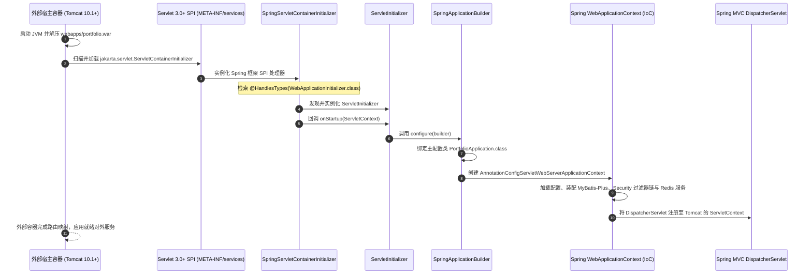

# 🏛️ WAR 传统企业级容器部署与 Jakarta EE 规范适配完整指南 (Enterprise WAR Deployment Guide)

## 1. 架构定位与双轨执行模式 (Dual-Mode Execution Architecture)

在现代微服务与云原生架构中，可执行 JAR 包（Executable Uber JAR）已成为容器化交付的主流标准；然而，在银行、金融机构、政府或传统大型企业私有化部署场景中，企业的 IT 基础设施往往由集中的运维团队维护一套统一的独立应用服务器集群（如 **Apache Tomcat 10.1+**、**Eclipse Jetty 12+** 或 **JBoss / WildFly 28+**）。在这类受监管环境中，规范要求应用必须以标准 WAR（Web Application Archive）包形式交付并挂载到中间件容器中。

本项目基于 **Spring Boot 3.4.2**、**Java 17** 与 **Gradle 8.5** 构建体系，设计并实现了**“双轨兼备的可执行 WAR 架构”（Dual-Executable WAR Pattern）**：
1. **既可作为标准 WAR 包**：直接交付并部署至外部独立 Servlet 容器（如 Tomcat 10.1+ 的 `webapps/` 目录），由宿主容器管理线程池与连接；
2. **又可作为独立可执行文件**：直接通过命令行 `java -jar portfolio-0.0.1-SNAPSHOT.war` 在单机或 Docker 中自包含启动运行，开发、测试与生产运维体验保持绝对一致。

```
                                  【双轨部署执行架构拓扑】

                                 ./gradlew bootWar
                                        │
                                        ▼
                        ┌───────────────────────────────┐
                        │ portfolio-0.0.1-SNAPSHOT.war  │
                        │ 包含:                          │
                        │ ├─ WEB-INF/classes/ (业务代码) │
                        │ ├─ WEB-INF/lib/ (运行时依赖)   │
                        │ ├─ WEB-INF/lib-provided/      │
                        │ │  └─ tomcat-embed-core-10.x  │
                        │ └─ org/.../WarLauncher        │
                        └───────────────┬───────────────┘
                                        │
               ┌────────────────────────┴────────────────────────┐
               │                                                 │
               ▼ [方式 A：传统外部容器部署]                      ▼ [方式 B：云原生独立执行]
    ┌─────────────────────────────┐                  ┌─────────────────────────────┐
    │ 外部独立 Servlet 容器       │                  │ 终端 / 容器独立执行         │
    │ (Apache Tomcat 10.1+)       │                  │ java -jar portfolio.war     │
    │                             │                  │                             │
    │ 1. 容器扫描 SPI             │                  │ 1. 触发 WarLauncher         │
    │ 2. 回调 ServletInitializer  │                  │ 2. 装载 lib-provided/ 依赖  │
    │ 3. 宿主接管 HTTP 线程与端口 │                  │ 3. 启动内置内嵌 Tomcat 8080 │
    │ 4. 共享中间件连接池与日志   │                  │ 4. 执行 Application.main()  │
    └─────────────────────────────┘                  └─────────────────────────────┘
```

---

## 2. 工程适配细节与 Jakarta EE 10 规范分水岭

### 2.1 关键依赖配置：`build.gradle`

在 `build.gradle` 中，通过应用 `war` 插件与 `providedCompile` 作用域实现 WAR 适配：

```groovy
plugins {
    id 'java'
    id 'war' // 1. 应用 Gradle WAR 打包插件
    id 'org.springframework.boot' version '3.4.2'
    id 'io.spring.dependency-management' version '1.1.7'
    // ...
}

dependencies {
    // 业务与核心组件依赖（最终打包进入 WEB-INF/lib/）
    implementation 'com.baomidou:mybatis-plus-spring-boot3-starter:3.5.7'
    implementation 'org.springframework.boot:spring-boot-starter-web'
    implementation 'org.springframework.boot:spring-boot-starter-security'
    // ...

    // 2. 将内嵌式 Tomcat 声明为 providedCompile 作用域
    providedCompile 'org.springframework.boot:spring-boot-starter-tomcat'
}

// 3. 规范定义 WAR 包输出文件名
bootWar {
    archiveFileName = 'portfolio-0.0.1-SNAPSHOT.war'
}
```

#### `providedCompile` 的底层精妙设计：
- **外部容器隔离**：Gradle 会将 `providedCompile` 声明的依赖（如 `tomcat-embed-core-10.1.34.jar`）打包到 WAR 包的 `WEB-INF/lib-provided/` 目录下，而不是标准的 `WEB-INF/lib/` 目录。当部署到外部独立 Tomcat 时，外部容器**严格忽略** `lib-provided/`，仅使用宿主自带的 Servlet API 与 Tomcat 内核类，彻底杜绝类加载器冲突（ClassLoader Collision）与符号重定义。
- **独立可执行支持**：当在终端直接执行 `java -jar portfolio-0.0.1-SNAPSHOT.war` 时，Spring Boot 的 `WarLauncher` 会主动将 `WEB-INF/lib-provided/` 加入其自身的类加载路径（Archive ClassLoader），从而顺利拉起内嵌 Tomcat 监听 8080 端口，实现双轨运行。

---

### 2.2 核心兼容性关键：Jakarta EE 10 与 Tomcat 版本选择

> [!CAUTION]
> **严禁在 Apache Tomcat 9 或更早版本上部署本项目！**

- **历史背景与包名变更**：从 **Spring Boot 3.0+** 开始，框架全量迁移至 **Spring Framework 6.x** 与 **Jakarta EE 10** 规范。原先所有基于 Java EE 的包名（`javax.servlet.*`、`javax.annotation.*`、`javax.persistence.*`）均已被彻底重构替换为 `jakarta.servlet.*`。
- **版本对应矩阵**：

| 组件名称 | 规范版本 | 底层包名空间 | 是否支持本项目 |
| :--- | :--- | :--- | :--- |
| **Apache Tomcat 9.x** | Servlet 4.0 / Java EE 8 | `javax.servlet.*` | ❌ **严重不兼容**（报错 `ClassNotFoundException: javax.servlet.Filter`） |
| **Apache Tomcat 10.0.x** | Servlet 5.0 / Jakarta EE 9 | `jakarta.servlet.*` (过渡版) | ⚠️ **已停更，不建议** |
| **Apache Tomcat 10.1.x** | **Servlet 6.0 / Jakarta EE 10** | **`jakarta.servlet.*`** | ✅ **官方完美兼容（强烈推荐）** |
| **Eclipse Jetty 12.x** | Servlet 6.0 / Jakarta EE 10 | `jakarta.servlet.*` | ✅ **完美兼容** |
| **WildFly 27+ / 28+** | Jakarta EE 10 Core Profile | `jakarta.servlet.*` | ✅ **完美兼容** |

---

## 3. 外部 Servlet 容器启动 SPI 机制与核心代码实现

### 3.1 引导入口：`ServletInitializer.java` 源码深度剖析

在 `src/main/java/com/listen/portfolio/ServletInitializer.java` 中，实现了 Spring Boot 与外部容器的桥接：

```java
package com.listen.portfolio;

import org.springframework.boot.builder.SpringApplicationBuilder;
import org.springframework.boot.web.servlet.support.SpringBootServletInitializer;

public class ServletInitializer extends SpringBootServletInitializer {

    @Override
    protected SpringApplicationBuilder configure(SpringApplicationBuilder application) {
        return application.sources(PortfolioApplication.class);
    }
}
```

### 3.2 容器引导全流程时序链路 (Sequence Flow)

外部 Tomcat 启动并部署 WAR 包时，并不执行 `PortfolioApplication.main()`，其生命周期时序如下：



---

## 4. WAR 包物理结构深度解剖

通过 Gradle 执行构建命令：
```bash
./gradlew bootWar
```
生成的 `build/libs/portfolio-0.0.1-SNAPSHOT.war` 文件遵循 Java EE 标准归档规范，其内部组织如下：

```
portfolio-0.0.1-SNAPSHOT.war
│
├── META-INF/
│   └── MANIFEST.MF                        # 包含 Main-Class: org.springframework.boot.loader.launch.WarLauncher
│
├── WEB-INF/
│   ├── classes/                           # 编译产物：业务字节码与应用配置文件
│   │   ├── application.properties         # 主环境配置
│   │   ├── application-docker.properties  # Docker 补充配置
│   │   ├── logback-spring.xml             # 结构化日志配置
│   │   └── com/listen/portfolio/
│   │       ├── PortfolioApplication.class
│   │       ├── ServletInitializer.class
│   │       ├── common/                    # 切面、过滤器、安全配置
│   │       └── ...
│   │
│   ├── lib/                               # 核心运行时依赖 (共 300+ 个外部第三方 Jar)
│   │   ├── mybatis-plus-spring-boot3-starter-3.5.7.jar
│   │   ├── spring-boot-starter-web-3.4.2.jar
│   │   ├── spring-security-core-6.4.2.jar
│   │   ├── mysql-connector-j-8.x.jar
│   │   └── ...
│   │
│   └── lib-provided/                      # ★ 关键：providedCompile 隔离的嵌入式 Tomcat
│       ├── spring-boot-starter-tomcat-3.4.2.jar
│       ├── tomcat-embed-core-10.1.34.jar
│       ├── tomcat-embed-el-10.1.34.jar
│       └── tomcat-embed-websocket-10.1.34.jar
│
└── org/springframework/boot/loader/       # Spring Boot 类加载器 (WarLauncher)
```

---

## 5. 独立 Apache Tomcat 10.1+ 生产部署实战

### 5.1 准备与验证 Tomcat 10.1 运行时环境

```bash
# 1. 确保安装 Java 17+
java -version
# 输出: openjdk version "17.0.x"

# 2. 下载并解压 Apache Tomcat 10.1 (以 10.1.34 为例)
wget https://archive.apache.org/dist/tomcat/tomcat-10/v10.1.34/bin/apache-tomcat-10.1.34.tar.gz
tar -xzf apache-tomcat-10.1.34.tar.gz
sudo mv apache-tomcat-10.1.34 /opt/tomcat10

# 3. 设置环境变量
export CATALINA_HOME=/opt/tomcat10
export PATH=$CATALINA_HOME/bin:$PATH
```

---

### 5.2 核心部署考量：Context Path 路径对齐

当将 WAR 文件放置于 `$CATALINA_HOME/webapps/` 目录时，Tomcat 会默认根据**文件名**分配上下文路径（Context Path）：
- 文件名为 `portfolio.war` $
ightarrow$ 访问路径为 `http://localhost:8080/portfolio/v1/projects`；
- 若客户端（Flutter App）或 Nginx 默认按根路径 `/` 请求，会导致全站 404 路由未命中！

#### 解决方案 A：绑定为根应用部署（强烈推荐，最简单零配置）
直接将 WAR 包重命名为 `ROOT.war`：
```bash
cp build/libs/portfolio-0.0.1-SNAPSHOT.war $CATALINA_HOME/webapps/ROOT.war
```
- **效果**：应用直接独占 Tomcat 根路径 `/`，所有接口路径与开发自测保持完全一致（`http://localhost:8080/v1/...`）。

#### 解决方案 B：通过 `conf/server.xml` 显式映射
若必须保留 `portfolio.war` 名称，可在 `$CATALINA_HOME/conf/server.xml` 的 `<Host>` 节点内添加配置：
```xml
<Host name="localhost" appBase="webapps" unpackWARs="true" autoDeploy="true">
    <!-- 将 / 根路径映射到 portfolio 应用 -->
    <Context path="" docBase="portfolio" reloadable="false"/>
</Host>
```

---

### 5.3 环境变量注入与 JVM 性能调优

在外部应用服务器上，生产敏感配置（如数据库密码、JWT 密钥、Redis 地址）严禁硬编码。
创建或编辑 `$CATALINA_HOME/bin/setenv.sh`（Windows 环境为 `setenv.bat`）：

```bash
#!/bin/bash
# -----------------------------------------------------------------------------
# Apache Tomcat 10.1 JVM 与环境变量配置 (setenv.sh)
# -----------------------------------------------------------------------------

# 1. JVM 内存与垃圾回收器 (G1GC) 调优
export JAVA_OPTS="-server   -Xms1024m   -Xmx2048m   -XX:MetaspaceSize=256m   -XX:MaxMetaspaceSize=512m   -XX:+UseG1GC   -XX:MaxGCPauseMillis=200   -XX:InitiatingHeapOccupancyPercent=45   -XX:+ExplicitGCInvokesConcurrent   -Djava.awt.headless=true   -Dfile.encoding=UTF-8"

# 2. 数据库敏感环境变量注入
export DB_URL="jdbc:mysql://127.0.0.1:3306/portfolio?useUnicode=true&characterEncoding=utf8&useSSL=false&allowPublicKeyRetrieval=true&serverTimezone=Asia/Tokyo"
export DB_USERNAME="portfolio_user"
export DB_PASSWORD="secure_db_password"

# 3. Redis 缓存环境变量注入
export REDIS_HOST="127.0.0.1"
export REDIS_PORT="6379"

# 4. JWT 安全秘钥与会话过期时间 (毫秒)
export JWT_SECRET="your-production-high-entropy-jwt-secret-at-least-256-bits-long"
export JWT_EXPIRATION="300000"
export JWT_REFRESH_EXPIRATION="86400000"

# 5. 邮件服务配置
export MAIL_HOST="smtp.gmail.com"
export MAIL_PORT="587"
export MAIL_USERNAME="your-email@gmail.com"
export MAIL_PASSWORD="your-app-password"
```

赋予执行权限：
```bash
chmod +x $CATALINA_HOME/bin/setenv.sh
```

---

### 5.4 启动与健康巡检验证

```bash
# 启动 Tomcat 服务
$CATALINA_HOME/bin/startup.sh

# 实时跟踪启动日志
tail -f $CATALINA_HOME/logs/catalina.out
```

**预期控制台输出日志关键标记**：
```log
org.apache.catalina.startup.HostConfig.deployWAR Deploying web application archive [/opt/tomcat10/webapps/ROOT.war]
...
com.listen.portfolio.ServletInitializer: Starting ServletInitializer using Java 17.0.x on ...
...
com.listen.portfolio.common.config.FlywayConfig: >>> [FlywayConfig] 数据库模式已成功迁移至最新版本: V2
...
org.apache.catalina.startup.HostConfig.deployWAR Deployment of web application archive [/opt/tomcat10/webapps/ROOT.war] has finished in [4,120] ms
```

**执行自动化健康探测**：
```bash
# 检查健康探针端点
curl -i http://localhost:8080/actuator/health

# 预期输出: HTTP/1.1 200 OK
# {"status":"UP","components":{"db":{"status":"UP"},"diskSpace":{"status":"UP"},"ping":{"status":"UP"},"redis":{"status":"UP"}}}
```

---

## 6. Nginx 边缘反向代理与协同配置

在外部 Tomcat 生产部署架构中，Nginx 作为统一的边缘网关接入并终止 SSL，反向代理转发至本地 Tomcat 容器。

```nginx
# /etc/nginx/conf.d/portfolio_war.conf

upstream tomcat_backend {
    server 127.0.0.1:8080 max_fails=3 fail_timeout=10s;
    keepalive 32;
}

server {
    listen 80;
    listen 443 ssl http2;
    server_name api.listen2code.com;

    # SSL 证书配置
    ssl_certificate /etc/letsencrypt/live/api.listen2code.com/fullchain.pem;
    ssl_certificate_key /etc/letsencrypt/live/api.listen2code.com/privkey.pem;
    ssl_protocols TLSv1.2 TLSv1.3;
    ssl_ciphers HIGH:!aNULL:!MD5;

    # 硬限制最大上传包体积 (匹配 UserController 7 层头像防护)
    client_max_body_size 10M;

    # 统一剥离 /api 路由前缀转发至外部 Tomcat 根路径
    location ^~ /api/ {
        proxy_pass http://tomcat_backend/;
        
        # 传递真实源 IP 与主机头
        proxy_set_header Host $host;
        proxy_set_header X-Real-IP $remote_addr;
        proxy_set_header X-Forwarded-For $proxy_add_x_forwarded_for;
        proxy_set_header X-Forwarded-Proto $scheme;

        # HTTP/1.1 长连接支持
        proxy_http_version 1.1;
        proxy_set_header Connection "";

        # 超时时间调优
        proxy_connect_timeout 5s;
        proxy_read_timeout 60s;
        proxy_send_timeout 60s;
    }

    # 安全管控：仅允许内网访问 Actuator 敏感监控
    location ^~ /api/actuator/ {
        # allow 172.16.0.0/12;
        # deny all;
        proxy_pass http://tomcat_backend/actuator/;
        proxy_set_header Host $host;
    }
}
```

---

## 7. 常见故障排查与诊断手册 (Troubleshooting)

### 问题 1：启动报错 `java.lang.ClassNotFoundException: jakarta.servlet.Filter`
- **根本原因**：外部应用服务器使用了旧版本（如 Apache Tomcat 8.5 或 9.0），旧容器仅支持 `javax.servlet.*`，无法识别 Spring Boot 3 的 `jakarta.servlet.*` 命名空间。
- **解决方案**：必须升级应用服务器至 **Apache Tomcat 10.1+**。

### 问题 2：应用启动成功但请求全部报 404
- **根本原因**：WAR 包部署文件名为 `portfolio.war`，Tomcat 将 Context Path 设置为 `/portfolio`；客户端请求 `http://host:port/v1/auth/login` 未附带 `/portfolio` 前缀。
- **解决方案**：
  1. 最优解：将 WAR 文件重命名为 `ROOT.war` 部署在 Tomcat 根路径；
  2. 次优解：在 Nginx 反向代理中配置 `proxy_pass http://127.0.0.1:8080/portfolio/;`。

### 问题 3：热卸载 (Undeploy) 时控制台出现内存泄漏报警
- **日志特征**：`The web application [ROOT] appears to have started a thread named [lettuce-eventExecutorLoop-...] but has failed to stop it. This is very likely to create a memory leak.`
- **根本原因**：外部 Tomcat 热卸载应用时，未正确关闭 Redis Lettuce 客户端的底层 Netty 线程池或 JDBC 驱动注册。
- **解决方案**：参考 `todo.md` Section 23，在 `ServletInitializer` 中实现 `ServletContextListener` 注册停机销毁回调，显式释放线程组与注销 JDBC 驱动。

---

## 8. 当前不足与未来演进路线 (已收录至 todo.md Section 23)

根据当前代码实现与生产实践，系统在 [`docs/todo.md`](file:///c:/Users/liste/Downloads/github/ListenPortfolioBackend/docs/todo.md) 第 23 节规划了 4 项传统容器部署演进任务：

| 规划序号 | 核心任务 | 现状痛点 | 演进与解决方案 |
| :--- | :--- | :--- | :--- |
| **23.1** | **Context Path 与反向代理网关协同重写** | 部署为非 `ROOT.war` 时自动分配上下文前缀，易导致 404 与静态资源错位 | 制定标准 `ROOT.war` 规范，在 Nginx 模板中增加自适应 Context Path 重写与重定向处理 |
| **23.2** | **JNDI 外部连接池条件装配与 HikariCP 平滑回退** | 强依赖内置 HikariCP，严管企业环境运维要求由中间件统一管辖连接池 | 增加 `@ConditionalOnProperty` 装配逻辑，优先查找 JNDI 数据源，未配置时自动平滑回退至内置 HikariCP |
| **23.3** | **外部容器生命周期管理与热卸载内存泄露防护** | 外部容器执行热重载时未关闭后台线程，易引发 Metaspace 内存泄漏报警 | 在 `ServletInitializer` 中补充 `ServletContextListener` 销毁监听器，显式关闭 Netty 线程组并注销 JDBC 驱动 |
| **23.4** | **CI/CD 双轨自动化构建矩阵与 Tomcat 10.1 冒烟探针** | CI 流水线仅覆盖 JAR 构建，缺少 WAR 包在真实外部容器中的健康巡检验证 | 扩展 GitHub Actions 矩阵支持 WAR 产物构建，拉起 Dockerized Tomcat 10.1 镜像执行冒烟测试探针 |

---

## 9. 关联参考

- [Spring Boot 官方 WAR 部署参考指南](https://docs.spring.io/spring-boot/docs/current/reference/htmlsingle/#howto.traditional-deployment)
- [Apache Tomcat 10.1 官方配置手册](https://tomcat.apache.org/tomcat-10.1-doc/index.html)
- [Jakarta EE 10 Servlet 6.0 Specification](https://jakarta.ee/specifications/servlet/6.0/)
- [项目规划待办清单 (docs/todo.md)](file:///c:/Users/liste/Downloads/github/ListenPortfolioBackend/docs/todo.md)
